# System Design Pillars

*Interview-ready reference guide*

---

## Why These Concepts Matter

Every scalable system — Netflix, Amazon, Uber, Swiggy, Instagram — is built on the same foundational concepts. Before you can design any real-world architecture, you need to speak fluently about:

1. **Scalability**
2. **Latency**
3. **Throughput**
4. **Bottleneck**
5. **Availability**
6. **Fault Tolerance**
7. **Consistent Hashing**
8. **CAP Theorem**

These aren't independent ideas — they're deeply connected. A system that scales but has high latency isn't good enough. A system that's fast but unavailable during peak load fails the user. Understanding how these trade off against each other is the actual skill being tested in a system design interview.

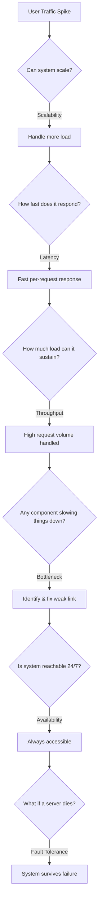

---

## 1. Scalability

**Definition:** The ability of a system to handle increasing load (traffic, data, users) without breaking or degrading performance.

### Real-World Analogy
A single food stall can comfortably serve 50–100 customers. When 1,000 customers show up at once, the queue explodes, ingredients run out, and service collapses. The stall needs to either get a much bigger kitchen (vertical) or open more stalls (horizontal).

### Two Types of Scaling

**Vertical Scaling** — same machine, more power:
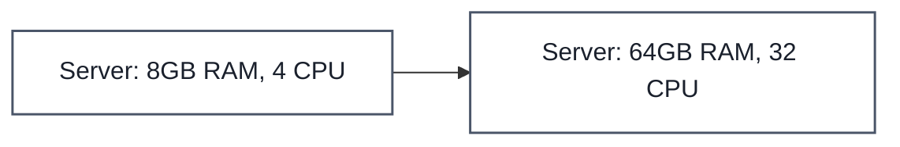

**Horizontal Scaling** — many machines, shared load:
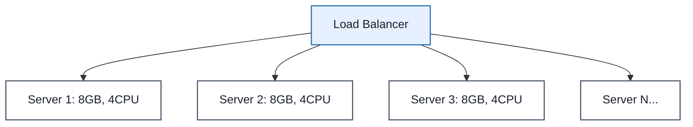

| | Vertical Scaling (Scale Up) | Horizontal Scaling (Scale Out) |
|---|---|---|
| **How** | Add more CPU/RAM to one machine | Add more machines behind a load balancer |
| **Pros** | Simple, no distributed-systems complexity, no data-partitioning needed | Near-limitless scale, better fault tolerance, cost-efficient with commodity hardware |
| **Cons** | Hard physical ceiling; single point of failure; downtime during upgrade | Needs load balancing, distributed data consistency, network overhead, operational complexity |
| **Enterprise Example** | Traditional large PostgreSQL/Oracle instances for core banking ledgers, where ACID consistency on one box was historically simpler | Netflix, Amazon, Uber — thousands of stateless microservice instances behind ELB/API Gateway, auto-scaled with Kubernetes/EC2 Auto Scaling Groups |

**Trade-off to mention in an interview:** Vertical scaling is where most systems *start* (simpler to reason about), but production-grade systems at scale almost always evolve toward horizontal scaling once they hit the ceiling of a single machine — the real cost is added complexity: service discovery, distributed state, and network partition handling (see CAP theorem).

### 🎯 Most Asked Interview Questions — Scalability

**Q1: What's the difference between vertical and horizontal scaling? When would you pick one over the other?**
*A: Vertical scaling is adding more CPU/RAM to an existing box — it's the fastest way to buy headroom and it keeps the architecture simple, so I'll reach for it early or for a workload that's genuinely hard to distribute, like a single-writer relational database. Horizontal scaling is adding more machines — it's what I'd choose once I know the workload will keep growing, because it removes the hard ceiling and gives me fault tolerance for free. In practice I usually do both: scale up until it's uneconomical or risky, then design the service to be stateless so it can scale out.*

**Q2: What are the limits of vertical scaling?**
*A: There's a hardware ceiling — you can only get so much RAM and CPU on one box before you're into exotic, expensive hardware. There's also a blast-radius problem: it's a single point of failure, and every upgrade usually means downtime or a risky live migration. I treat vertical scaling as a short-term lever, not a long-term strategy.*

**Q3: How does horizontal scaling affect data consistency?**
*A: Once you have multiple nodes, you're now a distributed system, so you inherit the CAP theorem trade-off. Writes have to be coordinated — through leader-follower replication, quorum writes, or sharding — and reads can go stale if they hit a replica that hasn't caught up yet. I make this trade-off explicit with the team early: do we need strong consistency (accept extra latency/coordination) or is eventual consistency acceptable (accept a stale-read window) for this particular data.*

**Q4: What is auto-scaling, and how does a system decide when to scale?**
*A: Auto-scaling adds or removes capacity automatically based on a signal — usually CPU/memory utilization, request queue depth, or a custom business metric like orders/minute. I set both a scale-out and scale-in policy with cooldown periods, because reacting too aggressively causes "flapping" — constantly spinning instances up and down. I also always define a minimum baseline capacity so a sudden traffic drop doesn't scale me down to zero right before the next spike.*

**Q5: Can you scale a stateful service horizontally? What problems come up (session affinity, shared state)?**
*A: You can, but it's harder — the goal is to externalize the state so any instance can serve any request. For session data, I'd move it to a shared store like Redis instead of keeping it in-memory on a specific node, which also avoids needing sticky sessions on the load balancer. If state truly must live on the node — like a sharded in-memory cache — I partition by a consistent hash so requests route deterministically to the right node.*

**Q6: How would you scale a system that has a single relational database as its bottleneck?**
*A: I'd go in order of least to most disruptive: first add read replicas and push read traffic off the primary, then add caching (Redis) in front of hot queries, then look at query/index optimization and connection pooling. If writes are still the constraint, I'd consider sharding by a key like customer ID or region — but that's a significant architectural change, so I'd only justify it once the simpler levers are exhausted.*

---

## 2. Latency

**Definition:** The time taken to process and respond to a *single* request. Measured request → response.

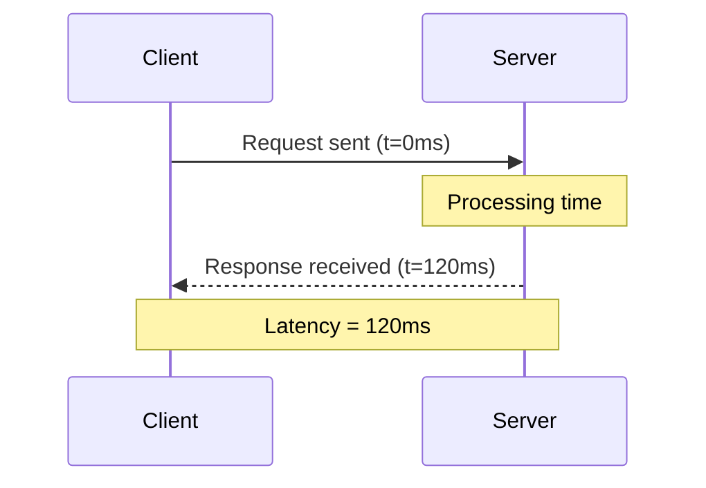

### What Drives Latency Up
- Multiple sequential database calls for one request
- Chained/synchronous calls to external APIs
- Unnecessary computation or unindexed queries
- Network hops (cross-region calls)

### Enterprise Example
Amazon famously found that **every 100ms of added latency cost them ~1% in sales**. This is why Amazon invests heavily in edge caching (CloudFront), DynamoDB single-digit-millisecond reads, and regional deployments — keeping compute physically close to the user.

### Pros/Cons of Optimizing for Low Latency
| Approach | Pros | Cons / Trade-off |
|---|---|---|
| Caching (Redis/CDN) | Sub-millisecond reads, reduces DB load | Stale data risk, cache invalidation complexity |
| Reducing DB round-trips (batching) | Fewer network hops | More complex query logic |
| Edge/CDN deployment | Very low latency for global users | Infrastructure & sync cost |
| Async processing | Frees up request thread | Doesn't reduce latency for that specific request — shifts work elsewhere |

> **Interview tip:** Latency and throughput are often confused. Latency = speed of *one* request. Throughput = *volume* of requests handled. You can have low latency but low throughput (a single fast waiter serving one table extremely quickly) or high throughput with higher latency (a buffet serving hundreds of people, but each one waits a bit longer).

### 🎯 Most Asked Interview Questions — Latency

**Q1: What factors contribute to latency in a distributed system?**
*A: I break it down into network time, queueing time, and processing time. Network time includes DNS lookup, TLS handshake, and physical distance to the server. Queueing time is how long a request waits for a thread/connection to be free. Processing time is the actual work — DB calls, serialization, business logic. When I'm debugging latency, I always trace the request end-to-end first, because guessing which of the three is the culprit wastes time.*

**Q2: How does caching reduce latency, and what are the risks?**
*A: Caching avoids recomputation or a round-trip to a slower store — an in-memory Redis lookup is orders of magnitude faster than a DB query. The risk is staleness: if the cache and source of truth drift apart, users can see outdated data, or worse, act on it. I mitigate that with a clear TTL strategy and, for anything that must be fresh, an explicit invalidation path on write rather than relying on TTL alone.*

**Q3: What's the difference between latency and response time?**
*A: Response time is the full time the client experiences, including queueing and network overhead. Latency, strictly, is the processing time within the system for that request. In casual conversation people use them interchangeably, but in an interview I'll clarify which one I mean, especially when we start talking about SLAs — an SLA is usually defined on response time, since that's what the user actually feels.*

**Q4: How would you reduce latency for users located far from your servers?**
*A: The core lever is moving compute or data physically closer to the user — a CDN for static assets, edge locations for compute (Lambda@Edge, Cloudflare Workers), and multi-region deployments with geo-based routing (Route 53 latency-based routing) for dynamic content. If full multi-region isn't justified yet, even just replicating read-heavy data to a regional cache gets most of the win at a fraction of the cost.*

**Q5: Explain P50, P95, P99 latency — why do we care about tail latency, not just average?**
*A: P50 is the median — half your requests are faster, half slower. P99 means 99% of requests are faster than that number, so it captures your worst-case-for-most-users experience. Average latency hides outliers — if 1% of requests take 5 seconds, the average might still look fine, but that's potentially thousands of angry users a day at scale. I always set SLOs on P95/P99, not average, because that's what actually reflects the experience of your unluckiest users.*

**Q6: Can you have zero latency? Why or why not?**
*A: No — physics won't allow it. Data has to travel, and even a fiber-optic signal is bounded by the speed of light, so there's a hard floor based on distance alone, before you even add processing time. The realistic goal is never "zero," it's "as close to physically necessary as the architecture allows," which is why we talk about latency budgets rather than eliminating latency entirely.*

---

## 3. Throughput

**Definition:** The number of requests a system can process within a given time window (e.g., requests/second, transactions/second).

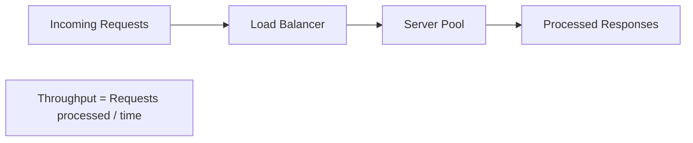

### How Throughput Is Improved
- **Load balancing** — spread requests across many servers
- **Caching** — avoid recomputation for repeat requests
- **Asynchronous processing** — queue heavy work (e.g., Kafka, SQS) instead of blocking
- **Horizontal scaling** — more workers processing in parallel
- **Database optimization** — indexing, read replicas, sharding

### Enterprise Example
**Visa's payment network** is built to sustain over **65,000 transactions per second** at peak (Black Friday, holiday sales) — this is a throughput engineering problem far more than a latency one; each individual transaction can take a bit longer as long as the *aggregate* volume is absorbed without failure.

### Latency vs. Throughput — The Classic Trade-off
| Scenario | Optimizing for Latency | Optimizing for Throughput |
|---|---|---|
| Batch size | Small/no batching (respond immediately) | Large batching (aggregate requests, process in bulk) |
| Example system | Real-time trading system, gaming | Analytics pipeline, bulk payment settlement |
| Risk | Doesn't scale to huge volume efficiently | Individual request may wait longer in queue |

### 🎯 Most Asked Interview Questions — Throughput

**Q1: How do you measure throughput, and what units are typically used?**
*A: Requests per second (RPS) or transactions per second (TPS) is the standard, though I'll use domain-specific units too — orders/minute for an e-commerce checkout, messages/second for a queue. I always measure it under realistic, sustained load, not a burst, because a system can look great for 10 seconds and fall over at minute two once connection pools or GC pressure catch up with it.*

**Q2: How does horizontal scaling improve throughput?**
*A: More instances means more requests can be processed in parallel, so aggregate throughput scales roughly with node count — as long as nothing shared, like a database or a downstream API, becomes the new limiting factor. That caveat matters: I've seen teams add ten app servers and see zero throughput improvement because the database connection pool was already saturated.*

**Q3: What's the relationship between throughput and latency — can you maximize both?**
*A: They're often in tension. Batching improves throughput by amortizing overhead across many items, but it adds latency for each individual item since it waits for the batch to fill. You can improve both simultaneously up to a point through better efficiency — caching, indexing, async I/O — but past that point it becomes an explicit trade-off tied to the use case, not a free win.*

**Q4: How does message queuing (Kafka/SQS) help improve throughput?**
*A: A queue decouples the producer from the consumer, so producers aren't blocked waiting on downstream processing — they just publish and move on, which raises the throughput the front door can absorb. It also lets you scale consumers independently and smooth out spiky traffic into a steady processing rate, at the cost of the work no longer being synchronous, which is a trade-off the product has to accept.*

**Q5: How would you design a system to sustain 100K requests/second?**
*A: I'd start by figuring out which layer breaks first — usually the database — and design around that: horizontal app-tier scaling behind a load balancer, aggressive caching for read-heavy paths, async processing via queues for anything that doesn't need a synchronous response, and database sharding or read replicas once a single DB instance is the ceiling. I'd also load test incrementally rather than assume the design works — at that scale, unexpected bottlenecks (connection limits, DNS, even TCP port exhaustion) show up in places you don't expect.*

**Q6: What is backpressure, and why does it matter for throughput?**
*A: Backpressure is a mechanism where a system signals upstream producers to slow down when it can't keep up, instead of silently dropping requests or falling over. Without it, a burst of traffic can cascade into a full outage — the classic case is an unbounded queue that eventually exhausts memory. I prefer explicit backpressure (bounded queues, rate limiting, load shedding) because a controlled slowdown is much better than an uncontrolled crash.*

---

## 4. Bottleneck

**Definition:** The single component that limits the performance of the *entire* system, regardless of how well-optimized everything else is.

### Real-World Analogy
An 8-lane highway that suddenly narrows to 1 lane. Traffic flows fine everywhere else, but that one narrow stretch throttles the whole road.

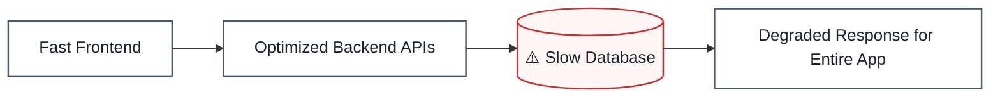

### Common Bottleneck Sources in Enterprise Systems
- **Database** — most common; unindexed queries, connection pool exhaustion, hot partitions
- **Single-threaded services** — a legacy component that can't be parallelized
- **Third-party API rate limits** — e.g., a payment gateway capping requests/sec
- **Network bandwidth** — cross-region calls in a globally distributed system
- **Message queue consumer lag** — producers outpacing consumers

### Enterprise Example
**Twitter's "Fail Whale" era (2008–2010):** Twitter's monolithic Ruby on Rails + MySQL architecture had the database as a severe bottleneck during viral events — every tweet fan-out was computed synchronously. This directly drove their migration to a fan-out-on-write architecture with dedicated timeline caches (Redis) — decoupling the bottleneck.

**How to identify bottlenecks:** distributed tracing (Jaeger, Zipkin), APM tools (Datadog, New Relic), load testing (JMeter, k6) to find where latency/errors spike under load.

### 🎯 Most Asked Interview Questions — Bottleneck

**Q1: How would you identify a bottleneck in a production system?**
*A: I'd start with distributed tracing to see where time is actually being spent across a request's full path, then cross-reference with APM dashboards (CPU, memory, DB connection pool usage, queue depth) to find the resource that's saturated. Guessing wastes time — I want data that points at the exact component before I start optimizing anything.*

**Q2: What are common causes of database bottlenecks, and how do you fix them?**
*A: Usually it's missing indexes causing full table scans, connection pool exhaustion under load, N+1 query patterns from an ORM, or a single hot partition taking disproportionate traffic. Fixes depend on the cause: add the right index, tune pool size and query timeouts, batch queries instead of looping, or repartition the hot key. I always profile first — throwing a bigger instance at an indexing problem just delays the same failure.*

**Q3: How does caching help eliminate bottlenecks?**
*A: If the database is the bottleneck because of repeated reads for the same data, caching absorbs that read traffic so the database only sees the requests that actually need fresh data. It doesn't fix a write bottleneck, though — that's a common mistake, treating caching as a universal fix when it only helps the read path.*

**Q4: What tools would you use to detect a bottleneck under load?**
*A: Load testing tools like JMeter or k6 to generate realistic traffic and see where the system starts degrading, paired with APM tools like Datadog or New Relic for real-time resource metrics, and distributed tracing like Jaeger or Zipkin to pinpoint which specific call in the chain is slow. I run load tests in a staging environment that mirrors production as closely as possible — bottlenecks found on an undersized test environment can be misleading.*

**Q5: Can horizontal scaling introduce a *new* bottleneck? Give an example.**
*A: Yes, very commonly. If I scale my application tier from 5 to 50 instances but they all still hit one database, the database quickly becomes the new bottleneck — I've just moved the constraint, not removed it. I always ask "what's shared across all these new instances?" because that shared thing — a DB, a cache, a downstream API — is where the next bottleneck will appear.*

**Q6: How do you prevent a single slow downstream service from taking down the whole system?**
*A: Circuit breakers, timeouts, and bulkheads. A circuit breaker stops calling a failing dependency after it detects repeated failures, so my service fails fast instead of piling up threads waiting on a hung call. Bulkheads isolate resource pools per dependency so one slow service can't exhaust the thread pool shared by everything else. I treat "what happens when this dependency is slow or down" as a required design question, not an afterthought.*

---

## 5. Availability

**Definition:** The percentage of time a system remains operational and accessible.

### Real-World Analogy
An ATM that works 24/7 = high availability. An ATM frequently showing "service unavailable" = low availability — and users simply go elsewhere.

### The "Nines" — Industry Standard Measurement
| Availability | Downtime/Year | Downtime/Month |
|---|---|---|
| 99% ("two nines") | ~3.65 days | ~7.3 hours |
| 99.9% ("three nines") | ~8.76 hours | ~43.8 minutes |
| 99.99% ("four nines") | ~52.6 minutes | ~4.4 minutes |
| 99.999% ("five nines") | ~5.26 minutes | ~26 seconds |

### How High Availability Is Achieved
- **Redundancy** — multiple servers/replicas across zones
- **Multi-region deployment** — survive a full data center outage
- **Health checks + auto-failover** — remove unhealthy nodes automatically
- **Load balancers** — reroute traffic away from failed instances

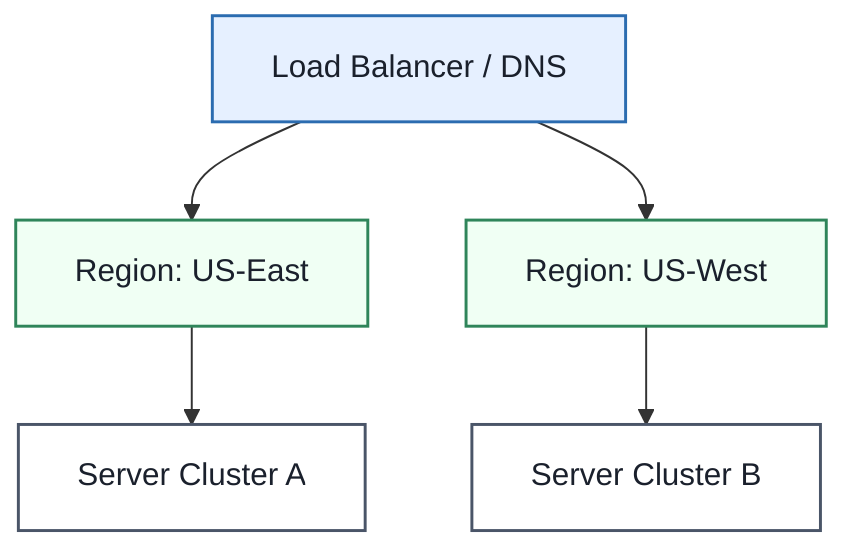

### Enterprise Example
**AWS S3's design target is 99.99% availability** (and 11 nines of durability for data). Amazon.com itself is architected across multiple Availability Zones specifically so that a single data center failure never takes the storefront down — because, as the transcript notes, if Amazon shows a blank page, the customer simply buys from a competitor instead.

### Trade-off
Higher availability = more redundant infrastructure = higher cost. Going from 99.9% to 99.999% availability is not a linear cost increase — it's often exponential, since it demands multi-region active-active setups, sophisticated failover automation, and constant chaos testing.

### 🎯 Most Asked Interview Questions — Availability

**Q1: How do you calculate availability, and what does "five nines" mean?**
*A: Availability = uptime / (uptime + downtime), usually expressed as a percentage over a year. Five nines is 99.999% — that's only about 5 minutes of downtime allowed per year, which is an extremely aggressive target that requires multi-region active-active infrastructure and near-instant automated failover. I always push back if a team casually asks for five nines without understanding the cost — most businesses don't actually need it and three or four nines is a far more reasonable, achievable target.*

**Q2: What's the difference between availability and reliability?**
*A: Availability is about whether the system is up and reachable right now. Reliability is about whether it performs correctly and consistently over time without failures — a system can be "up" but still returning wrong answers or partial failures, which would be a reliability problem even though availability metrics look fine. I make sure our monitoring covers both, not just an uptime check.*

**Q3: How does redundancy improve availability?**
*A: Redundancy means no single component failure takes the whole system down — multiple instances, multiple AZs, multiple regions. If one node fails, traffic automatically routes to a healthy one and the user never notices. The trade-off is cost: you're paying for capacity that sits idle most of the time purely as insurance, so I size redundancy based on the actual criticality of the service, not a blanket policy.*

**Q4: What is a single point of failure, and how do you eliminate it?**
*A: It's any component whose failure takes down the whole system — a single database instance, a single load balancer, even a single DNS provider. I eliminate them by adding redundancy at every layer: multiple app instances, database replication with automated failover, redundant load balancers, and multi-region DNS. The exercise I always do is draw the architecture and ask "what happens if this one box dies" for every single box.*

**Q5: How would you design a system for 99.99% availability?**
*A: That's about 52 minutes of downtime a year, so I'd deploy across multiple Availability Zones at minimum, use auto-scaling groups with health checks so unhealthy instances get replaced automatically, put a database with automated failover behind it (like RDS Multi-AZ), and add circuit breakers so a downstream failure degrades gracefully instead of cascading. I'd also invest in good alerting and a tested runbook, because a lot of "availability" in practice comes down to how fast humans respond when automation isn't enough.*

**Q6: Explain the CAP theorem — how does it force a trade-off involving availability?**
*A: CAP says that during a network partition, a distributed system can only guarantee either consistency or availability, not both. If I choose consistency, the system may reject requests or return errors until the partition heals, to avoid serving stale or conflicting data. If I choose availability, the system keeps serving requests but risks returning inconsistent data across nodes until things reconcile. Which one I pick depends entirely on the use case — a banking ledger leans consistency, a social media like-counter can lean availability.*

---

## 6. Fault Tolerance

**Definition:** The system's ability to **continue operating correctly even when part of it fails.**

### Real-World Analogy
An app deployed on Server 1 and Server 2. If Server 1 crashes, Server 2 silently absorbs all traffic — the user never notices anything happened.

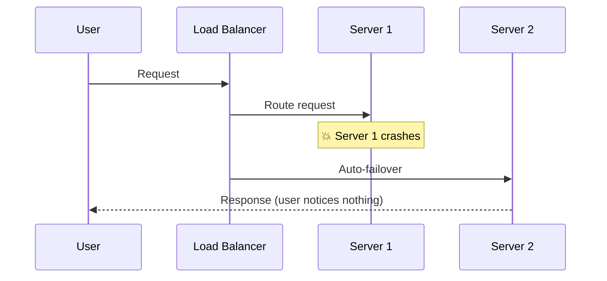

### How Fault Tolerance Is Built
- **Replication** — data copied across multiple nodes/regions
- **Redundant servers** — N+1 or N+2 capacity so a single loss doesn't cause an outage
- **Circuit breakers** — stop cascading failures (e.g., Netflix Hystrix/resilience4j)
- **Graceful degradation** — show cached/partial results instead of a hard failure
- **Chaos engineering** — deliberately inject failures to prove resilience

### Enterprise Example
**Netflix's Chaos Monkey** randomly terminates production instances *on purpose*, continuously, to force every team to build services that tolerate failure by default rather than assuming servers stay alive. This is why a Netflix stream rarely fully drops even when AWS has regional issues — the architecture assumes failure is normal, not exceptional.

### Availability vs. Fault Tolerance — Don't Confuse Them
| | Availability | Fault Tolerance |
|---|---|---|
| **Measures** | % uptime over time | Ability to keep functioning *during* a failure |
| **Analogy** | ATM is reachable 24/7 | ATM keeps dispensing cash even if one internal module fails |
| **Relationship** | Fault tolerance is often *how* you achieve high availability | High availability is the outcome; fault tolerance is a mechanism |

### 🎯 Most Asked Interview Questions — Fault Tolerance

**Q1: What's the difference between fault tolerance and high availability?**
*A: Availability measures whether the system is reachable — it's an outcome. Fault tolerance is the mechanism that gets you there — the system's ability to keep functioning correctly while a component has actually failed. You can think of fault tolerance as one of the primary tools you use to achieve high availability, but availability could theoretically also come from just never having failures, which isn't realistic at scale — so in practice they're tightly linked.*

**Q2: How does replication help achieve fault tolerance?**
*A: If data or a service exists on multiple nodes, the loss of one node doesn't mean data loss or downtime — a replica takes over. The trade-off is consistency and cost: synchronous replication guarantees replicas are in sync but adds write latency, while asynchronous replication is faster but risks losing the last few writes if the primary fails before replicating. I choose based on how tolerant the data is of loss — payment data leans synchronous, activity logs can lean async.*

**Q3: What is a circuit breaker pattern, and why is it used?**
*A: It's a pattern that monitors calls to a dependency, and after a threshold of failures, "opens" the circuit and stops calling that dependency for a cooldown period, failing fast instead. This protects the calling service from wasting threads and resources waiting on a hung or failing downstream call, and it protects the downstream service from being hammered with retries while it's already struggling. I always pair it with sane timeouts and a fallback response — like cached or default data — so the user sees something rather than a hard error.*

**Q4: How does Netflix's Chaos Monkey improve system resilience?**
*A: It randomly kills production instances on a regular basis, which forces every team to design services that assume failure is normal, not exceptional — you can't get lazy and assume a server will stay up. It converts fault tolerance from a theoretical requirement into something that's continuously tested in production, so when a real failure happens, it's not the first time the system has had to handle it.*

**Q5: What is graceful degradation, and can you give a real example?**
*A: It's designing a system to keep providing a reduced but still useful experience when a component fails, instead of failing completely. A good example is an e-commerce site where the recommendation engine goes down — rather than the whole page erroring out, it just shows the product page without the "you might also like" section. I try to identify which features are "core" versus "enhancement" up front, so degradation paths are designed in, not improvised during an incident.*

**Q6: How would you design a payment system so a single service failure doesn't lose a transaction?**
*A: I'd make the payment write idempotent and persist the transaction intent to a durable store — like a database or an event log — before attempting the actual charge, so a crash mid-process doesn't lose the record; on restart or retry the system can pick up where it left off using the idempotency key. I'd also use the outbox pattern or a message queue to reliably propagate the result (success/failure) to downstream systems like notifications or ledger updates, rather than a direct synchronous call that could fail silently. The core principle is: never let "did this financial operation happen" depend on a single in-memory step that a crash can erase.*

---

## 7. Consistent Hashing

**Definition:** A way of assigning keys (cache entries, shards, users) to nodes using a fixed circular hash space, so that when a node is added or removed, only a small slice of keys move — instead of almost everything remapping at once.

### The Problem It Solves: Modulo Hashing Falls Apart

The naive approach is `node = hash(key) % number_of_nodes`. This works fine until the node count changes.

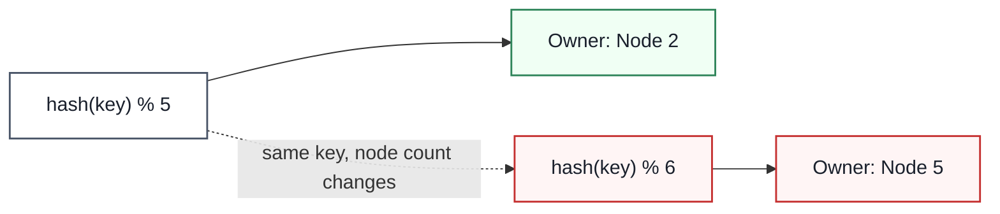

Go from 5 nodes to 6, and the formula for nearly every key changes — not because the data changed, but because the *divisor* changed. For a cache, that's a cache-miss storm hitting your database all at once. For a storage system, it's a massive, unplanned data migration triggered by adding a single box.

### How Consistent Hashing Works: The Ring

Both nodes and keys are hashed onto the *same* fixed circular space (`0` to `2^64 - 1`, wrapping back to `0`). A key belongs to the first node found walking **clockwise** from the key's position.

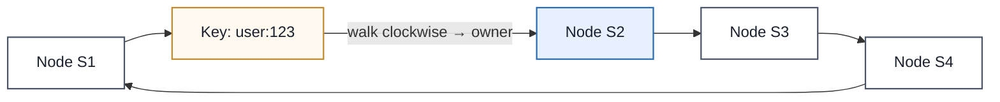

### Adding a Node: Only Local Keys Move

When `S5` joins between `S1` and `S2`, it claims the range up to itself. Only keys that fell in that slice move — everything owned by `S3` and `S4` is untouched.

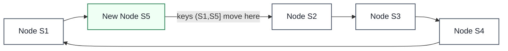

With `N` evenly balanced nodes, adding one moves roughly `1/(N+1)` of the keys — not the whole keyspace. Removing a node works the same way in reverse: only its range moves, to its clockwise successor.

### Virtual Nodes: Fixing Uneven Ranges

Placing each physical node at a single ring position produces lumpy, uneven ranges — and if that node fails, its *entire* range dumps onto one unlucky successor. **Virtual nodes** place each physical node at many points on the ring instead.

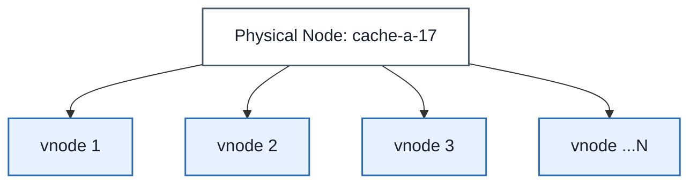

This gets you: better balance (many small ranges average out better than a few large ones), smoother failures (a dead node's ranges scatter across *several* successors instead of one), and weighted capacity (a bigger box just gets more virtual nodes).

### Consistent Hashing vs. Alternatives

| Technique | Best Fit | Note |
|---|---|---|
| **Consistent hashing ring** | Caches, storage shards, stateful routing | The default choice; well understood, supports virtual nodes |
| **Rendezvous hashing** | Picking one or more owners from a node set | No ring structure needed; simpler for smaller clusters |
| **Jump consistent hash** | Mapping a key to a numbered bucket fast | Great when buckets are append-only and numbered |
| **Fixed partitions** | Logs, queues, databases with partition movement | Decouples hashing from physical node membership entirely |

### Enterprise Example
Amazon's **Dynamo** whitepaper — the design that later became the basis for DynamoDB — popularized consistent hashing with virtual nodes specifically so Amazon's shopping cart infrastructure could add or remove capacity without a full data reshuffle across the fleet. Memcached client libraries (the **Ketama** algorithm) apply the same idea to distribute cache keys across a pool of cache servers at companies like Twitter and Facebook-scale caching layers.

> **Trade-off:** Consistent hashing solves *ownership stability*, not hot-key overload — if one key is extremely popular, its owning node can still get hammered even though key distribution is "balanced." That needs a separate mitigation: request coalescing, local caching, or replicating just that hot key.

### 🎯 Most Asked Interview Questions — Consistent Hashing

**Q1: Why does modulo hashing break when you add or remove a node?**
*A: Because the node count is part of the formula — `hash(key) % N` — so changing N changes the result for almost every key, even though the underlying data hasn't changed at all. It's not a partial failure, it's a near-total remap, which for a cache means a miss storm and for a database means a mass migration, both triggered by something as small as adding one box.*

**Q2: How does consistent hashing limit the blast radius of adding a node?**
*A: Both nodes and keys live on the same fixed ring, and a key is always owned by the next node clockwise. When a new node joins, it only claims the slice of the ring between itself and its predecessor — so only the keys in that specific slice move, roughly `1/(N+1)` of the total, and everyone else's ownership is untouched.*

**Q3: What problem do virtual nodes solve, and what's the cost?**
*A: A single ring position per physical node gives you uneven, lumpy ranges, and if that node dies, its entire slice dumps onto one successor — that's a thundering-herd risk. Virtual nodes spread each physical node across many ring positions, which balances load better and scatters failure impact across several successors instead of one. The cost is more bookkeeping — more ring entries to track and rebalance, and you have to tune how many vnodes per physical node.*

**Q4: How would you add replication on top of a consistent hashing ring?**
*A: I'd hash the key to find the primary — the first node clockwise — then keep walking clockwise to pick the next N-1 distinct physical nodes as replicas. In production I'd also add placement constraints so you're not putting two replicas on the same rack or availability zone, otherwise a single rack failure could take out every copy of that data at once.*

**Q5: Is consistent hashing a substitute for a full storage system?**
*A: No — it's placement logic, not the whole system. It tells you which node *should* own a key, but it doesn't move the actual data, handle replication, resolve conflicts, or guarantee durability on its own. A real storage system still needs background migration, checksums, and repair jobs layered on top.*

**Q6: When would you NOT use consistent hashing?**
*A: When requests are stateless and any node can serve any request — there's no ownership to preserve, so a plain load balancer is simpler and more flexible. I'd reach for consistent hashing specifically when I need stable, sticky ownership: caches, shards, or workers tied to a particular key.*

---

## 8. CAP Theorem

**Definition:** When a distributed system's nodes can't communicate (a network partition), it must choose between returning a possibly-stale answer (**availability**) or refusing/delaying the request until it can guarantee freshness (**consistency**). Partition tolerance itself isn't optional — networks fail — so the real choice CAP describes is C vs. A *during* a partition, not a permanent, all-the-time label on a database.

### What CAP Actually Means

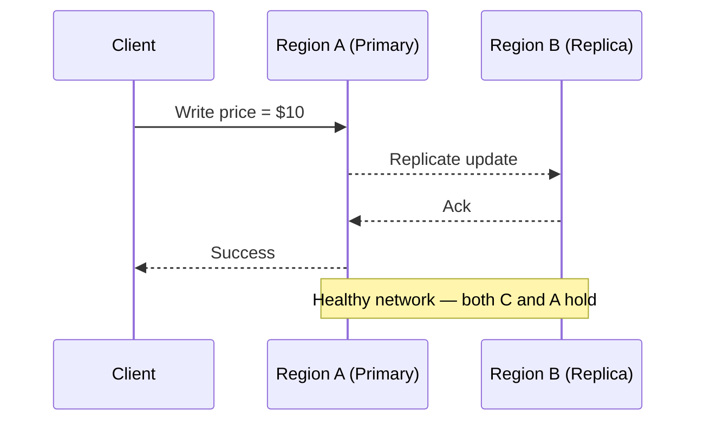

Now the network between regions breaks mid-flight:

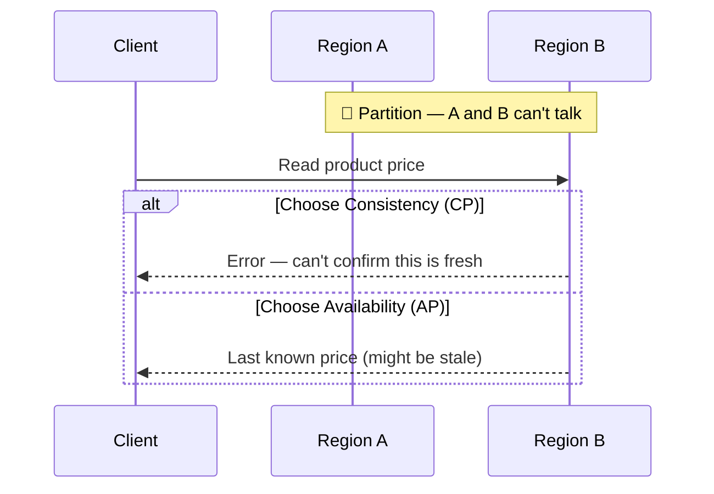

There's no clever protocol that lets Region B know about a write it's physically cut off from. It has exactly two options, and CAP is just naming that fork in the road.

### The Three Letters, Precisely

- **Consistency (CAP sense):** every read reflects the latest completed write, or the system errors instead of returning stale data. This is closer to *linearizability* than to ACID "consistency."
- **Availability (CAP sense):** every request to a non-failing node gets a non-error response. Note this says nothing about freshness, speed, or uptime SLOs — a system can be CAP-available and still return year-old data.
- **Partition tolerance:** the system has *defined* behavior when nodes can't talk to each other. You don't get to opt out of this for a real distributed system — you only get to choose what happens when it occurs.

### Choosing CP or AP — Start From the Invariant, Not the Label

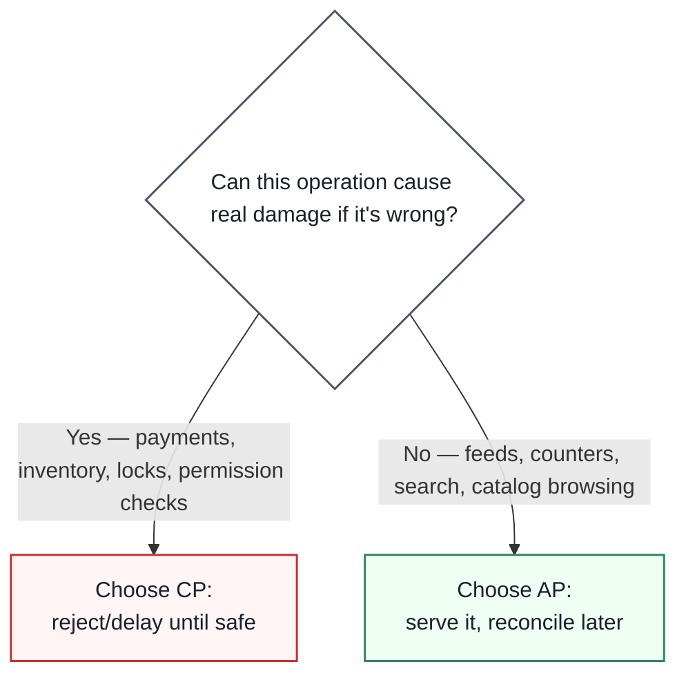

| Area | Typical Choice | Why |
|---|---|---|
| Payment ledger / billing | CP | A wrong write is worse than a temporarily rejected request |
| Inventory reservation (last item in stock) | CP | Two partitioned regions must not both sell the same unit |
| API key / permission revocation | CP on the enforcement path | A stale "still valid" check is a security bug, not just an inconvenience |
| Shopping cart | AP with merge logic | Accepting both partitions' updates and merging is better than rejecting |
| Product catalog browsing, search index | AP / eventual | Short staleness is invisible to most users |
| Likes, views, reaction counters | AP | Exact real-time accuracy isn't worth the coordination cost |

**CA (Consistency + Availability, no partition tolerance)** only really exists for a single-node system, or while the network happens to be healthy. Once nodes can be separated — which is a fact of life for any real distributed system — "we're just CA" usually means "we haven't defined what happens during a partition," not that we've somehow escaped the trade-off.

### Beyond CAP: PACELC

CAP only covers what happens *during* a partition — and partitions are rare. Most of the time the real, everyday trade-off is consistency vs. **latency**, which is what PACELC adds: *if* there's a **P**artition, choose **A**vailability or **C**onsistency; **e**lse, choose **L**atency or **C**onsistency. A cross-region quorum read is safer but slower than reading the nearest local replica — that trade-off exists on a perfectly healthy network, every single day, not just during outages.

### Enterprise Example
**Amazon DynamoDB** defaults reads to eventual consistency (AP-leaning) for speed, but explicitly offers a "strongly consistent read" option when the caller needs the CP guarantee instead — making the CAP choice a per-request decision rather than a database-wide label. **Google Cloud Spanner** takes the opposite default: it uses synchronized atomic clocks (TrueTime) to offer strong, CP-style consistency across regions globally, accepting extra write latency as the cost of that guarantee.

> **Trade-off:** Choosing CP doesn't mean "always unavailable," and choosing AP doesn't mean "always wrong" — it means during the rare window of an actual partition, CP sometimes says no and AP sometimes says something slightly stale. The engineering work is deciding, invariant by invariant, which behavior you can live with.

### 🎯 Most Asked Interview Questions — CAP Theorem

**Q1: What does CAP actually say — and what's the common misreading?**
*A: The common misreading is "pick any two of three, permanently" — as if a database wears one label forever. What it actually says is narrower: when nodes can't communicate, you have to choose between rejecting an operation (consistency) or serving it anyway with possibly stale data (availability) — for the operations affected by that partition, not the whole system, and not all the time.*

**Q2: Why is partition tolerance "not optional"?**
*A: Because networks fail — links saturate, packets drop, regions become unreachable — and that's true whether or not your architecture accounts for it. You don't get to choose whether partitions happen; you only get to choose what your system does when one does. If you haven't defined that behavior, you haven't avoided the trade-off, you've just left it undefined and it'll surprise you in production.*

**Q3: How is CAP consistency different from ACID consistency?**
*A: ACID consistency means a transaction moves the database from one valid state to another according to its constraints. CAP consistency is about time — whether a read reflects the most recent completed write, closer to what's formally called linearizability. They're both called "consistency" but they're answering different questions, so I'm careful to clarify which one I mean in an interview.*

**Q4: Give a real example of a CP choice and an AP choice, and explain why each is right for that case.**
*A: Inventory reservation for the last unit of a product is a CP case — if two partitioned regions both accept the sale, you've oversold, so it's better to make one of them fail the reservation. A shopping cart is the opposite — if a user adds items from two devices while replicas are split, merging both sets of additions when the partition heals is a fine outcome, and rejecting either add would just annoy the user for no real benefit.*

**Q5: What's PACELC, and why does it matter even when there's no partition?**
*A: PACELC extends CAP by pointing out that CAP only describes the rare case of an actual partition — but even on a perfectly healthy network, there's a everyday trade-off between consistency and latency. A quorum read across regions is safer but slower than reading a local replica. I bring this up in interviews because CAP alone makes it sound like the trade-off only matters during outages, and that's misleading — it's a daily latency-vs-correctness decision.*

**Q6: How would you decide whether a new feature's data should be CP or AP?**
*A: I'd start from the invariant, not the label — ask "what must never happen" versus "what can be temporarily stale." Double-charging a customer or overselling the last item in stock must never happen, so that's CP. A view counter or a recommendation list being a few seconds stale is invisible to the user, so that's AP. I try to avoid stamping an entire service with one acronym, because in practice different tables or endpoints in the same system often make different choices.*

---

Imagine a cricket World Cup final between India and Pakistan. Millions of users open a food delivery app simultaneously.

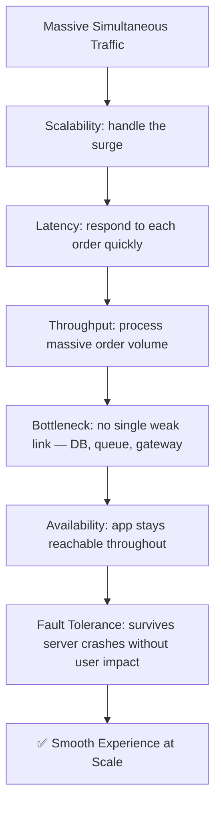

None of these six pillars work in isolation. A system can be scalable but still fail if latency is high. It can be fast but fail if it isn't fault tolerant. Real architectures — Netflix, Uber, Amazon, Swiggy, Instagram — are built by continuously balancing trade-offs across all six.

---

## Quick-Reference Interview Cheat Sheet

| Pillar | One-line Definition | Primary Techniques |
|---|---|---|
| **Scalability** | Handle growing load without breaking | Vertical scaling, horizontal scaling, auto-scaling |
| **Latency** | Time for a single request-response cycle | Caching, CDN, reducing DB round-trips |
| **Throughput** | Volume of requests handled per unit time | Load balancing, async processing, sharding |
| **Bottleneck** | The one component limiting the whole system | Profiling, distributed tracing, decoupling with queues |
| **Availability** | % of time system is up and reachable | Redundancy, multi-region, health checks |
| **Fault Tolerance** | System keeps working despite failures | Replication, circuit breakers, chaos engineering |
| **Consistent Hashing** | Stable key-to-node ownership as nodes change | Hash ring, virtual nodes, clockwise ownership |
| **CAP Theorem** | During a partition, pick consistency or availability | Quorum reads/writes, per-operation CP/AP choice, PACELC |

### Common Interview Follow-Up Questions
- "How would you improve throughput without sacrificing latency?" → batching vs. real-time trade-off
- "What's the difference between availability and fault tolerance?" → outcome vs. mechanism
- "How do you find a bottleneck in production?" → tracing, APM, load testing
- "CAP theorem — how does it relate to scalability?" → horizontal scaling forces you to choose consistency vs. availability during a partition
- "How does consistent hashing relate to CAP?" → it's placement logic that sits underneath either a CP or AP system — the ring decides *who* owns a key; CAP decides what that owner does when it's cut off from its replicas
