# Web Request Fundamentals: DNS, Client-Server, HTTP/HTTPS & Proxies

*Interview-ready reference guide*

---

## Why These Concepts Matter

"What happens when you type google.com into your browser?" is one of the most commonly asked system design interview questions — not because it's obscure, but because it quietly touches almost every fundamental concept in the field: DNS, caching, TCP/TLS, client-server architecture, encryption, CDNs, load balancers, and proxies. If you can walk through this flow confidently and explain *why* each step exists, you've demonstrated foundational depth that a lot of candidates skip past.

This guide covers that full journey, plus the two building blocks underneath it — client-server architecture and HTTP/HTTPS — and a topic that shows up constantly once systems scale: proxies vs. reverse proxies.

1. **What Happens When You Type a URL**
2. **Client-Server Architecture**
3. **HTTP vs. HTTPS**
4. **Proxy vs. Reverse Proxy**

---

## 1. What Happens When You Type a URL

**Definition:** The end-to-end journey a browser takes to turn a human-readable address like `youtube.com/javatechy` into a rendered page — involving URL parsing, DNS resolution, a secure connection, a round trip across the internet, and a rendering pipeline back on your screen.

### Step 1 — The Browser Parses the URL

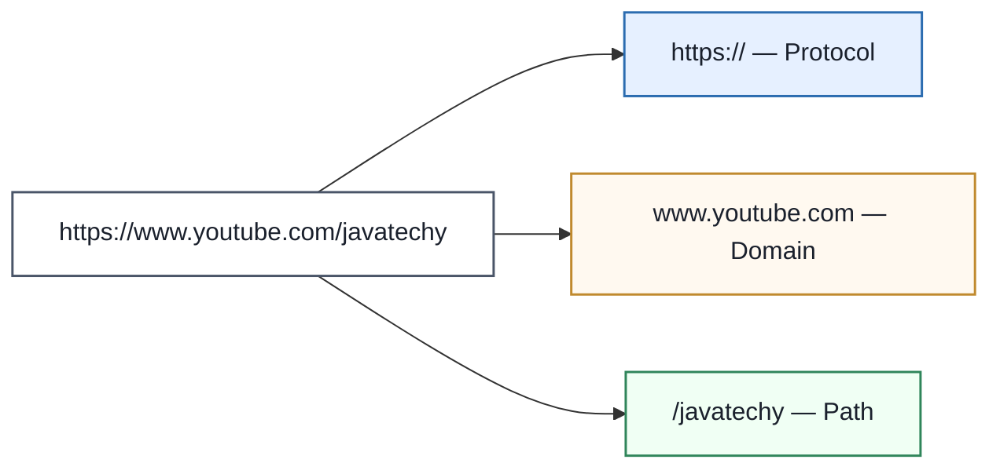

Humans use domain names (`google.com`) because they're memorable. Computers route using **IP addresses** (`142.250.183.206`) because that's what internet routing actually understands. Bridging that gap is the entire job of the next step.

### Step 2 — Check the Caches Before Asking DNS

Doing a full DNS lookup on every single request would be painfully slow, so the browser checks a chain of caches first, in order, and only falls through to a real DNS lookup if all of them miss.

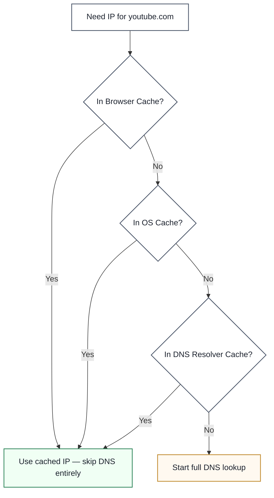

**Analogy:** think of it like your phone's contacts app. You don't look up a friend's number in a phonebook every time you call them — you check your saved contacts first (browser cache), then maybe your SIM card (OS cache), and only if neither has it do you actually go looking it up (DNS lookup).

### Step 3 — DNS Recursive Resolution (on a Cache Miss)

If nothing is cached, the browser doesn't ask one all-knowing DNS server — it walks a chain of servers, each pointing to the next, until it finds the answer.

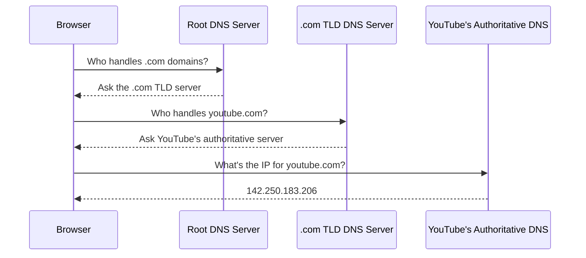

This chain — root → TLD → authoritative — is exactly why it's called *recursive* resolution: each server doesn't know the final answer, only who to ask next.

### Step 4 — Secure the Connection (TCP + TLS Handshake)

Having the IP address isn't enough to start sending data — for an HTTPS site, the browser and server first need to agree on an encrypted channel.

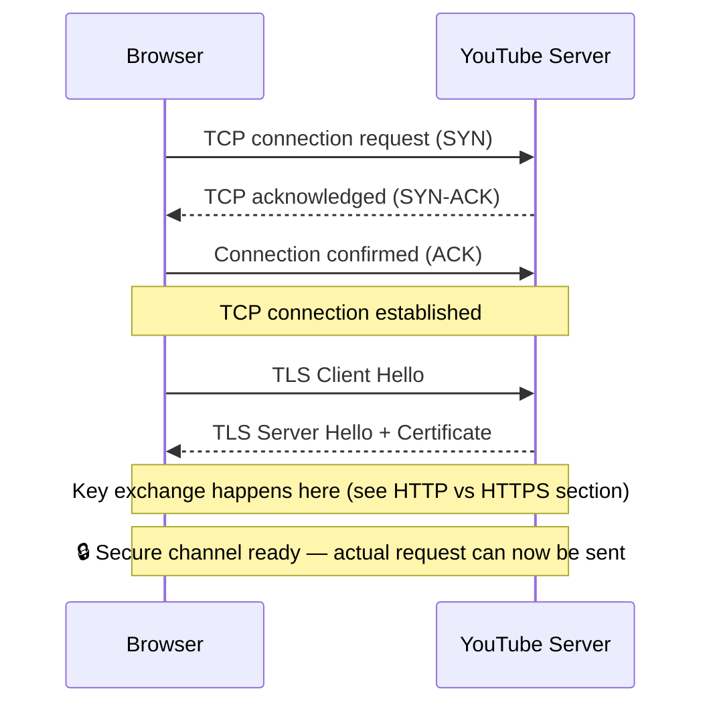

Only *after* this handshake completes does the browser build and send the real HTTP request — with the method, headers, cookies, and any payload.

### Step 5 — The Request Crosses the Internet

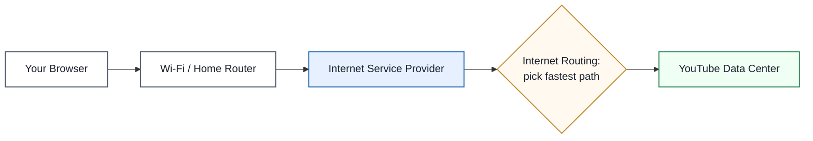

Your ISP doesn't send the packet straight to YouTube — it hands it off into a mesh of routers spread across the globe, and each router dynamically decides the fastest next hop, the same way a maps app recalculates the best route in real time.

### Step 6 — Response Path: CDN, Rendering, and What You Actually See

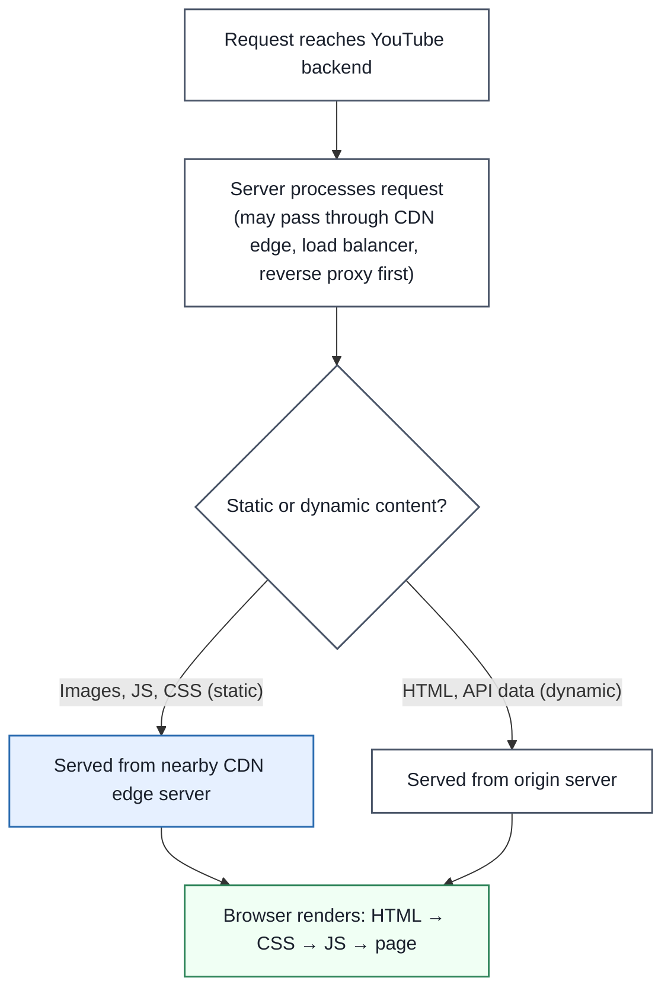

**Analogy:** it's the difference between driving to a Walmart distribution center for a single item versus grabbing it from a corner store five minutes away. Static assets (images, videos, JS bundles) get served from a **CDN** edge location near you instead of the original server halfway across the world — that's why YouTube still loads fast even with millions of concurrent users.

### Enterprise Example
Cloudflare's public DNS resolver (`1.1.1.1`) and Google's (`8.8.8.8`) exist specifically to make the "check caches, then resolve" step faster and more privacy-respecting than most ISP-provided resolvers. On the CDN side, YouTube and Google Search both rely on Google's own global edge network so that static assets are served from whichever data center is geographically closest to the request — the same principle behind Akamai and Cloudflare's CDN businesses.

> **Trade-off:** Every caching layer in this flow (browser, OS, DNS resolver, CDN) trades *freshness* for *speed*. A DNS record's TTL (time-to-live) controls exactly how long a cached IP is trusted before it's re-checked — set it too long and a server migration takes ages to propagate; set it too short and you're back to paying the full DNS lookup cost on every request.

### 🎯 Most Asked Interview Questions — URL Request Lifecycle

**Q1: Walk me through what happens when you type a URL and hit enter.**
*A: I'd break it into three phases: first, resolving the domain to an IP address — checking browser, OS, and resolver caches before falling back to a full recursive DNS lookup through root, TLD, and authoritative servers. Second, establishing a secure connection — a TCP handshake followed by a TLS handshake if it's HTTPS. Third, the actual request-response cycle — the request routes through the ISP and internet backbone to the server, which may pass through a CDN, load balancer, or reverse proxy before hitting the application, and the response comes back to be rendered. I always mention that static assets typically come from a CDN edge node rather than the origin server, since that's usually the detail that separates a surface-level answer from a strong one.*

**Q2: Why does the browser check multiple caches before doing a DNS lookup?**
*A: Because a full recursive DNS lookup involves multiple network round trips — root, TLD, authoritative — and doing that on every single request would add unnecessary latency for something that rarely changes. Browser cache, OS cache, and the resolver's own cache all exist to short-circuit that cost when the answer is already known and still within its TTL.*

**Q3: What's the difference between a TCP handshake and a TLS handshake?**
*A: The TCP handshake — SYN, SYN-ACK, ACK — just establishes a reliable connection between two endpoints; it has nothing to do with security. The TLS handshake happens on top of that established TCP connection and is what actually negotiates encryption — exchanging certificates and agreeing on a shared secret key so the data that follows is unreadable to anyone intercepting it. You need both: TCP for a reliable pipe, TLS for a private one.*

**Q4: Why doesn't every request go straight to the origin server?**
*A: Because hitting the origin for every request — especially for static assets like images or JS bundles that rarely change — wastes both latency and origin capacity. A CDN edge node near the user can serve that content in a few milliseconds instead of a few hundred, and a reverse proxy or load balancer in front of the origin can absorb traffic spikes, terminate SSL, and route to whichever backend instance is healthy.*

**Q5: What is DNS TTL, and why does it matter operationally?**
*A: TTL is how long a DNS record is allowed to be cached before it's considered stale and needs re-resolving. It's a direct trade-off: a long TTL means faster average lookups but slow propagation if you ever need to move a server to a new IP; a short TTL means you can fail over or migrate quickly, at the cost of more frequent DNS queries. Before any planned infrastructure migration, I'd lower the TTL in advance so the change propagates fast when it actually happens.*

**Q6: How does the internet "know" the fastest path to route my request?**
*A: There's no single map — routers use dynamic routing protocols (like BGP at the internet backbone level) to continuously share reachability information with their neighbors, and each router makes a local best-next-hop decision based on that information. It's less like a GPS with a full map and more like a relay race where each runner only needs to know who to hand off to next.*

---

## 2. Client-Server Architecture

**Definition:** A model where a **client** (anything that sends a request for data) and a **server** (anything that processes that request and sends back a response) are separate systems that communicate over a network — as opposed to one monolithic program doing everything locally.

### Real-World Analogy
You're at a restaurant. You don't walk into the kitchen and cook your own food — you tell the waiter what you want, the waiter relays it to the kitchen, the kitchen prepares it, and the waiter brings it back. You (the client) never talk to the kitchen (the server's internals) directly — you go through a defined interface (the waiter, i.e. the API).

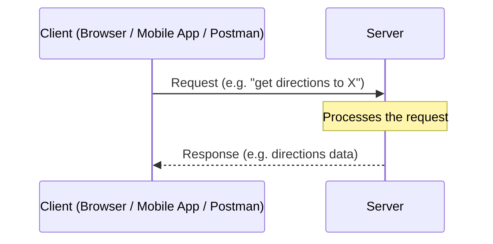

### What Counts as a Client vs. a Server

| | Client | Server |
|---|---|---|
| **Job** | Sends requests for data/information | Processes requests and returns responses |
| **Examples** | Chrome, the Instagram app, Postman, a mobile app | Google Maps backend, a banking API, a YouTube video server |
| **Initiates communication?** | Yes — clients initiate | No — servers respond (traditionally; WebSockets/SSE relax this) |

### Enterprise Example
When you open Google Maps and search a destination, the mobile app is purely a **client** — it captures your input and displays results, but all the actual route computation happens on Google's **servers**. This separation is exactly why Google can update its routing algorithm for a billion users overnight without anyone updating their app — the client just needs to know how to ask the question and render the answer.

> **Trade-off:** Client-server architecture centralizes logic and data on the server, which makes updates and consistency easy but means the server is a bottleneck and a single point of failure if not scaled properly (see the Scalability and Fault Tolerance sections in the System Design Pillars doc). The alternative, peer-to-peer architecture, removes that central bottleneck but makes consistency, discovery, and security much harder to reason about.

### 🎯 Most Asked Interview Questions — Client-Server Architecture

**Q1: What's the fundamental difference between a client and a server?**
*A: A client initiates a request for information — it doesn't matter if it's a browser, mobile app, or a tool like Postman. A server's job is to receive that request, process it, and send back a response. The relationship is directional: clients ask, servers answer, and that asymmetry is the whole basis of the model.*

**Q2: Can something be both a client and a server?**
*A: Yes, and it's actually the norm in real architectures. A backend service might be a server when it receives a request from a mobile app, but turn around and act as a client when it calls a payment gateway or a database. In microservices, most services are simultaneously servers to their callers and clients to their dependencies.*

**Q3: What are the advantages of client-server over a standalone application?**
*A: Centralizing logic and data on the server means you can update business logic, fix bugs, and roll out features without touching every client — think how Google can change ranking algorithms without anyone updating their browser. It also lets you enforce consistent security and validation in one place instead of trusting every client to do it correctly.*

**Q4: What are the downsides of centralizing everything on the server?**
*A: The server becomes a single point of failure and a scaling bottleneck if you don't architect around it — every client depends on it being up and fast. That's exactly why concepts like load balancing, horizontal scaling, caching, and CDNs exist: they're all ways of avoiding a single server, or even a single location, being a hard dependency for every request.*

**Q5: How does this model change with something like WebSockets?**
*A: Traditional client-server is strictly request-then-response — the server never speaks first. WebSockets (and similarly Server-Sent Events) keep a connection open so the server can push data to the client without the client asking again, which is what powers things like live chat or real-time notifications. It's still client-server in the sense that one side is a defined client and the other a defined server, but the strict "client always initiates" rule is relaxed.*

**Q6: Why do mobile apps, browsers, and tools like Postman all count as "clients" even though they look nothing alike?**
*A: Because "client" is a role defined by behavior, not by what the software looks like — anything whose job is to send a request and consume a response fits the definition. Postman doesn't render a UI or serve end users, but functionally it's doing the exact same thing a browser does: constructing an HTTP request and displaying the response.*

---

## 3. HTTP vs. HTTPS

**Definition:** HTTP (**H**yper**T**ext **T**ransfer **P**rotocol) is the set of rules that lets a client and server exchange requests and responses. HTTPS (**HTTP Secure**) is the same protocol, but wrapped in TLS encryption — so the same request/response conversation happens, except no one intercepting it in transit can read it.

### The Problem HTTP Alone Doesn't Solve

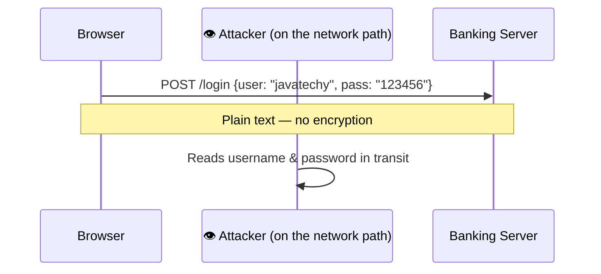

Your request already travels through your Wi-Fi router, ISP, and multiple internet routers before reaching the server (see Section 1) — with plain HTTP, anyone positioned along that path can read the raw contents, including passwords, if they intercept the traffic.

### How HTTPS Fixes It: the TLS Handshake

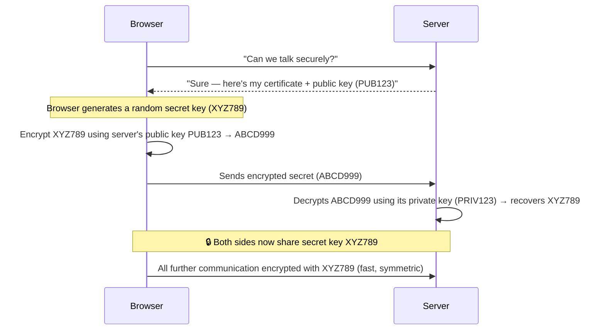

The clever part: **asymmetric encryption** (public/private key pairs) is only used briefly, to safely exchange a **symmetric** secret key. After that handshake, both sides switch to symmetric encryption for the rest of the session because it's dramatically faster — asymmetric crypto is too computationally expensive to use for every single packet.

### HTTP vs. HTTPS at a Glance

| | HTTP | HTTPS |
|---|---|---|
| **Port** | 80 | 443 |
| **Encryption** | None — plain text | TLS-encrypted |
| **Certificate required** | No | Yes (issued by a trusted Certificate Authority) |
| **Browser trust indicator** | "Not Secure" warning (modern browsers) | 🔒 padlock icon |
| **Performance cost** | None | Small — TLS handshake adds latency on connection setup (mitigated by session resumption, TLS 1.3, HTTP/2) |
| **Use case today** | Effectively none for production traffic | Default expectation for essentially all real-world sites |

### Enterprise Example
Google Chrome began actively marking all plain-HTTP sites as **"Not Secure"** in the address bar starting in 2018 — a deliberate move by Google to push the entire web toward HTTPS. Around the same time, **Let's Encrypt** (a free, automated certificate authority launched by the nonprofit ISRG) removed the cost barrier to getting a TLS certificate, which is a huge part of why HTTPS adoption went from a "nice to have for banks" to "the default for basically every website" within a few years.

> **Trade-off:** HTTPS isn't free — the TLS handshake adds round trips (and therefore latency) before the first byte of actual data flows, and encryption/decryption has a real CPU cost at scale. Modern mitigations (TLS session resumption, TLS 1.3 cutting handshake round trips, HTTP/2 multiplexing) have shrunk this cost enormously, which is exactly why there's essentially no excuse left to run production traffic over plain HTTP.

### 🎯 Most Asked Interview Questions — HTTP vs HTTPS

**Q1: What problem does HTTPS solve that HTTP doesn't?**
*A: HTTP sends data in plain text, so anyone positioned along the network path — a compromised router, a malicious Wi-Fi hotspot, an ISP — can read exactly what's being sent, including passwords and personal data. HTTPS wraps that same conversation in TLS encryption, so even if someone intercepts the traffic, all they see is unreadable ciphertext.*

**Q2: Walk me through what happens during a TLS handshake.**
*A: The client says it wants a secure connection, and the server responds with its TLS certificate and public key. The client generates a random symmetric secret key, encrypts it using the server's public key, and sends it over — only the server's matching private key can decrypt it, so an eavesdropper who intercepts that encrypted blob can't recover the secret. Once the server decrypts it, both sides hold the same secret key and switch to fast symmetric encryption for the rest of the session.*

**Q3: Why not just use asymmetric encryption for the entire session instead of switching to symmetric?**
*A: Asymmetric encryption is computationally expensive — it's fine for a one-time key exchange, but using it for every packet in a session would add real latency and CPU cost at scale. Symmetric encryption with a shared secret is much faster, so the handshake's whole purpose is to safely bootstrap that shared secret using asymmetric crypto just once, then hand off to the cheaper method.*

**Q4: What is a TLS certificate actually proving?**
*A: It's proving identity, not just enabling encryption — the certificate is signed by a trusted Certificate Authority and says "this public key genuinely belongs to youtube.com," not just anyone claiming to be YouTube. Without that verification step, you could still encrypt data, but you'd have no guarantee you're encrypting it to the real server and not an attacker doing a man-in-the-middle attack.*

**Q5: Does HTTPS slow things down noticeably?**
*A: There's a real but small cost — the handshake adds extra round trips before the first request can be sent. In practice this is heavily mitigated: TLS session resumption avoids a full handshake on reconnect, TLS 1.3 cut the handshake down to fewer round trips than 1.2, and HTTP/2 lets you multiplex many requests over one connection so you're not paying that setup cost repeatedly. For virtually all production systems today, the security benefit far outweighs the remaining latency cost.*

**Q6: If I see the padlock icon in my browser, does that mean the site is fully trustworthy?**
*A: No — it only guarantees the connection is encrypted and that the certificate matches the domain you're on, not that the site's content or operator is trustworthy. A phishing site can absolutely have a valid HTTPS certificate for its own look-alike domain; the padlock protects the transport layer, not your judgment about who you're talking to.*

---

## 4. Proxy vs. Reverse Proxy

**Definition:** A **forward proxy** sits in front of *clients* and makes requests on their behalf, hiding the client's identity from the server. A **reverse proxy** sits in front of *servers* and receives requests on their behalf, hiding the server's internal structure from the client. Same basic idea — an intermediary — pointed in opposite directions.

### Forward Proxy — Protects/Represents the Client

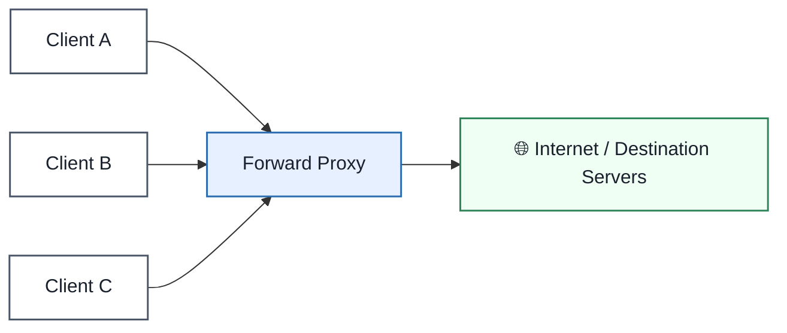

**Analogy:** think of a forward proxy like a personal shopper you send to the store instead of going yourself. The store only ever sees the shopper — it doesn't know who actually asked for the item, or that multiple different customers are all routing their purchases through the same shopper.

The destination server sees requests coming from the proxy, not from the individual clients behind it. This is why corporate networks use forward proxies to filter, log, or anonymize employee internet traffic.

### Reverse Proxy — Protects/Represents the Server

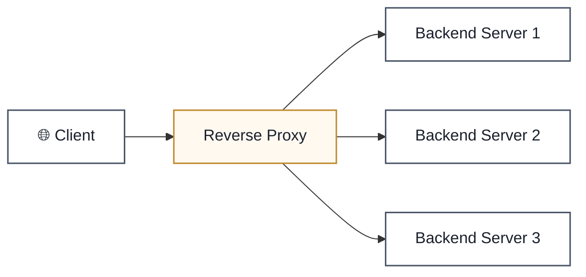

**Analogy:** a reverse proxy is like a hotel's front desk. Guests never call a specific room directly — they go through the front desk, which routes the request to housekeeping, room service, or maintenance as needed. From outside, all a guest ever sees is "the hotel" — they have no idea which specific staff member or department actually handled their request.

The client only ever talks to the reverse proxy — it has no idea which of potentially dozens of backend servers actually served the request. This is also where load balancing, SSL termination, caching, and rate limiting commonly live.

### Side-by-Side Comparison

| | Forward Proxy | Reverse Proxy |
|---|---|---|
| **Sits in front of** | Clients | Servers |
| **Hides identity of** | The client (from the server) | The server (from the client) |
| **Who configures it** | The client's network (e.g. a company IT department) | The server's operator (e.g. the backend team) |
| **Common uses** | Content filtering, anonymity, bypassing geo-restrictions, corporate traffic logging | Load balancing, SSL/TLS termination, caching, DDoS protection, routing to microservices |
| **Real-world tools** | Squid, corporate VPN/proxy gateways | NGINX, HAProxy, Cloudflare, AWS ALB |

### Enterprise Example
Most large-scale sites — including the YouTube flow described in Section 1 — put an **NGINX or cloud load balancer acting as a reverse proxy** directly in front of their application servers. It terminates SSL/TLS (so individual backend servers don't each need to manage certificates), load-balances traffic across many backend instances, and can serve cached responses without ever bothering the origin. On the forward proxy side, many corporate networks route all outbound employee traffic through a forward proxy (like Squid) to enforce content policies and prevent data exfiltration — the destination websites only ever see the company's proxy IP, never individual employee machines.

> **Trade-off:** Both proxy types add an extra network hop, which means a small amount of added latency — but in exchange, a reverse proxy centralizes SSL management, load balancing, and caching in one place instead of duplicating that logic across every backend server, and a forward proxy centralizes policy enforcement instead of trusting every individual client device to behave correctly.

### 🎯 Most Asked Interview Questions — Proxy vs. Reverse Proxy

**Q1: What's the core difference between a forward proxy and a reverse proxy?**
*A: It comes down to which side it's representing. A forward proxy sits in front of clients and makes requests on their behalf — the destination server only sees the proxy, not the real client. A reverse proxy sits in front of servers and receives requests on their behalf — the client only sees the proxy, not which specific backend server actually handled it. Same mechanism, opposite direction of who's being hidden.*

**Q2: Why would a company want a forward proxy for its employees?**
*A: Mainly for policy enforcement and visibility — content filtering to block certain sites, logging outbound traffic for security auditing, and masking individual employee IPs so external services just see the company's proxy. It also lets IT apply one consistent security policy centrally instead of configuring every single device separately.*

**Q3: What does a reverse proxy actually do for a backend architecture, beyond just forwarding requests?**
*A: In practice it's doing a lot more than pass-through — load balancing traffic across multiple backend instances, terminating SSL so individual app servers don't each need certificate management, caching responses to reduce origin load, and often rate limiting or basic DDoS mitigation. I think of it as the single front door that lets you change or scale what's behind it without the client ever noticing.*

**Q4: Can a reverse proxy and a load balancer be the same thing?**
*A: In practice, yes — most reverse proxies like NGINX or an AWS ALB do double duty as load balancers, since routing to one of several healthy backends is a natural extension of "receiving requests on behalf of a server." They're conceptually distinct roles — a reverse proxy is about the position in the architecture, load balancing is about the algorithm for choosing a destination — but the same piece of software commonly does both jobs.*

**Q5: Does using a proxy add latency, and is it worth it?**
*A: Yes, technically — every proxy hop is an extra network jump, so there's some added latency versus talking directly to the origin. In almost every real system it's worth it: a reverse proxy's SSL termination, caching, and load balancing typically save far more time than the hop itself costs, and the operational simplicity of having one place to manage certificates and routing is a significant win on its own.*

**Q6: How would you explain the difference to someone non-technical in one line?**
*A: A forward proxy is like sending an assistant to the store so the store never sees your face — it protects the client. A reverse proxy is like a hotel front desk that takes every guest request and routes it internally — it protects the server. Same idea, just pointed in opposite directions depending on who's being shielded from whom.*

---

## Bringing It All Together — One Request, Start to Finish

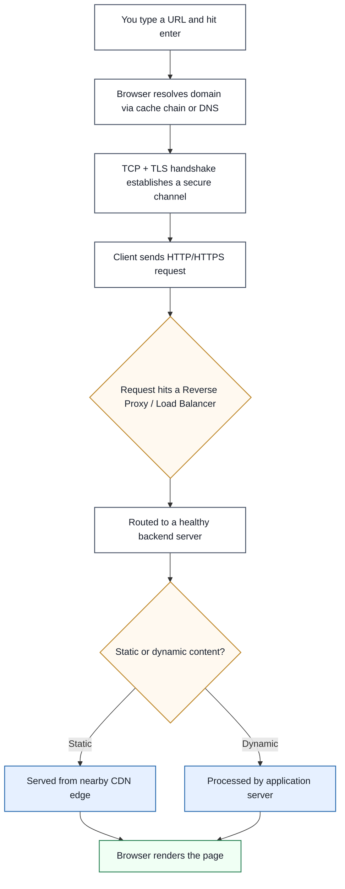

Every one of these steps — DNS caching, the TLS handshake, client-server separation, reverse proxying, CDN offload — exists because a naive "browser talks directly to one server" model breaks down at real-world scale. This is why the question shows up so often in interviews: it's really asking whether you understand *why* the modern web is built the way it is, not just what the acronyms stand for.

---

## Quick-Reference Interview Cheat Sheet

| Topic | One-line Definition | Primary Mechanisms |
|---|---|---|
| **URL Request Lifecycle** | Full journey from typed URL to rendered page | Cache chain, recursive DNS, TCP/TLS handshake, internet routing, CDN |
| **Client-Server Architecture** | Clients request, servers process and respond | Request/response cycle, centralized logic, horizontal scaling |
| **HTTP vs HTTPS** | Same protocol, HTTPS adds TLS encryption | Certificates, asymmetric key exchange → symmetric session encryption |
| **Proxy vs Reverse Proxy** | Forward proxy hides the client; reverse proxy hides the server | Load balancing, SSL termination, caching, content filtering |

### Common Interview Follow-Up Questions
- "Why is DNS resolution usually fast even though it involves multiple servers?" → multi-layer caching (browser/OS/resolver) short-circuits most lookups before a full recursive resolution is needed
- "Where does a reverse proxy fit in the request lifecycle from Section 1?" → right before the request hits the backend, often doing SSL termination and load balancing in the same step
- "Why does HTTPS use both asymmetric and symmetric encryption instead of just one?" → asymmetric is secure but slow, symmetric is fast but needs a safely-shared key — the handshake uses asymmetric once to bootstrap the symmetric key
- "Is a CDN a type of reverse proxy?" → conceptually yes — it's an intermediary in front of the origin server that can serve cached content on the origin's behalf, which is the same core idea as a reverse proxy applied at global scale
