# API Fundamentals

*Interview-ready reference guide*

---

## Why These Concepts Matter

Every product you've ever used — Stripe, GitHub, Slack, your banking app — is really just a set of well-designed **APIs** wired together. This guide covers the eight concepts that come up constantly once you move past "what is an API" and into "how do production APIs actually behave under retries, scale, and real-time demands":

1. **APIs** — the contract itself
2. **Idempotency** — making retries safe
3. **API Gateway** — the single front door
4. **REST vs. GraphQL** — two philosophies for shaping data
5. **WebSockets** — real-time, two-way communication
6. **Webhooks** — the provider notifies you, instead of you asking
7. **Rate Limiting** — protecting a service from being overwhelmed
8. **API Design** — the practical rules that make an API pleasant to use

---

## 1. APIs

**Definition:** An API (Application Programming Interface) is the agreed-upon way one piece of software asks another for something — what you can request, what you must send, what you'll get back, and what can go wrong. It's a **boundary**: callers use the API instead of reaching into a database, source code, or internal service directly.

### Real-World Analogy
An API is a restaurant's front desk, not its kitchen. You don't walk into the kitchen and start cooking — you tell the front desk what you want, using a menu (the contract) they've published. The kitchen can completely change its recipes, suppliers, or layout, and as long as the same dish comes out for the same order, you never notice.

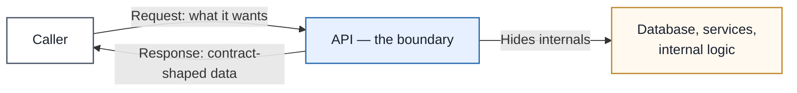

### Anatomy of an API Request/Response

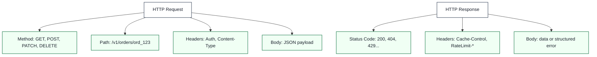

### Types of APIs

| Type | Used By | Needs |
|---|---|---|
| **Public** | External developers, customers | Docs, stable versioning, rate limits, monitoring |
| **Partner** | Selected external orgs | Contract review, per-tenant access, audit logs |
| **Internal** | Teams within one org | Clear ownership, timeouts, stable shapes even if "informal" |
| **Library** | Same running program | Function signatures, types — no network involved |

### Enterprise Example
**Stripe's** payment API is often cited as the gold standard for API design — versioned, extremely well-documented, with idempotency keys built into the contract from day one. That design discipline is a major reason Stripe became the default choice for payments infrastructure rather than just "a competent API among many."

> **Trade-off:** A strict API contract is what lets a server's internals evolve freely — but that same strictness means breaking the contract (renaming a field, changing a status code's meaning) breaks every client that depends on it. This is exactly why API versioning exists.

### 📋 Quick Reference — APIs
| | |
|---|---|
| **One-liner** | The agreed contract that lets one system safely depend on another without seeing its internals |
| **Use when** | Any time two independently-deployed pieces of software need to talk |
| **Watch out for** | Contracts that leak internal implementation details, making every change a breaking change |
| **Key idea to remember** | An API is a boundary — the value is in what it *hides*, not just what it exposes |

### 🎯 Most Asked Interview Questions — APIs

**Q1: What makes something an API contract versus just "a function that returns data"?**
*A: A contract is explicit and stable — it documents what callers can send, what they'll get back, what errors mean, and what limits apply, and it's meant to be relied on by code you don't control. A function inside your own codebase can change its behavior freely because you control every caller; an API can't, because external callers are depending on today's behavior continuing tomorrow.*

**Q2: Why do we say APIs are "boundaries"?**
*A: Because the whole value of the boundary is that the server's internals — database choice, internal services, caching layer — can change freely as long as the API's external behavior stays the same. Without that boundary, every internal refactor becomes a coordination problem across every team that consumes your service.*

**Q3: What's the difference between authentication and authorization in an API context?**
*A: Authentication answers "who is calling" — verifying identity via an API key, OAuth token, or session. Authorization answers "what are they allowed to do" — a signed-in user might still be forbidden from reading another tenant's data. I always check both, because a valid, authenticated caller is not automatically an authorized one.*

**Q4: Why shouldn't API keys or tokens go in the URL as query parameters?**
*A: Because URLs end up in browser history, proxy logs, server access logs, and referrer headers — anywhere the URL is logged, the secret leaks with it. Headers like `Authorization` are the right place, since they're not logged or cached the same way by default.*

**Q5: What should a well-designed API do when a request fails?**
*A: Return a clear, predictable status code plus a structured error body — not a 200 OK with `{"success": false}` buried in the payload, since that forces every client to parse the body just to know if the call worked. Clients, proxies, and monitoring tools all rely on the status code to make routing and retry decisions, so it needs to be accurate.*

---

## 2. Idempotency

**Definition:** An operation is idempotent when running it multiple times produces the same intended effect as running it once. It's the property that makes retries safe — critical because networks drop responses, clients time out, and retrying a non-idempotent request (like "charge this card") can silently double-charge a customer.

### The Problem: Retries Without Idempotency

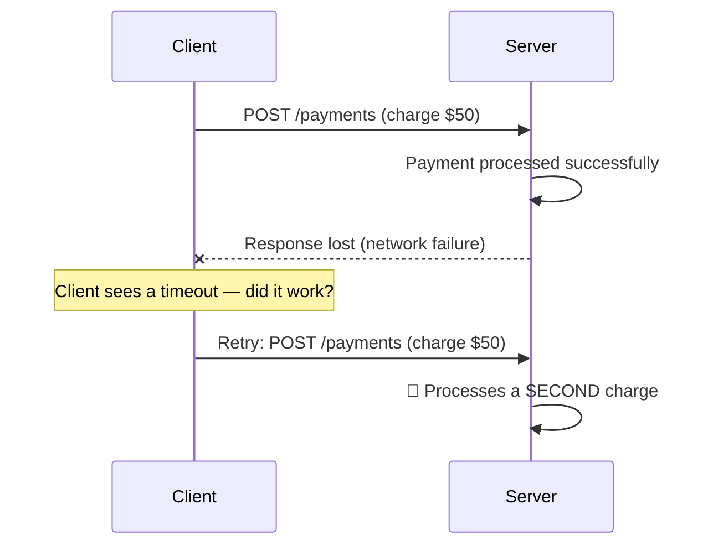

### The Fix: Idempotency Keys

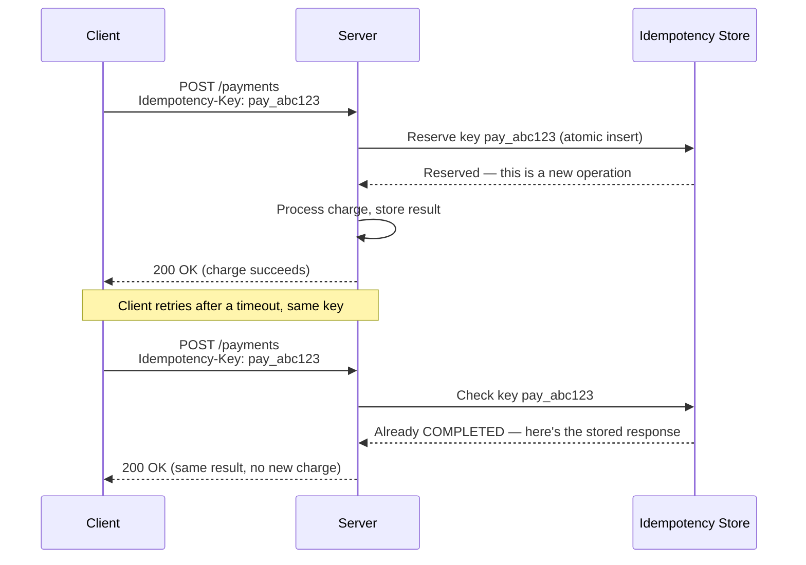

### Natural vs. Engineered Idempotency

| | Natural Idempotency | Engineered Idempotency |
|---|---|---|
| **How it works** | The operation itself sets a final state | The system tracks a stable operation ID to detect duplicates |
| **Example** | `PUT /users/123/status` → `ACTIVE` (repeating it changes nothing further) | `POST /payments` with an `Idempotency-Key` header |
| **HTTP methods** | `GET`, `PUT`, `DELETE` are idempotent by definition | `POST`, and some `PATCH` operations, need explicit design |

### Enterprise Example
**Stripe** popularized the `Idempotency-Key` header pattern industry-wide — every `POST` request that creates a charge, refund, or transfer accepts a client-generated idempotency key, and Stripe stores it for 24 hours so a retried request with the same key returns the original result instead of creating a duplicate.

> **Trade-off:** Idempotency isn't free — it requires durable storage for keys, atomic reservation logic to prevent two concurrent retries from both "winning," and a retention policy (keep the record too briefly and a legitimate late retry gets treated as new; keep it forever and storage grows unbounded).

### 📋 Quick Reference — Idempotency
| | |
|---|---|
| **One-liner** | Same request sent twice → same effect as sent once |
| **Use when** | Any operation with a side effect that a client might retry — payments, order creation, job submission |
| **Watch out for** | Generating a new idempotency key on every retry (defeats the whole purpose), or non-atomic key reservation (race condition lets two retries both process) |
| **Key idea to remember** | Idempotency ≠ exactly-once execution — it means repeated attempts converge on one intended effect, not that the code definitely ran only once |

### 🎯 Most Asked Interview Questions — Idempotency

**Q1: Why is POST not idempotent by default, but PUT is?**
*A: PUT is defined to replace or create a resource at a known URI, so sending the same PUT twice leaves the resource in the same final state — the second call just re-sets what's already set. POST typically means "create a new resource" or "start processing," so by default each call is a new, distinct operation — that's exactly why POST endpoints with side effects need an explicit idempotency key to become safe to retry.*

**Q2: Walk me through how you'd implement idempotency keys server-side.**
*A: The client generates a unique key before the first request and sends it in a header. The server does an atomic insert to "reserve" that key — if the insert succeeds, this is a new operation and the server processes it; if it fails because the key exists, the server looks up the stored result and returns that instead of re-running the operation. The reservation has to be atomic — a naive check-then-insert has a race where two concurrent retries can both pass the check and both process the payment.*

**Q3: What happens if the server crashes after reserving a key but before finishing the operation?**
*A: This is why you need a lease, not just a status flag — store a `locked_until` timestamp alongside the `IN_PROGRESS` status. If a duplicate request comes in while the lease is still valid, the server tells the client to retry later, assuming the original is still working. If the lease has expired, the server assumes the original owner crashed and lets the duplicate claim the lease and run the operation instead.*

**Q4: Is idempotency the same as exactly-once delivery?**
*A: No, and conflating them is a common mistake. Idempotency guarantees that no matter how many times an operation is attempted, the final effect is the same as running it once — it doesn't guarantee the underlying code only executed one time. Exactly-once delivery is a much stronger, harder guarantee that's usually only available within a single system boundary, like a message broker's internal exactly-once mode, and doesn't automatically extend to an external API call the code makes along the way.*

**Q5: How does idempotency apply outside of HTTP APIs — say, in a message queue consumer?**
*A: The exact same principle applies — most message brokers offer at-least-once delivery, meaning a consumer can receive the same message more than once after a crash, rebalance, or redelivery. The consumer needs a durable way to detect it's already processed a given message ID, usually via a unique constraint on a processed-messages table or the business table itself, and should only acknowledge the message after that write is durably committed.*

---

## 3. API Gateway

**Definition:** An API Gateway is a single server that sits between clients and a system's backend services, so clients send every request to one place instead of talking to each microservice directly. The gateway handles routing, authentication, rate limiting, and other cross-cutting concerns centrally.

### Without a Gateway — Every Client Talks to Every Service

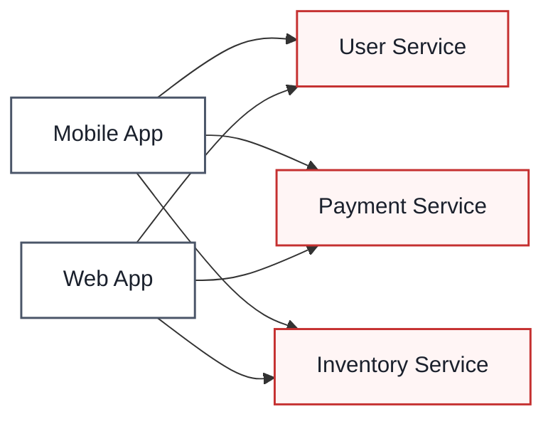
Every client needs to know where every service lives, and every service needs to implement its own auth, rate limiting, and validation. That's duplicated effort *and* a scattered attack surface.

### With a Gateway — One Front Door

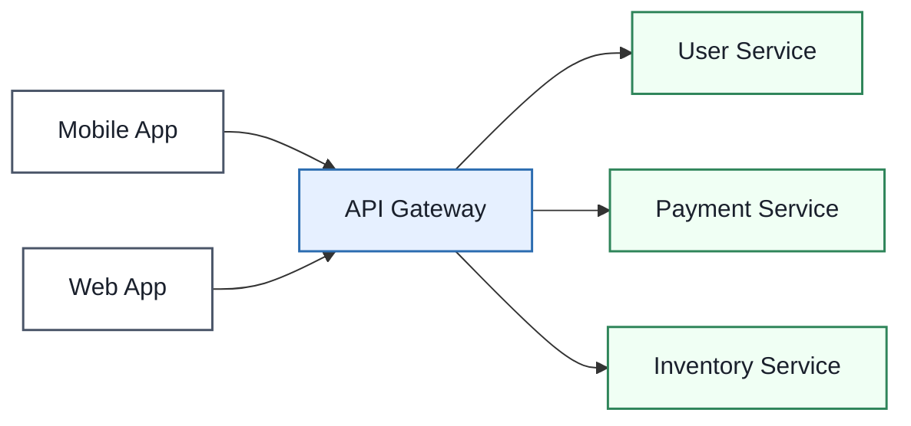

### What Happens Inside the Gateway (Order Placement Example)

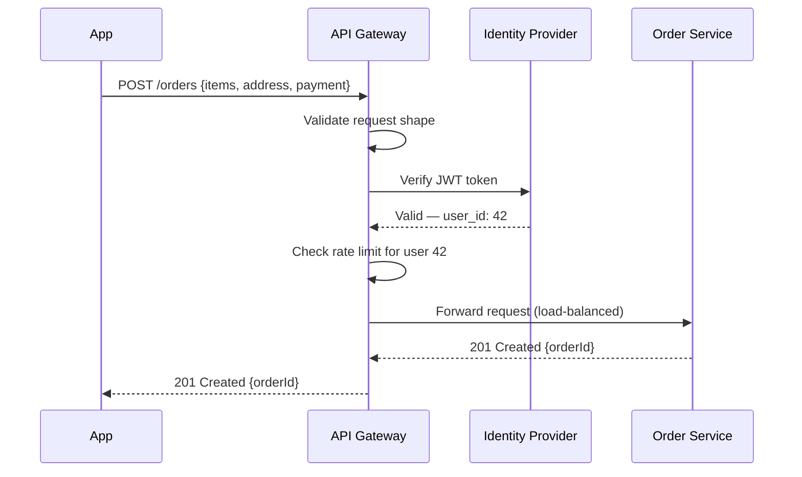

### Core Features
| Feature | Job |
|---|---|
| **Authentication/Authorization** | Verify identity and permissions once, centrally |
| **Rate Limiting** | Block excessive traffic before it reaches backend services |
| **Load Balancing** | Route to healthy service instances |
| **Caching** | Serve frequent responses without hitting the backend |
| **Request Transformation** | Reshape requests/responses between client and backend formats |
| **Circuit Breaking** | Stop routing to a service that's failing repeatedly |
| **Logging & Monitoring** | One place to observe traffic across all services |

### Enterprise Example
**Netflix's Zuul** gateway (and its successor) sits in front of hundreds of internal microservices, handling authentication, routing, and resiliency for every device — TV, phone, browser — hitting Netflix's backend, so individual teams don't each reimplement auth and rate limiting. **Amazon API Gateway** offers the same pattern as a managed AWS service for teams that don't want to run their own.

> **Trade-off:** Centralizing everything behind a gateway makes it a single point of failure and a potential bottleneck if not scaled and made highly available itself — you're trading distributed complexity for a concentrated dependency that now needs its own redundancy story.

### 📋 Quick Reference — API Gateway
| | |
|---|---|
| **One-liner** | The single front door that centralizes auth, rate limiting, and routing for a microservices system |
| **Use when** | You have more than a couple of backend services and don't want every client managing service discovery and cross-cutting concerns itself |
| **Watch out for** | Making the gateway a single point of failure — it needs its own redundancy and load balancing |
| **Key idea to remember** | A reverse proxy and an API gateway overlap heavily — the gateway is a reverse proxy with API-aware features (auth, rate limiting, transformation) layered on top |

### 🎯 Most Asked Interview Questions — API Gateway

**Q1: What problem does an API Gateway solve in a microservices architecture?**
*A: Without it, every client needs to know the location of every backend service, and every service has to implement its own authentication, rate limiting, and validation — that's duplicated logic and a much bigger attack surface. The gateway centralizes those cross-cutting concerns into one place, so clients talk to a single endpoint and backend teams don't each reinvent security and traffic control.*

**Q2: Doesn't putting everything behind one gateway create a single point of failure?**
*A: Yes, and that's the real cost of the pattern — the gateway itself needs to be deployed with redundancy, health checks, and horizontal scaling just like any other critical service, usually behind its own load balancer. I'd never run a single gateway instance in production; the gateway layer needs the same fault-tolerance thinking as the services it protects.*

**Q3: How is an API Gateway different from a plain reverse proxy or load balancer?**
*A: A reverse proxy just forwards requests; a load balancer just distributes them across instances. An API Gateway typically does both of those *plus* API-specific concerns — authentication, per-client rate limiting, request/response transformation, and routing based on the API contract, not just the URL. In practice, many gateways are built as a reverse proxy with these extra layers added on top.*

**Q4: How would you design rate limiting inside an API Gateway?**
*A: I'd key the limit by client identity — user ID or API key, not just IP, since IPs are shared behind NAT and unreliable — and implement it with something like a Redis counter with a TTL matching the window, checked before the request is forwarded to any backend. The gateway is the right place for this because it's the one component that sees every request before it fans out to services, so it can reject over-limit traffic without wasting backend capacity.*

**Q5: Can a gateway do request transformation, and why would that matter?**
*A: Yes — for example, translating a plain-text address a client sends into GPS coordinates a delivery microservice actually expects, or converting a legacy service's XML response into JSON for a modern frontend. It matters because it decouples client-facing contracts from internal service contracts, so backend teams can evolve their own data shapes without forcing every client to adapt at the same time.*

---

## 4. REST vs. GraphQL

**Definition:** REST structures an API around fixed resources and URLs, using standard HTTP methods (`GET`, `POST`, `PUT`, `DELETE`) to act on them. GraphQL exposes a single endpoint backed by a typed schema, letting the client specify exactly which fields it wants in one query — trading REST's simplicity for GraphQL's flexibility.

### REST — Fixed Endpoints, Server Decides the Shape

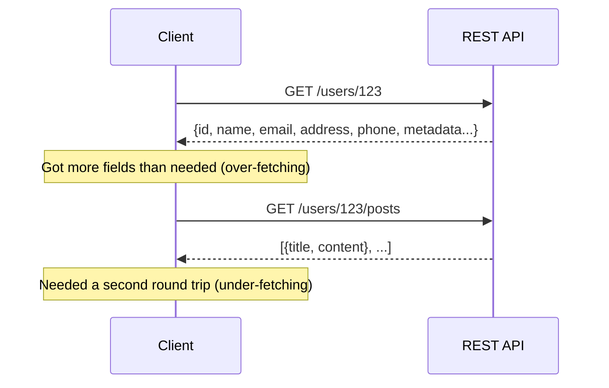

### GraphQL — One Endpoint, Client Decides the Shape

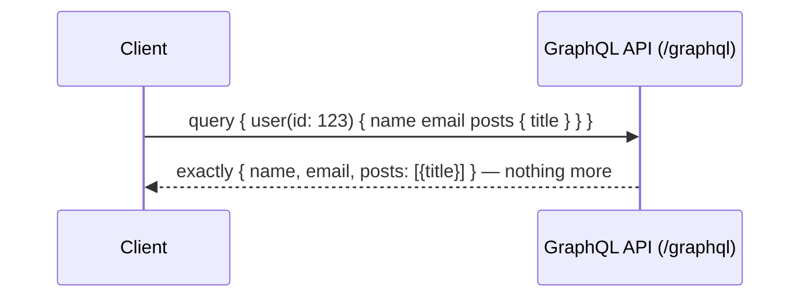

### Side-by-Side Comparison

| | REST | GraphQL |
|---|---|---|
| **Structure** | Multiple endpoints, one per resource | One endpoint, schema-driven queries |
| **Data shape** | Server decides — risk of over/under-fetching | Client decides — precise field selection |
| **Caching** | Simple — standard HTTP caching (CDNs, browsers) works out of the box | Harder — queries are usually `POST`, so HTTP caching doesn't apply directly |
| **Versioning** | Often needs `/v1`, `/v2` URL versioning | New fields can be added without breaking old queries |
| **Real-time** | Needs a separate mechanism (WebSockets, polling) | Native support via subscriptions |
| **Learning curve** | Low — works with `curl`, browsers, basic HTTP tools | Higher — needs a GraphQL client, schema, resolvers |
| **Risk profile** | Predictable load — endpoints are fixed | A poorly-formed nested query can trigger a full table scan |

### Enterprise Example
**GitHub** runs both: its REST API (v3) remains supported for simplicity and backward compatibility, while its GraphQL API (v4) is recommended for anything that needs to fetch related data — repos, issues, and pull requests — in a single request instead of chaining several REST calls. **Facebook**, which invented GraphQL in 2015, built it specifically to solve mobile over-fetching, where every unnecessary byte cost real money and battery on 2G/3G connections.

> **Trade-off:** GraphQL's flexibility is also its biggest operational risk — because the client constructs the query, a deeply nested or unbounded query can trigger a very expensive database operation that a fixed REST endpoint would never allow. Production GraphQL APIs need query depth limits and cost analysis to guard against this.

### 📋 Quick Reference — REST vs. GraphQL
| | |
|---|---|
| **One-liner** | REST: fixed endpoints, server decides the data shape. GraphQL: one endpoint, client decides. |
| **Use REST when** | Simple API, third-party integrations, want free HTTP caching |
| **Use GraphQL when** | Multiple clients need different data shapes, deeply nested/related data, real-time subscriptions matter |
| **Key idea to remember** | They're not mutually exclusive — many companies run GraphQL for client-facing apps and REST for internal/admin services in the same architecture |

### 🎯 Most Asked Interview Questions — REST vs. GraphQL

**Q1: What are over-fetching and under-fetching, and how does GraphQL solve them?**
*A: Over-fetching is getting more data than you need — a REST endpoint returning a full user object when the client only wanted the name. Under-fetching is the opposite — needing multiple round trips because one endpoint doesn't include related data, like fetching a user and then separately fetching their posts. GraphQL solves both because the client specifies exactly which fields it wants, across related resources, in a single request.*

**Q2: Why is HTTP caching harder with GraphQL than REST?**
*A: REST benefits from HTTP's built-in caching because GET requests are cacheable by URL — `/users/123` is a stable cache key. GraphQL typically sends all queries as POST requests to a single `/graphql` endpoint, and since the query is in the body rather than the URL, standard HTTP and CDN caching can't key off it the same way — you usually need application-level caching or a specialized GraphQL caching layer instead.*

**Q3: How can a GraphQL API be vulnerable to denial-of-service in a way REST typically isn't?**
*A: Because the client constructs the query, someone can write a deeply nested query — user → posts → comments → author → posts → comments... — that explodes into an enormous number of database calls or a full table scan on the backend. REST endpoints are predefined by the server, so the server controls exactly what data operations each endpoint can trigger; GraphQL needs explicit guardrails like query depth limits, complexity scoring, and timeouts to prevent this.*

**Q4: If a team is already comfortable with REST, when is it actually worth adopting GraphQL?**
*A: The strongest signal is multiple client types — web, mobile, third-party — with meaningfully different data needs from the same backend, since that's exactly the over/under-fetching problem GraphQL was built to solve. If it's a simple API with one main consumer and no complex relational data, I'd stick with REST — GraphQL's schema, resolver, and tooling overhead isn't worth paying for a problem you don't have.*

**Q5: Can REST and GraphQL coexist in the same system?**
*A: Yes, and it's actually a common pattern — GraphQL for client-facing product surfaces where flexibility and precise data fetching matter, REST for internal services, admin tools, and third-party integrations where simplicity and standard HTTP caching are more valuable than flexibility. GitHub's public API is a good real example of exactly this split.*

---

## 5. WebSockets

**Definition:** WebSockets are a protocol that establishes a persistent, full-duplex (two-way) connection between a client and server over a single TCP connection — after an initial HTTP handshake, both sides can send messages to each other at any time, without the request-response back-and-forth HTTP normally requires.

### The Handshake — Upgrading From HTTP

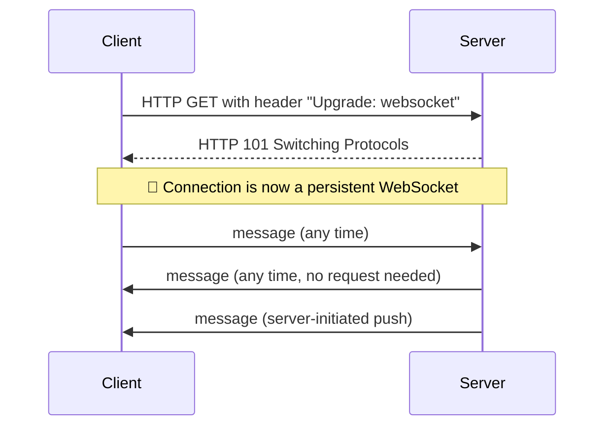

### WebSockets vs. Polling vs. Long-Polling

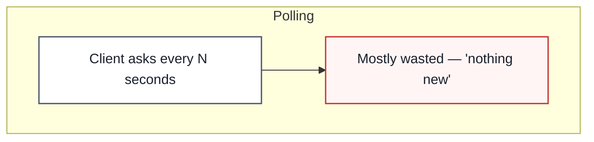

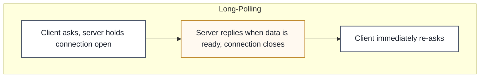

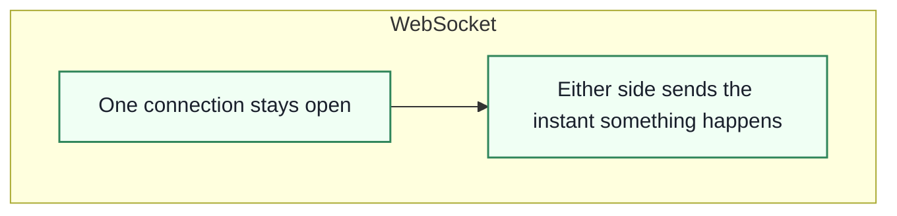

| | Polling | Long-Polling | WebSockets |
|---|---|---|---|
| **Latency** | High — bound by poll interval | Medium — bound by request cycle time | Low — near-instant |
| **Wasted requests** | Many ("nothing new" responses) | Fewer | None — messages only sent when there's data |
| **Direction** | Client asks only | Client asks only | Either side can send anytime |
| **Resource usage** | Many short-lived connections | Many held-open connections | One long-lived connection per client |

### Enterprise Example
**Slack** uses WebSockets to deliver messages and typing indicators instantly rather than having every client poll for updates — this is what makes a Slack workspace feel "live" instead of refresh-based. Real-time multiplayer games and trading platforms rely on the same mechanism because milliseconds of added latency are directly felt by the user.

> **Trade-off:** A persistent connection per client means a server holding a WebSocket open for every connected user is fundamentally more stateful and resource-intensive than a stateless REST server handling short-lived requests — scaling WebSocket infrastructure typically needs dedicated load balancers with connection affinity and horizontally distributed WebSocket servers, which is real added operational complexity most REST APIs never have to think about.

### 📋 Quick Reference — WebSockets
| | |
|---|---|
| **One-liner** | A persistent, two-way connection — either side can push a message anytime, no polling needed |
| **Use when** | Chat, live collaboration, multiplayer games, trading platforms, live notifications |
| **Watch out for** | Corporate proxies/firewalls that block WebSocket upgrades; always have a fallback (long-polling) |
| **Key idea to remember** | The connection starts as a normal HTTP request and *upgrades* — it's not a separate protocol from scratch |

### 🎯 Most Asked Interview Questions — WebSockets

**Q1: How does a WebSocket connection actually get established?**
*A: It starts as a completely normal HTTP GET request, but with an `Upgrade: websocket` header. If the server supports it, instead of a normal response it replies with HTTP status 101 Switching Protocols, and from that point on the same underlying TCP connection is repurposed as a persistent, bidirectional WebSocket channel instead of being closed after one request-response cycle.*

**Q2: Why are WebSockets better than polling for real-time features?**
*A: Polling means the client repeatedly asks "anything new?" on a timer, and most of those requests come back empty — that's wasted requests and it still adds latency up to the poll interval. WebSockets keep one connection open, so the server can push data the instant something happens, with no polling overhead and dramatically lower latency for anything that needs to feel truly live.*

**Q3: What are the operational challenges of running WebSockets at scale?**
*A: Unlike stateless REST requests that any server instance can handle, a WebSocket connection is stuck to whichever server instance accepted it, so load balancers need connection affinity or you need a pub/sub layer so a message destined for a user connected to server A can be routed there even if it originated on server B. You also need reconnection logic and heartbeat/ping-pong messages on the client, since networks drop persistent connections more often than they drop short HTTP requests.*

**Q4: What's a fallback strategy if a client's network doesn't support WebSockets?**
*A: Long-polling is the standard fallback — some corporate proxies and older infrastructure block the WebSocket upgrade handshake entirely. A production real-time system should detect a failed WebSocket connection attempt and gracefully degrade to long-polling rather than just breaking the feature for that user.*

**Q5: Are WebSockets always the right choice for real-time-feeling features?**
*A: No — if the data only flows one direction, server-to-client, Server-Sent Events (SSE) are simpler to run and use plain HTTP, so I'd reach for WebSockets specifically when the client also needs to send frequent updates, like a chat message or a game input. Using a full bidirectional WebSocket for something that's really just "notify me when this changes" adds connection-management complexity you don't need.*

---

## 6. Webhooks

**Definition:** A webhook is an HTTP request one system (the **provider**) sends to another (the **consumer**) automatically when something happens — flipping the usual direction of communication so the consumer doesn't have to keep asking "did anything change yet?"

### The Problem: Polling for Events

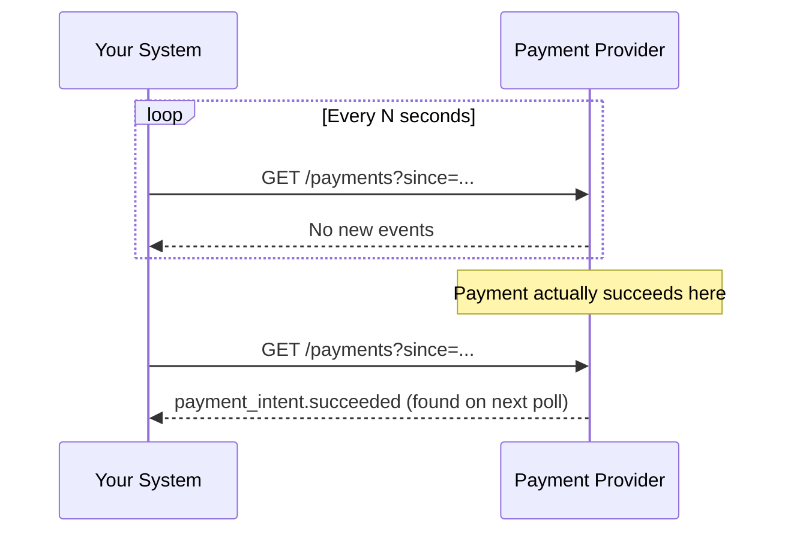

### The Fix: The Provider Pushes to You

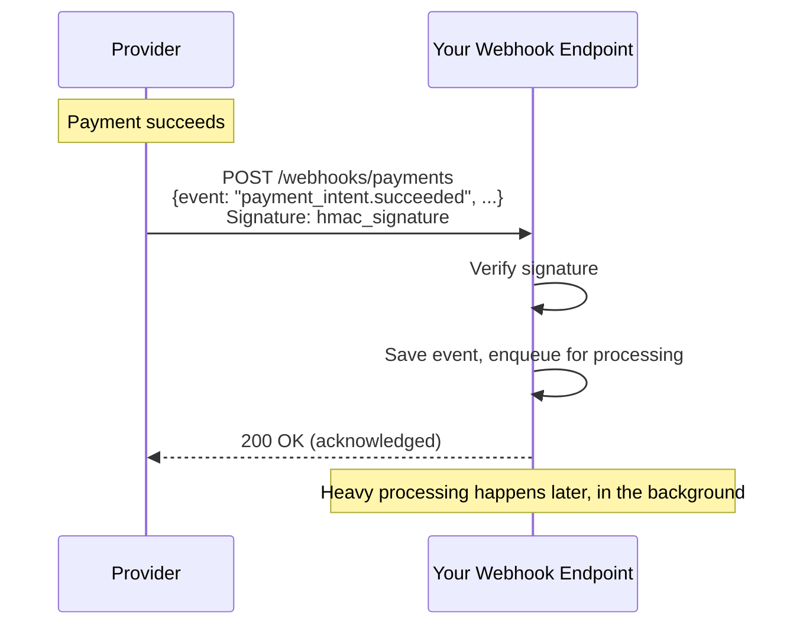

### Building a Safe Receiver — What Can Go Wrong

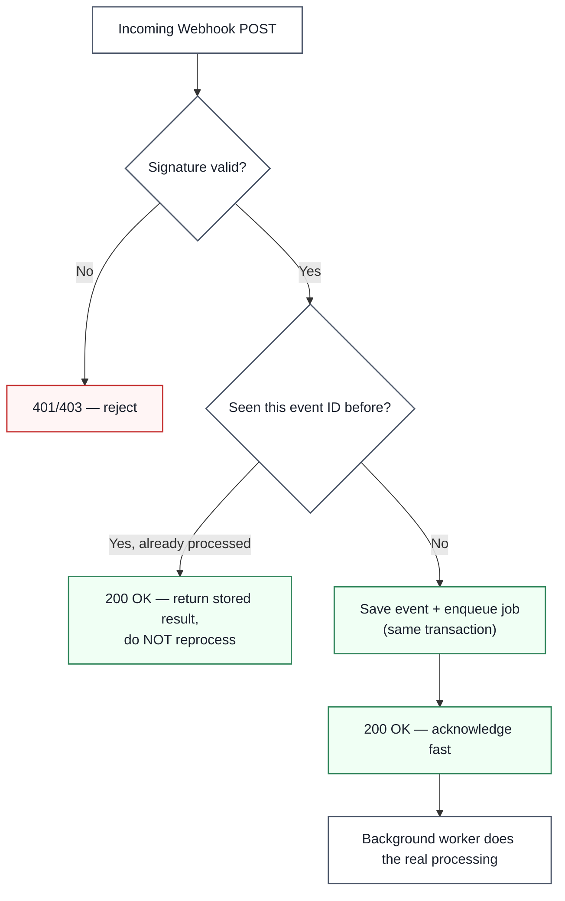

### Enterprise Example
**Stripe** and **GitHub** are the textbook webhook providers: Stripe sends signed `POST` requests (`Stripe-Signature` header) for every payment lifecycle event, and GitHub sends events like `pull_request.opened` to CI systems and bots. Both assume **at-least-once delivery** — their own documentation explicitly tells receivers to deduplicate by event ID, which is exactly why idempotency (Section 2) and webhooks show up together so often in real systems.

> **Trade-off:** Webhooks trade the wasted work of polling for the operational burden of running a public, internet-facing endpoint that must verify signatures, tolerate duplicate and out-of-order delivery, and never lose an event between "acknowledged" and "safely saved." Many production systems keep a periodic reconciliation poll running anyway, specifically to catch any webhook that got silently dropped.

### 📋 Quick Reference — Webhooks
| | |
|---|---|
| **One-liner** | The provider pushes an HTTP request to you when something happens, instead of you polling for it |
| **Use when** | You need to react to events owned by another system, and polling would waste resources or add too much delay |
| **Watch out for** | Skipping signature verification (anyone can fake events), doing heavy processing synchronously in the handler, assuming events arrive in order |
| **Key idea to remember** | Always assume at-least-once, possibly-out-of-order delivery — design the receiver to be duplicate-tolerant from day one |

### 🎯 Most Asked Interview Questions — Webhooks

**Q1: How do webhooks fundamentally differ from an API a client calls?**
*A: A normal API is pull-based — your system decides when to ask for data. A webhook flips that: the provider decides when something worth telling you about has happened, and pushes an HTTP request to an endpoint you've registered. That's a big architectural shift because now your system has to run and secure a public receiving endpoint instead of just making outbound calls.*

**Q2: Why is signature verification critical for webhook receivers?**
*A: Because a webhook endpoint is a public URL — without verifying a signature (usually HMAC, computed from the raw request body and a shared secret), anyone who discovers that URL could send fake events, like a forged `payment_succeeded` that grants access or ships an order for free. The receiver has to compute the same signature independently and compare it before trusting anything in the body.*

**Q3: What does it mean to design a webhook receiver as "duplicate-tolerant," and why does it matter?**
*A: Most providers guarantee at-least-once delivery, meaning the same event can legitimately arrive more than once — after a timeout, a manual redelivery, or an operator replaying old events. The receiver needs to check a stable event ID against durable storage before processing, and if it's already been handled, just return success without redoing the side effect — otherwise a harmless retry becomes a duplicate charge or a duplicate email.*

**Q4: Why shouldn't a webhook handler do all its processing synchronously before responding?**
*A: Because the provider is waiting for a response and will likely time out and retry if it takes too long — doing six downstream API calls in the handler risks that timeout, causing the provider to redeliver an event you actually did receive. The right pattern is to verify, save the event, and enqueue a background job as fast as possible, then let a worker do the actual business logic afterward.*

**Q5: If webhooks can be delayed, duplicated, or arrive out of order, why not just rely entirely on polling instead?**
*A: Because polling has a real cost too — wasted requests when nothing has changed, and delay bounded by however often you poll. In practice, the strongest systems use both: webhooks for fast notification most of the time, plus an occasional reconciliation poll against the provider's API to catch anything a dropped or missed webhook would have silently lost. Neither mechanism alone is fully reliable on its own.*

---

## 7. Rate Limiting

**Definition:** Rate limiting caps how many requests a client can make in a given time window, protecting a service from being overwhelmed by excessive traffic — whether from a bug, a traffic spike, or a deliberate abuse/DDoS attempt.

### Token Bucket — the Most Common Approach

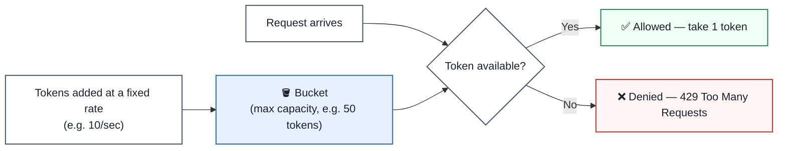
Allows short bursts up to the bucket's capacity — useful when occasional spikes are fine as long as the average rate holds.

### Leaky Bucket — Smooths Bursts Into a Steady Rate

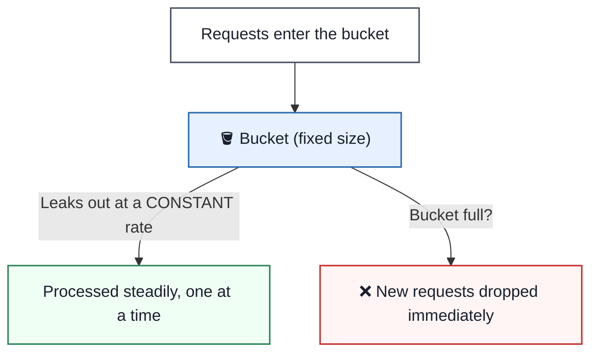
Unlike token bucket, it doesn't tolerate bursts — it enforces a perfectly steady processing rate regardless of how requests arrive.

### The Five Common Algorithms

| Algorithm | How It Works | Pros | Cons |
|---|---|---|---|
| **Token Bucket** | Tokens refill at a fixed rate; request needs a token | Simple, allows short bursts | Memory scales per-user; not perfectly smooth |
| **Leaky Bucket** | Requests processed at a constant "leak" rate | Smooths bursts into steady output | Doesn't handle bursts well — excess is dropped |
| **Fixed Window Counter** | Count requests per fixed time window (e.g. per minute) | Easy to implement and reason about | Allows ~2x the limit right at window boundaries |
| **Sliding Window Log** | Store every request timestamp, count those within the window | Very accurate, no boundary issues | Memory-intensive at high volume |
| **Sliding Window Counter** | Weighted blend of current + previous window counts | Nearly as accurate as the log, far cheaper | Slightly more complex to implement |

### Enterprise Example
**Stripe's API** enforces rate limits per account and communicates them via response headers so SDKs can implement proper backoff — exceeding the limit returns a `429` with guidance on when to retry. **Cloudflare** offers rate limiting as an edge-level product specifically so abusive traffic gets rejected before it ever reaches the origin server, protecting infrastructure that hasn't implemented its own limiting.

> **Trade-off:** More accurate algorithms (sliding window log) cost more memory and compute per request; cheaper algorithms (fixed window) are simpler but let bursts slip through at window boundaries. Most production systems land on sliding window counter or token bucket specifically because they balance accuracy against operational cost.

### 📋 Quick Reference — Rate Limiting
| | |
|---|---|
| **One-liner** | Cap how many requests a client can make in a time window, to protect the service |
| **Use when** | Any public or shared API — protects against abuse, bugs that retry in a tight loop, and traffic spikes |
| **Watch out for** | Fixed window's boundary burst problem; rate-limiting by IP alone (unreliable behind NAT/shared proxies) |
| **Key idea to remember** | The best place to enforce rate limits is usually the API Gateway (Section 3) — reject over-limit traffic before it costs backend capacity |

### 🎯 Most Asked Interview Questions — Rate Limiting

**Q1: Walk me through how the token bucket algorithm works.**
*A: A bucket holds a maximum number of tokens, and tokens are added back at a fixed rate — say 10 per second, up to a cap of 50. Every incoming request needs to take one token to proceed; if the bucket's empty, the request gets rejected with a 429. The nice property is it naturally allows short bursts up to the bucket's capacity, since a client that's been idle can suddenly send a burst as long as enough tokens have accumulated.*

**Q2: What's the specific weakness of the fixed window counter algorithm?**
*A: It resets the counter at fixed boundaries, so a client can send the full limit right at the end of one window and the full limit again right at the start of the next — that's up to double the intended rate in a short burst spanning the boundary. Sliding window approaches fix this by blending in some weight from the previous window instead of hard-resetting to zero.*

**Q3: How would you decide between sliding window log and sliding window counter?**
*A: Sliding window log is the most accurate — it stores every request's timestamp and counts exactly how many fall in the trailing window — but that gets memory-expensive fast at high request volume since you're storing a timestamp per request per client. Sliding window counter approximates the same accuracy with a weighted blend of the current and previous window's counts, which is far cheaper, so I'd reach for the log only for low-volume, high-precision needs and the counter for anything at real scale.*

**Q4: Where in the architecture should rate limiting actually be enforced?**
*A: Ideally as early as possible — at the API Gateway or edge/CDN layer, before the request consumes any backend capacity, since the whole point is protecting downstream services. Some systems also add a second, tighter layer of rate limiting inside a specific service for particularly expensive operations, but the first line of defense should be centralized rather than duplicated ad-hoc across every service.*

**Q5: Why is rate limiting by IP address alone often not good enough?**
*A: Many legitimate users can share a single IP — behind a corporate NAT, a school network, or a mobile carrier's shared address pool — so IP-based limiting can unfairly throttle a whole group of innocent users because of one bad actor. Keying the limit by an authenticated identity, like a user ID or API key, is more accurate, though IP-based limiting still has a role as a coarse first line of defense against unauthenticated abuse.*

---

## 8. API Design

**Definition:** API design is the set of practical conventions — resource naming, HTTP verb usage, status codes, versioning, pagination — that make an API predictable, consistent, and easy for other engineers to integrate with correctly on the first try.

### A Well-Designed Request/Response, Piece by Piece

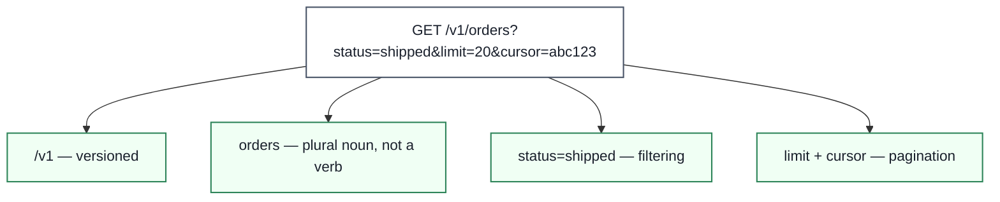

### Naming: Resources, Not Actions

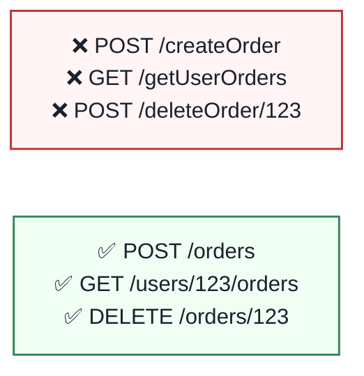
The HTTP method already carries the verb (`POST` = create, `DELETE` = remove) — repeating it in the path is redundant and inconsistent across different engineers' choices.

### Core Practices

| Practice | Why It Matters |
|---|---|
| **Use nouns, not verbs, in paths** | `/orders`, not `/getOrders` — the HTTP method already is the verb |
| **Use plural resource names** | `/users/123`, not `/user/123` — consistent regardless of ID count |
| **Version explicitly** | `/v1/orders` — lets you evolve without breaking existing clients |
| **Use correct status codes** | `201` for created, `404` for missing, `429` for rate-limited — don't bury outcomes only in the body |
| **Paginate list endpoints** | Cursor or offset-based — never return an unbounded list |
| **Consistent error shape** | Every error response follows the same structure so clients can handle errors generically |
| **Support filtering and sorting via query params** | `?status=shipped&sort=-created_at` — keeps the URL structure predictable |

### Enterprise Example
**Stripe's API** is frequently cited as the reference example for REST API design: predictable resource-based URLs, consistent error objects with a `type` and `message`, cursor-based pagination on every list endpoint, and API versioning tied to the date the integration was built, so existing integrations never break even as the API evolves. Studying Stripe's public API reference is a common recommendation for engineers learning API design specifically because the whole surface is internally consistent.

> **Trade-off:** Strict, consistent conventions take more upfront design time than just shipping whatever's convenient for the current backend model — but that upfront cost is paid back many times over in fewer integration bugs, less support burden, and APIs that don't need a `/v2` rewrite the first time requirements shift.

### 📋 Quick Reference — API Design
| | |
|---|---|
| **One-liner** | The conventions that make an API predictable enough that developers can guess how it works before reading the docs |
| **Use when** | Every API — the earlier good conventions are established, the less painful a later breaking change becomes |
| **Watch out for** | Verbs in URLs, inconsistent pluralization, undocumented breaking changes, unbounded list responses |
| **Key idea to remember** | Good API design is mostly about *consistency*, not cleverness — the same pattern applied everywhere beats a locally clever design applied inconsistently |

### 🎯 Most Asked Interview Questions — API Design

**Q1: Why do REST conventions favor nouns over verbs in URL paths?**
*A: Because the HTTP method already communicates the action — GET reads, POST creates, PUT/PATCH updates, DELETE removes — so putting a verb in the path like `/deleteOrder` is redundant and, worse, inconsistent, since different engineers will phrase their verbs differently. Sticking to `/orders` with the right HTTP method keeps the whole API's structure predictable regardless of who built which endpoint.*

**Q2: How would you approach versioning an API that's already in production with real clients?**
*A: I'd version explicitly, usually via the URL path like `/v1/orders`, so existing integrations keep working unchanged while a new `/v2` can introduce breaking changes for clients who opt in. The key discipline is defining what counts as a breaking change up front — removing a field or changing its type breaks clients, but adding a new optional field usually doesn't, so I wouldn't bump the version for purely additive changes.*

**Q3: What makes a good error response, beyond just the status code?**
*A: The status code tells you the category of what went wrong, but the body should carry a machine-readable error code, a human-readable message, and ideally which field caused a validation failure — so client code can handle errors programmatically rather than just displaying whatever text came back. I'd also keep the error shape completely consistent across every endpoint, so client error-handling code doesn't need a special case per endpoint.*

**Q4: Why is pagination important, and what are the two common approaches?**
*A: Without pagination, a list endpoint can return an unbounded, ever-growing response as the underlying dataset grows, which eventually becomes a performance and memory problem for both server and client. Offset-based pagination (`?page=2&limit=20`) is simple but can skip or duplicate items if data changes between requests; cursor-based pagination (`?cursor=abc123`) is more robust against that and scales better on large datasets, which is why most high-scale APIs prefer it.*

**Q5: How would you decide what belongs in the URL versus the request body versus headers?**
*A: The URL path identifies the resource being acted on — `/orders/123` — and query parameters handle filtering, sorting, and pagination for that resource. The body carries the actual data for a create or update operation, and headers carry metadata about the request itself — authentication, content type, idempotency keys — rather than data about the specific resource. Getting this split right is a big part of why a well-designed API feels intuitive instead of arbitrary.*

---

## Quick-Reference Interview Cheat Sheet

| Topic | One-line Definition | Primary Mechanisms |
|---|---|---|
| **APIs** | The contract that lets systems safely depend on each other | Request/response shape, auth, versioning |
| **Idempotency** | Retrying an operation has the same effect as running it once | Idempotency keys, atomic reservation, natural vs. engineered |
| **API Gateway** | Single front door for auth, routing, and rate limiting | Centralized cross-cutting concerns, reverse-proxy + API awareness |
| **REST vs GraphQL** | Fixed endpoints vs. client-shaped queries | Over/under-fetching, schema, subscriptions |
| **WebSockets** | Persistent two-way connection, no polling needed | HTTP upgrade handshake, full-duplex frames |
| **Webhooks** | Provider pushes events to you instead of you polling | Signature verification, at-least-once delivery, DLQ |
| **Rate Limiting** | Cap requests per client per time window | Token bucket, leaky bucket, sliding window |
| **API Design** | Conventions that make an API predictable | Resource naming, status codes, versioning, pagination |

### Common Interview Follow-Up Questions
- "How does idempotency relate to webhooks?" → webhook receivers need idempotent processing because providers guarantee at-least-once, possibly duplicate delivery
- "Where would you put rate limiting in a microservices system with an API Gateway?" → at the gateway, before requests reach any backend service, keyed by authenticated identity rather than IP alone
- "Would you use REST or GraphQL for a public webhook payload?" → webhooks are provider-initiated pushes, not queries — they're inherently REST-shaped (a fixed POST payload), GraphQL's client-driven querying doesn't apply to that direction of communication
- "How does an API Gateway relate to a reverse proxy?" → a gateway is a reverse proxy with API-specific features (auth, rate limiting, transformation) layered on top — same core position in the architecture, more responsibility
