# Database Fundamentals

*Interview-ready reference guide*

---

## Why These Concepts Matter

Almost every system design interview eventually comes down to the database: how it stores data reliably, how it scales past one machine, and how it stays fast as both data volume and read/write traffic grow. This guide covers the nine concepts you need fluent command of:

1. **ACID Transactions** — reliability guarantees for a single database
2. **SQL vs. NoSQL** — two philosophies for structuring data
3. **Database Indexes** — making reads fast
4. **Database Sharding** — scaling writes horizontally
5. **Data Replication** — scaling reads and surviving failure
6. **Database Scaling** — the full toolkit, in order of when to reach for each
7. **Database Types** — matching the storage model to the workload
8. **Bloom Filters** — a space-efficient trick for "have I seen this before?"
9. **Database Architectures** — how replicas actually get organized (active-passive vs. active-active)

---

## 1. ACID Transactions

**Definition:** A transaction is a group of database operations that succeed or fail together as one unit. **ACID** — Atomicity, Consistency, Isolation, Durability — is the set of guarantees that makes transactions reliable even when the database crashes mid-operation or handles many transactions at once.

### The Problem: Partial Updates

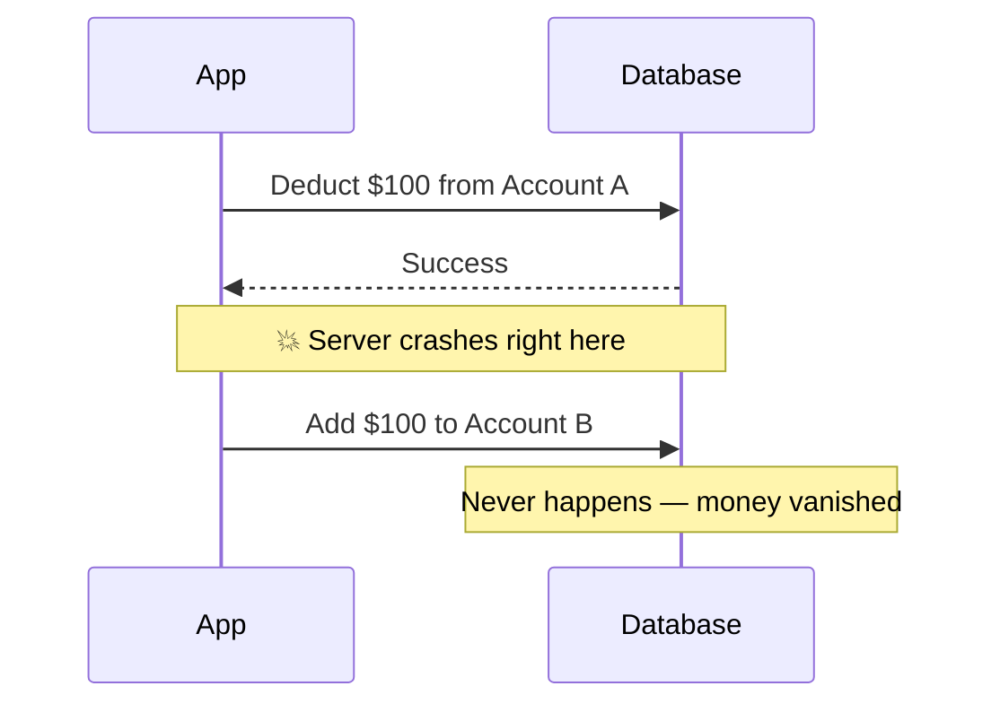

### The Fix: Wrapped in a Transaction

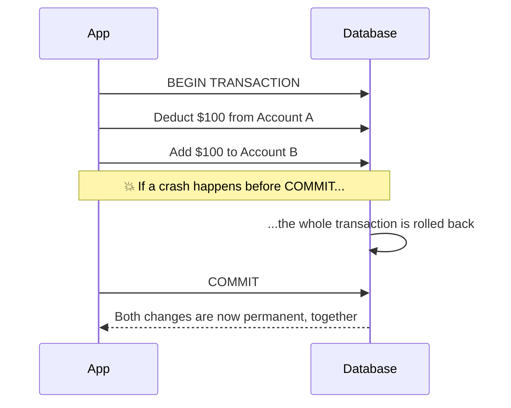

### The Four Guarantees

| Letter | Guarantee | Plain Meaning |
|---|---|---|
| **A**tomicity | All-or-nothing | Either every operation in the transaction applies, or none do |
| **C**onsistency | Valid state to valid state | The transaction can't leave the database violating its own constraints (no duplicate primary keys, no orphaned foreign keys) |
| **I**solation | Concurrent transactions don't corrupt each other | Two transactions running at the same time still produce a result as if they ran one after another |
| **D**urability | Survives a crash | Once committed, the change is written to durable storage and won't be lost even if the power goes out immediately after |

### Enterprise Example
**PostgreSQL** and **MySQL's InnoDB engine** implement full ACID compliance using **MVCC** (multi-version concurrency control) and row-level locking, which is exactly why banking systems, order-processing systems, and anything involving money default to a relational database rather than a NoSQL store that only offers weaker guarantees.

> **Trade-off:** Strong isolation is what prevents two concurrent transactions from corrupting shared state — like two doctors' scheduling systems both reading "on call: true" and both flipping it to false, leaving nobody on call — but stricter isolation levels mean more locking, which caps how many transactions a database can process concurrently. This is why isolation level is a tunable knob, not a fixed setting.

### 📋 Quick Reference — ACID Transactions
| | |
|---|---|
| **One-liner** | Group of operations that succeed or fail together, with guarantees that survive crashes and concurrency |
| **Use when** | Any operation where a partial update would corrupt real-world state — payments, inventory, bookings |
| **Watch out for** | Assuming ACID alone makes an application correct — it protects the mechanics of the transaction, not your business logic |
| **Key idea to remember** | Isolation is what protects you from *other transactions*; atomicity and durability are what protect you from *crashes* |

### 🎯 Most Asked Interview Questions — ACID Transactions

**Q1: Walk me through what each ACID letter actually guarantees.**
*A: Atomicity means the transaction is all-or-nothing — if any step fails, everything rolls back. Consistency means the transaction can only move the database from one valid state to another, respecting constraints like primary keys and foreign keys. Isolation means concurrent transactions don't see each other's uncommitted changes and don't corrupt shared data. Durability means once the database says "committed," that change survives a crash or power loss. I always tie these back to a concrete example, like a money transfer, because the letters alone are easy to memorize but not always easy to apply.*

**Q2: What real problem does isolation solve, with a concrete example?**
*A: It solves the problem of two concurrent transactions reading the same data, both making decisions based on that stale read, and both writing conflicting results. A classic case is two processes both checking "is there a doctor on call" and both independently deciding to take the last on-call doctor off duty — without proper isolation, you can end up with zero doctors on call even though the business rule required at least one. With proper isolation, the database ensures that the second transaction waits or retries until the first is committed, preventing the race condition and maintaining a consistent final state*

**Q3: Does ACID make an application "correct"?**
*A: No — ACID guarantees the mechanics of a transaction are reliable, but it doesn't know or enforce your actual business rules beyond database-level constraints. You still need to model your data correctly and write the right application logic; ACID just gives you a solid foundation to build that logic on top of, so a crash or concurrent access doesn't silently corrupt what you built.*

**Q4: Why do some high-scale systems intentionally relax ACID guarantees?**
*A: Because strict isolation and durability guarantees require coordination — locks, write-ahead logs, synchronous replication — and that coordination costs throughput and latency, especially across a distributed, sharded system. Many NoSQL systems trade strict consistency for availability and speed at scale, which is fine for data where eventual correctness is acceptable but not fine for a bank balance.*

**Q5: How does atomicity work when a transaction spans multiple physical servers, like in a sharded database?**
*A: A single-server ACID transaction is straightforward because one database engine controls the whole commit. Across shards, you need a distributed transaction protocol like two-phase commit, or you avoid distributed transactions entirely with patterns like the Saga pattern, where each shard does its own local transaction and compensating actions undo earlier steps if a later step fails. This is exactly why cross-shard transactions are called out as one of sharding's biggest challenges.*

---

## 2. SQL vs. NoSQL

**Definition:** SQL (relational) databases store data in structured tables with fixed schemas and enforce relationships via foreign keys, using SQL as the query language. NoSQL databases relax that structure — trading strict schemas and joins for flexibility, horizontal scalability, or a data model that fits a specific access pattern better.

### Structural Difference

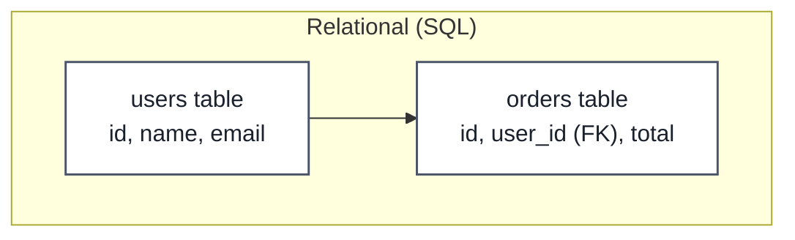

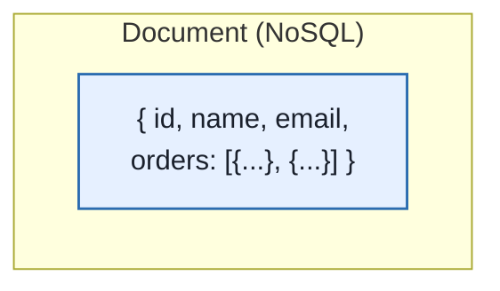
SQL normalizes related data into separate tables joined by keys. A document-model NoSQL store often embeds related data directly, avoiding a join at read time in exchange for possible duplication.

### Side-by-Side Comparison

| | SQL (Relational) | NoSQL |
|---|---|---|
| **Schema** | Fixed, enforced upfront | Flexible — often schema-less or schema-per-document |
| **Scaling** | Traditionally vertical (though modern systems shard) | Built for horizontal scaling from the start |
| **Consistency** | Strong — full ACID | Often eventual consistency (tunable in many systems) |
| **Relationships** | Native via joins and foreign keys | Usually denormalized or handled at the application layer |
| **Query language** | SQL (standardized) | Varies by product (MongoDB query language, CQL, etc.) |
| **Best fit** | Structured data with complex relationships, transactions | High-volume, flexible, or rapidly evolving data models |
| **Examples** | PostgreSQL, MySQL, Oracle | MongoDB (document), Cassandra (wide-column), Redis (key-value) |

### Enterprise Example
**Instagram** uses PostgreSQL as a core relational store for structured data like user accounts and relationships, while also relying on Cassandra (wide-column NoSQL) for feed and activity data at a scale where horizontal write scaling matters more than joins. This "use both" pattern — sometimes called polyglot persistence — is extremely common at scale rather than picking one model for the entire system.

> **Trade-off:** SQL's rigid schema and relational integrity make data easy to reason about and query flexibly, at the cost of harder horizontal scaling. NoSQL's flexibility and native horizontal scaling come at the cost of weaker consistency guarantees and pushing relationship logic into the application layer instead of the database.

### 📋 Quick Reference — SQL vs. NoSQL
| | |
|---|---|
| **One-liner** | SQL: structured, relational, strong consistency. NoSQL: flexible, horizontally-scalable, often eventually consistent |
| **Use SQL when** | Data is inherently relational, you need complex queries/joins, or you need strong ACID guarantees |
| **Use NoSQL when** | Schema will evolve quickly, write volume needs horizontal scaling, or the access pattern is simple key lookups |
| **Key idea to remember** | This isn't binary in practice — most large systems run both, choosing per-service based on that service's specific access pattern |

### 🎯 Most Asked Interview Questions — SQL vs. NoSQL

**Q1: How would you decide between SQL and NoSQL for a new service?**
*A: I'd start from the access pattern, not a general preference — if the data is naturally relational and needs complex queries or strong consistency, like financial transactions, SQL is the safer default. If the data is high-volume, the schema will change often, or the main access pattern is simple key-based lookups at massive scale, NoSQL's flexibility and native horizontal scaling usually wins. In practice I'd also ask what the team already knows well, since operational familiarity is a real cost too.*

**Q2: Can a SQL database scale horizontally, or is that exclusively a NoSQL advantage?**
*A: SQL databases can scale horizontally through sharding, but it's not built into the model the way it is for most NoSQL systems — you have to design and manage the sharding yourself, and cross-shard joins and transactions become genuinely hard. NoSQL systems like Cassandra are architected from the ground up assuming horizontal distribution, so that scaling is closer to a first-class feature than a retrofit.*

**Q3: What does "eventual consistency" mean, and why do many NoSQL systems default to it?**
*A: It means that after a write, different replicas might briefly disagree about the current value, but they'll converge to the same state given enough time without further writes. Many NoSQL systems default to it because enforcing strong consistency across a horizontally distributed, replicated cluster requires coordination that adds latency — trading a little staleness for a lot more availability and throughput is the right call for data like a social media like-count, but not for a bank balance.*

**Q4: Give an example of a system that uses both SQL and NoSQL together, and why.**
*A: Instagram is a good real example — relational PostgreSQL for structured data like user accounts where relationships and integrity matter, and Cassandra for high-volume feed and activity data where write throughput and horizontal scale matter more than joins. This polyglot approach is common because forcing every workload in a system through one database model usually means compromising badly on at least one of them.*

**Q5: What's lost when you denormalize data into a NoSQL document instead of normalizing it across SQL tables?**
*A: You lose the guarantee that there's a single source of truth for that data — if a user's name is embedded inside every order document instead of joined from a single users table, updating that name means updating every document that embedded it, or living with stale copies. That's a real trade-off: faster reads because there's no join, at the cost of either more complex update logic or accepting some inconsistency between the copies.*

---

## 3. Database Indexes

**Definition:** An index is a separate data structure — typically a B-tree — that lets a database find rows matching a query without scanning every row in the table, similar to how a book's index lets you jump straight to a page instead of reading cover to cover.

### Without an Index — Full Table Scan

### With an Index — Direct Lookup

### The Cost: Every Write Now Touches Two Structures

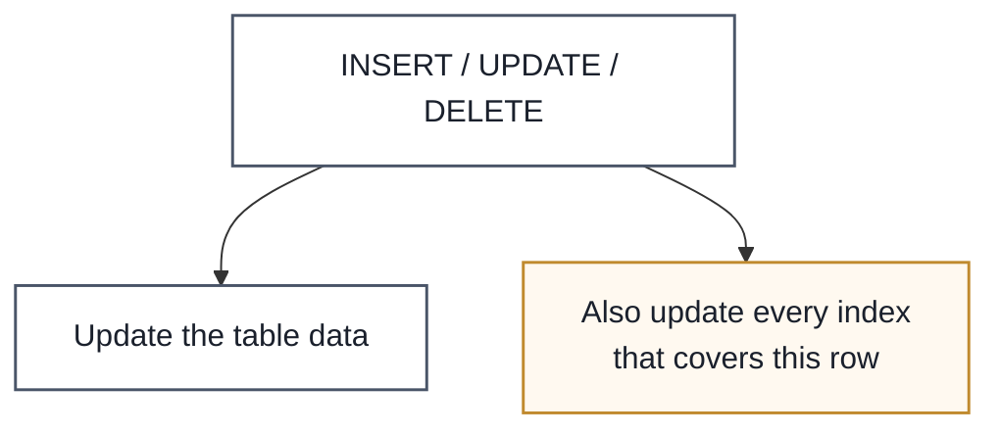

### Enterprise Example
**MySQL** and **PostgreSQL** both default to a **B-tree index** on primary keys automatically, and every additional index you add (on `email`, `created_at`, etc.) speeds up reads filtered on that column at the cost of slightly slower writes, since the index has to be updated too. A common real-world mistake is over-indexing a write-heavy table — like an events-ingestion table getting 10 indexes "just in case" — which can measurably slow down ingestion throughput.

> **Trade-off:** Indexes trade write performance and storage space for read performance. An index only helps queries that filter, sort, or join on the indexed column(s) — an index on `email` does nothing for a query filtering on `created_at`, so indexing strategy has to follow actual query patterns, not just "index everything."

### 📋 Quick Reference — Database Indexes
| | |
|---|---|
| **One-liner** | A separate lookup structure that avoids scanning every row for a query |
| **Use when** | A column is frequently filtered, sorted, or joined on |
| **Watch out for** | Over-indexing write-heavy tables — every index adds write overhead |
| **Key idea to remember** | An index only helps the specific columns it covers — it's not a general "make queries faster" switch |

### 🎯 Most Asked Interview Questions — Database Indexes

**Q1: How does an index actually make a query faster?**
*A: Most indexes are implemented as a B-tree, which is a sorted, balanced tree structure that lets the database narrow down to the matching row(s) in roughly logarithmic time instead of checking every row linearly. Without an index, the database has to do a full table scan — reading every single row to check if it matches — which gets proportionally slower as the table grows.*

**Q2: Why don't we just index every column?**
*A: Because every index adds overhead on writes — every INSERT, UPDATE, or DELETE has to update not just the table but every index that covers the changed row, and each index also consumes additional storage. Indexing should follow actual query patterns: index the columns that are frequently filtered, sorted, or joined on, not every column just in case.*

**Q3: What's the difference between a single-column index and a composite index?**
*A: A single-column index only helps queries filtering on that one column. A composite index covers multiple columns together and can help queries that filter on the same combination — or a leading prefix of that combination — but generally won't help a query filtering only on the second column of the composite if the first column isn't also part of the filter. Choosing column order in a composite index should match how queries actually combine filters.*

**Q4: When would an index NOT help a query?**
*A: If the query filters on a column the index doesn't cover, if the query applies a function to the indexed column (like `WHERE LOWER(email) = ...` against a plain index on `email`), or if the table is small enough that a full scan is actually faster than the overhead of using the index. Query planners typically decide this automatically, but understanding why helps you write index-friendly queries in the first place.*

**Q5: How would you diagnose whether a slow query is missing an index?**
*A: I'd run the query through the database's query planner — `EXPLAIN` in PostgreSQL/MySQL — and look for a full table scan (often labeled "Seq Scan" or similar) on a large table where I'd expect an index lookup instead. If the plan shows a scan on the filtered column, that's the signal to add an index there, then re-run `EXPLAIN` to confirm the plan switched to an index scan.*

---

## 4. Database Sharding

**Definition:** Sharding is a horizontal scaling technique that splits a large database into smaller, independent pieces called **shards**, each holding a subset of the data and running on its own server — so no single machine has to hold or serve the entire dataset.

### The Problem: One Server, All the Data

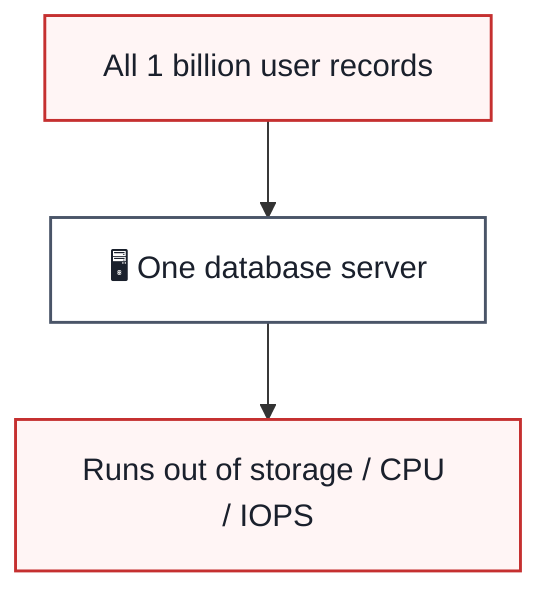

### The Fix: Split Across Shards by a Key

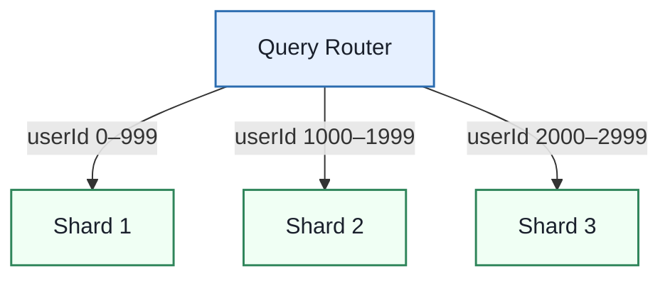

### Sharding Strategies

| Strategy | How It Works | Watch Out For |
|---|---|---|
| **Hash-Based** | `hash(key) % N` decides the shard | Adding/removing shards remaps almost everything unless paired with consistent hashing |
| **Range-Based** | Shard 1 = IDs 1-10000, Shard 2 = 10001-20000, etc. | Easy range queries, but can create "hot" shards if recent data is always in one range |
| **Geo-Based** | Shard by user's region | Great for latency, but uneven if user populations differ wildly by region |
| **Directory-Based** | A lookup table maps each key directly to a shard | Most flexible, but the lookup table itself becomes a critical dependency |

### Enterprise Example
**Instagram** shards its Postgres database by user ID to handle over a billion user profiles without a single server holding them all — a pattern also used by **Amazon** for product catalogs and **Google** for search indices. All three share the same underlying motivation: no single machine's CPU, memory, or disk can hold or serve the full dataset at that scale.

> **Trade-off:** Sharding solves the single-machine ceiling, but at the cost of real complexity — cross-shard joins become expensive or impossible without application-level work, and choosing the wrong shard key creates uneven "hot" shards that need painful rebalancing later. Most teams should exhaust read replicas, caching, and query optimization before reaching for sharding.

### 📋 Quick Reference — Database Sharding
| | |
|---|---|
| **One-liner** | Splitting a database into independent pieces across multiple servers, keyed by a shard key |
| **Use when** | A single database server can no longer hold or serve the data volume/traffic, even after other scaling techniques |
| **Watch out for** | A poorly chosen shard key creating uneven ("hot") shards, and expensive cross-shard joins/transactions |
| **Key idea to remember** | Shard only when necessary — it's the most complex tool in the scaling toolkit, not the first one to reach for |

### 🎯 Most Asked Interview Questions — Database Sharding

**Q1: What makes a good shard key?**
*A: High cardinality so data spreads across many possible values, even distribution so no single shard gets a disproportionate share of the traffic, alignment with your actual query patterns so most queries can be routed to a single shard, and ideally immutability so a record doesn't need to migrate shards after creation. A bad shard key — like sharding by country when 80% of your users are in one country — creates a hot shard that defeats the whole purpose.*

**Q2: How do cross-shard queries and joins work, and why are they hard?**
*A: If related data lives on different shards, a join has to be done at the application layer — query each relevant shard separately and merge the results in code — since the database engine on shard A has no visibility into shard B's data. This is slower and more complex than a native join, which is why schema design for a sharded system tries hard to keep frequently-joined data on the same shard whenever possible.*

**Q3: What's the difference between hash-based and range-based sharding?**
*A: Hash-based sharding applies a hash function to the shard key to pick a shard, which distributes data evenly but makes range queries (like "all orders from March") expensive since they might hit every shard. Range-based sharding keeps sequential keys together on the same shard, making range queries efficient, but risks a hot shard if writes are concentrated in a narrow, recent range — like all of today's new orders landing on the same shard.*

**Q4: How does consistent hashing help with sharding specifically?**
*A: Plain hash-based sharding with `hash(key) % N` breaks badly when N changes — adding or removing a shard remaps almost every key. Consistent hashing places both shards and keys on a fixed ring, so adding or removing a shard only remaps the keys in the affected slice of the ring, dramatically reducing the data movement needed during rebalancing.*

**Q5: If a system is struggling with database load, why shouldn't sharding be the first thing you reach for?**
*A: Because sharding adds substantial application-level complexity — routing logic, cross-shard queries, rebalancing — that's hard to undo once in place. Simpler techniques usually solve the same problem with far less complexity: adding indexes, introducing a caching layer, adding read replicas for read-heavy load, or vertical scaling if the current load still fits on a bigger single box. Sharding is the right call specifically when write volume or total data size has outgrown what any single server can hold, not as a first response to "the database is slow."*

---

## 5. Data Replication

**Definition:** Data replication creates and maintains multiple copies (replicas) of a database across different servers, keeping them synchronized with the primary — improving read throughput, availability, and disaster recovery, since no single server failure takes the whole database down.

### Basic Replication Flow

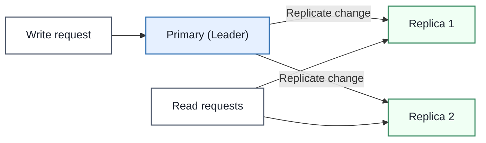
Writes go to the primary; reads can be spread across replicas, taking load off the primary and placing data closer to users in other regions.

### Synchronous vs. Asynchronous Replication

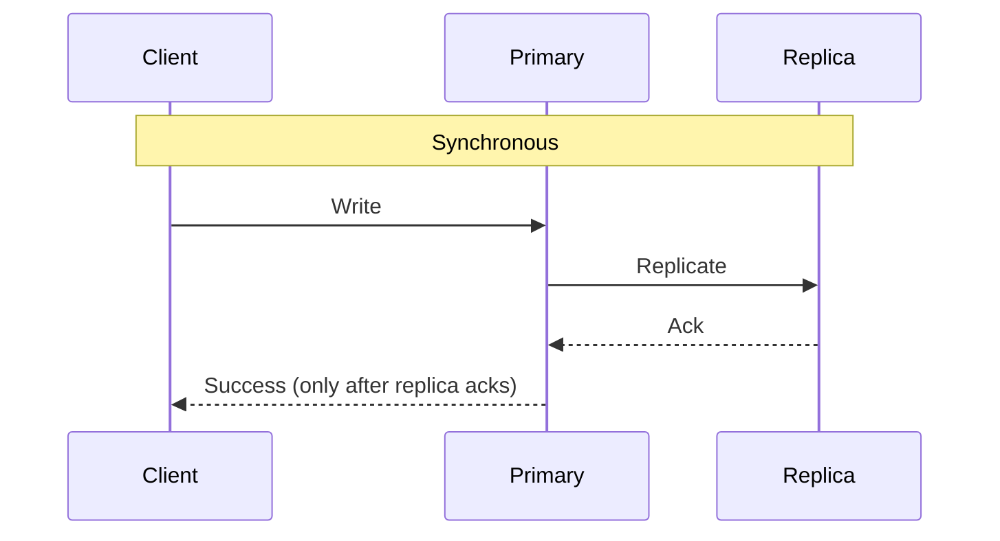

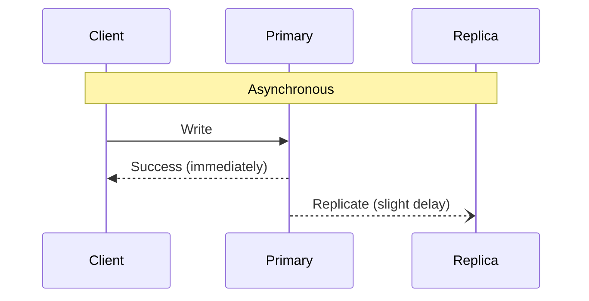

| | Synchronous | Asynchronous |
|---|---|---|
| **Consistency** | Strong — replica confirmed before success | Replication lag possible — replica briefly stale |
| **Performance** | Slower — waits for replica ack | Faster — doesn't wait |
| **Risk** | Write blocks if a replica is slow/down | A crash right after the primary's write can lose the not-yet-replicated change |

### Enterprise Example
**Redis** and most managed relational databases (Amazon RDS, Google Cloud SQL) offer read replicas as a standard feature specifically so read-heavy applications can scale reads horizontally without sharding — a news site serving millions of reads per article publish is a textbook case where replication alone solves the scaling problem, since writes (new articles) are comparatively rare.

> **Trade-off:** Synchronous replication guarantees replicas are never stale but adds latency to every write and can block entirely if a replica is unreachable. Asynchronous replication keeps writes fast but accepts "replication lag" — a window where a replica's data is a few milliseconds (or more, under load) behind the primary, which matters if a client writes and then immediately reads from a replica that hasn't caught up yet.

### 📋 Quick Reference — Data Replication
| | |
|---|---|
| **One-liner** | Multiple synchronized copies of a database across servers, for read scaling and availability |
| **Use when** | Read-heavy workloads, needing geographic distribution, or wanting failover if the primary goes down |
| **Watch out for** | Replication lag causing a client to read stale data right after its own write ("read-your-writes" problem) |
| **Key idea to remember** | Replication scales *reads*; it does not scale *writes* — every write still goes through the primary (or requires a different architecture, see Section 9) |

### 🎯 Most Asked Interview Questions — Data Replication

**Q1: How does replication improve availability, not just read performance?**
*A: If the primary fails and there's no replica, the whole database is down until it's restored. With replicas in place, a failover process can promote a replica to become the new primary, so the system keeps serving traffic — usually with a brief interruption — instead of a full outage. That's why replication is as much a resilience strategy as a scaling one.*

**Q2: What is replication lag, and when does it actually cause a bug?**
*A: Replication lag is the delay between a write landing on the primary and that same write appearing on a replica, which exists with asynchronous replication. It causes a real bug in the "read-your-writes" scenario — a user updates their profile, the write goes to the primary, but the very next read gets routed to a replica that hasn't caught up yet, so the user sees their old data right after "successfully" changing it.*

**Q3: How would you fix the read-your-writes problem in a replicated system?**
*A: A few common approaches: route a user's reads to the primary for a short window right after they write, use "read-your-own-writes" session stickiness so a user's subsequent reads hit the same replica or the primary, or have the client track a version/timestamp and have replicas wait until they've caught up to that version before answering. Which one makes sense depends on how tolerant the specific feature is of staleness.*

**Q4: Does replication help you scale write throughput?**
*A: No — in a standard primary-replica setup, every write still has to go through the primary, so replication only helps distribute read load, not write load. If write throughput itself is the bottleneck, you need sharding to split writes across multiple independent primaries, or a multi-leader/active-active architecture that accepts writes on more than one node (see Section 9).*

**Q5: Why would you choose synchronous over asynchronous replication, given it's slower?**
*A: When the cost of losing even a few milliseconds of unreplicated data is unacceptable — financial ledgers or anything where "we might have silently lost a write during a crash" is a serious problem. For most read-scaling use cases, like serving a busy blog's read traffic, asynchronous is the right call because a few milliseconds of replica staleness is harmless and the latency savings on every write add up significantly at scale.*

---

## 6. Database Scaling

**Definition:** Database scaling is the full set of techniques — from a quick vertical upgrade to a full sharding rollout — used to keep a database performing well as data volume and traffic grow. Most real systems apply several of these together rather than picking just one.

### The Toolkit, Roughly in Order of When to Reach for Each

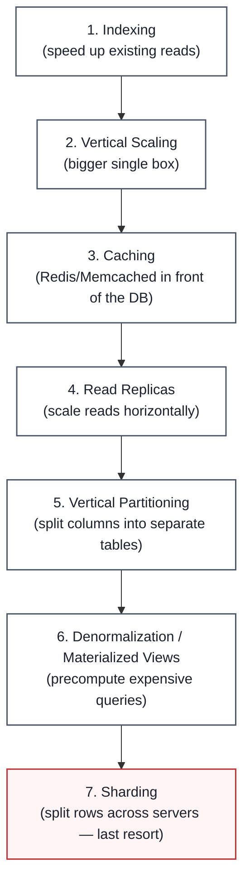

### Quick Reference Table

| Technique | Solves | Example |
|---|---|---|
| **Vertical Scaling** | Not enough CPU/RAM on one box | Add more RAM before a holiday sales spike |
| **Indexing** | Slow reads on specific columns | Index `email` for fast login lookups |
| **Sharding** | Too much data/traffic for one server | Split users across servers by `userId` |
| **Vertical Partitioning** | Some columns accessed far more than others | Split `product` into `core_product` + `product_details` + `product_media` |
| **Caching** | Same data read repeatedly | Cache trending articles in Redis |
| **Replication** | Read-heavy load, geographic latency, availability | Read replicas per region |
| **Materialized Views** | Expensive, frequently-run aggregate queries | Precomputed daily sales summary |
| **Denormalization** | Slow multi-table joins | Embed a user's recent posts directly on their profile document |
| **Connection Pooling** | Overhead of opening/closing DB connections under load | Reuse a pool of open connections instead of creating new ones per request |

### Enterprise Example
A growing e-commerce site's typical progression: start on a single managed Postgres instance (Amazon RDS), add indexes as query patterns emerge, add a Redis cache in front of product pages, add read replicas as traffic grows, then only reach for sharding once a single primary can no longer handle write volume — this is a deliberately incremental order, not a checklist to apply all at once from day one.

> **Trade-off:** Every technique on this list trades some form of simplicity for scale — caching trades consistency for speed, replication trades some staleness risk for read capacity, sharding trades query simplicity for horizontal write capacity. The engineering skill is picking the *cheapest* technique that solves today's actual bottleneck, not reaching for the most powerful one preemptively.

### 📋 Quick Reference — Database Scaling
| | |
|---|---|
| **One-liner** | The ordered toolkit of techniques for keeping a database fast as data and traffic grow |
| **Use when** | Query latency degrades, a single server hits resource limits, or read/write load outpaces one machine's capacity |
| **Watch out for** | Reaching for sharding before exhausting simpler, lower-complexity options |
| **Key idea to remember** | Start simple (indexing, caching, vertical scaling) and only add architectural complexity (sharding) once simpler techniques are actually exhausted |

### 🎯 Most Asked Interview Questions — Database Scaling

**Q1: If a database is slow, what's the first thing you'd check before scaling anything?**
*A: I'd look at the actual queries first — run `EXPLAIN` on the slow ones and check for missing indexes or full table scans, since a missing index is often the entire problem and costs nothing to fix compared to any scaling technique. Jumping straight to "let's shard" or "let's add read replicas" without first ruling out a cheap query-level fix is a common and expensive mistake.*

**Q2: What's the difference between vertical partitioning and sharding — they sound similar?**
*A: Vertical partitioning splits a table by *columns* — separating rarely-accessed or large columns like images into their own table, but all the rows for a given entity can still live on the same server. Sharding splits a table by *rows* across different servers — different users' data physically lives on different machines. They solve different problems: vertical partitioning optimizes what gets read together, sharding solves a single-machine capacity ceiling.*

**Q3: When would caching not be enough, and you'd need read replicas instead?**
*A: Caching helps when the same data is read repeatedly — a trending article, a popular product page — but it doesn't help for read traffic that's genuinely diverse across many different records, where a cache would need to hold nearly the whole dataset to be useful. Read replicas scale the actual read *capacity* of the database itself, which is the right tool when read queries are too varied for caching to meaningfully reduce database load.*

**Q4: Why is connection pooling worth mentioning in a scaling discussion — it seems minor?**
*A: Because opening a new database connection isn't free — TCP handshake, authentication, sometimes TLS negotiation — and under high request volume, that overhead alone can become a meaningful bottleneck if every request opens a fresh connection. Connection pooling reuses a set of already-open connections, which is a cheap, low-complexity win that's easy to overlook next to flashier techniques like sharding.*

**Q5: How would you decide the order to apply these techniques for a system you're designing in an interview?**
*A: I'd apply them roughly cheapest-and-least-disruptive first: confirm indexes are right, add caching for hot reads, add read replicas if reads are the bottleneck, consider vertical partitioning or denormalization if specific access patterns are slow, and only reach for sharding once I've established that a single primary genuinely can't hold the data or handle the write volume anymore. Presenting that order in an interview signals you understand the trade-offs, not just the vocabulary.*

---

## 7. Database Types

**Definition:** Different database types optimize for different data shapes and access patterns — there's no single "best" database, only the best fit for a given workload's structure and query needs.

### The Landscape

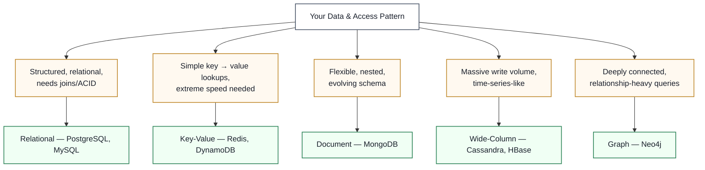

### Common Types at a Glance

| Type | Data Model | Best Fit | Examples |
|---|---|---|---|
| **Relational** | Tables, rows, foreign keys | Structured data, complex queries, transactions | PostgreSQL, MySQL, Oracle |
| **Key-Value** | Simple key → value pairs | Session storage, caching, extreme-speed lookups | Redis, DynamoDB |
| **Document** | JSON-like nested documents | Flexible/evolving schemas, content management | MongoDB, Couchbase |
| **Wide-Column** | Rows with dynamic, sparse columns | Massive write throughput, time-series data | Cassandra, HBase |
| **Graph** | Nodes and edges | Relationship-heavy queries — social graphs, recommendations | Neo4j, Amazon Neptune |
| **Time-Series** | Timestamped data points | Metrics, IoT sensor data, monitoring | InfluxDB, TimescaleDB |
| **Search Engine** | Inverted index over text | Full-text search, log search | Elasticsearch, Solr |
| **Vector** | High-dimensional embeddings | Similarity search for AI/ML (semantic search, RAG) | Pinecone, Weaviate |

### Enterprise Example
**LinkedIn** uses a graph-shaped data model to power "people you may know" and connection-degree queries, since traversing relationships is the graph model's whole reason for existing — a relational database could technically do this with recursive joins, but it's dramatically slower for deep relationship traversal. **Netflix** and **Uber** both rely on Cassandra (wide-column) for the massive, geographically-distributed write volume of viewing history and trip events, where relational joins aren't the priority — sustained write throughput is.

> **Trade-off:** Picking a specialized database type for each workload (polyglot persistence) gets you the best performance characteristics per workload, at the cost of operational complexity — more systems to run, monitor, back up, and staff expertise for. Many teams intentionally start with "just Postgres for everything" and only introduce a specialized store once a specific workload's access pattern genuinely doesn't fit well.

### 📋 Quick Reference — Database Types
| | |
|---|---|
| **One-liner** | Different database types optimize for different data shapes — pick based on the access pattern, not habit |
| **Use when** | Designing any new service's data layer — always ask "what does this data look like, and how will it be queried?" first |
| **Watch out for** | Defaulting to whatever database the team already knows, even when the workload is a poor fit (e.g. deeply relational graph queries forced into a document store) |
| **Key idea to remember** | Most large systems are polyglot — several specialized databases, one per workload — rather than a single database type for everything |

### 🎯 Most Asked Interview Questions — Database Types

**Q1: Why would you choose a graph database over a relational database for a social network's "friends of friends" feature?**
*A: A relational database can express that query with recursive joins, but performance degrades quickly as the relationship depth grows, since each additional hop is another expensive join. A graph database stores relationships as first-class edges and is built specifically to traverse them efficiently, so a "friends of friends within 3 hops" query stays fast even as the graph grows — that's precisely the workload graph databases are optimized for.*

**Q2: When is a key-value store the right choice, and what are its limits?**
*A: It's the right choice when the access pattern really is just "give me the value for this key" — session data, feature flags, a cache — since key-value stores are extremely fast and simple for that exact pattern. The limit is that you generally can't query by anything other than the key; if you need to filter or query by a value's internal fields, you either need a different database type or you're forcing the key-value store into a role it wasn't designed for.*

**Q3: What makes a wide-column store like Cassandra good for massive write throughput?**
*A: Its storage engine (typically an LSM-tree) is optimized for fast sequential writes rather than optimizing for read flexibility, and its architecture is natively distributed with no single primary bottleneck for writes, unlike a traditional relational primary-replica setup. That's why systems ingesting huge volumes of write-heavy event data — viewing history, trip logs, sensor telemetry — reach for wide-column stores specifically.*

**Q4: Why might a team choose to run multiple database types (polyglot persistence) instead of one?**
*A: Because no single database type is optimal for every workload — a system might need fast key lookups for sessions, relational integrity for billing, and full-text search for a search feature, and forcing all three through one database usually means each one performs worse than a purpose-built alternative would. The trade-off is operational: more systems to run, monitor, and staff for, so it's a decision made deliberately per-workload, not by default.*

**Q5: How would you decide whether a new AI-powered search feature needs a vector database?**
*A: If the feature needs to find items by semantic similarity — "find documents similar in meaning to this one" using embeddings — rather than exact keyword or structured field matches, that's the specific problem vector databases like Pinecone are optimized to solve efficiently at scale. If the search is really keyword-based full-text search, a search engine like Elasticsearch is usually a better fit than forcing it through a vector store.*

---

## 8. Bloom Filters

**Definition:** A Bloom filter is a probabilistic data structure that answers "might this element be in the set?" using far less memory than storing the actual elements — at the cost of occasionally returning a false positive (saying "maybe present" when it isn't), though it never produces a false negative.

### Structure: A Bit Array + Multiple Hash Functions

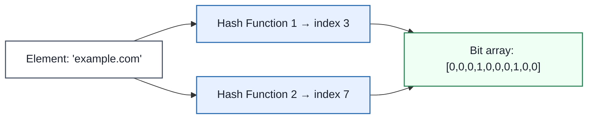

### Checking Membership — Two Outcomes

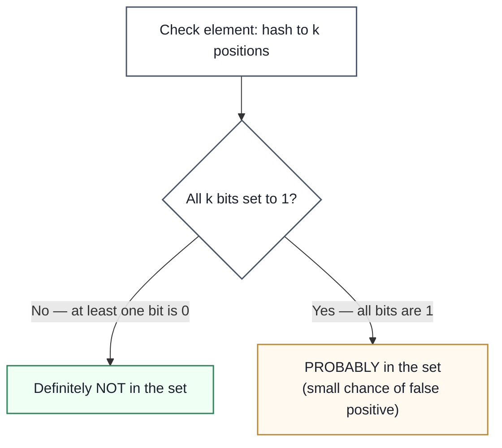

### Common Real-World Uses

| Use Case | What It Avoids |
|---|---|
| **Database key lookups** (Cassandra, HBase) | Unnecessary disk reads for keys that definitely don't exist |
| **Web crawler / visited-URL tracking** | Storing every full URL just to check "have I crawled this?" |
| **Spam filtering** | Checking every email against a huge spam-address database directly |
| **CDN/cache membership checks** | A full cache lookup for content that's definitely not cached |
| **Recommendation systems** (Netflix, Amazon) | Recommending content a user has already watched/bought |

### Enterprise Example
**Cassandra** uses Bloom filters internally before every disk read — since disk I/O is expensive, checking an in-memory Bloom filter first lets it skip disk lookups entirely for keys that are definitely absent, which is a major reason Cassandra can serve reads efficiently at massive scale. **Chrome's Safe Browsing** feature historically used a Bloom filter to check URLs against a huge list of known malicious sites without downloading or querying the full list for every page visit.

> **Trade-off:** Bloom filters trade certainty for space — a hash table gives exact answers but costs memory proportional to every element stored; a Bloom filter costs a small, fixed amount of memory per element regardless of how large the elements themselves are, but accepts a tunable false-positive rate in exchange. They also can't support deletion in their standard form, and they only answer membership — never "what are the actual elements," so they're always a filter in front of a real lookup, not a replacement for one.

### 📋 Quick Reference — Bloom Filters
| | |
|---|---|
| **One-liner** | A space-efficient way to ask "might this be in the set?" — no false negatives, occasional false positives |
| **Use when** | You need fast, memory-cheap membership checks and can tolerate occasional false positives — as a filter in front of an expensive lookup |
| **Watch out for** | Needing to delete elements (standard Bloom filters can't) or needing exact/definite membership answers |
| **Key idea to remember** | "Definitely not present" is always trustworthy; "probably present" always still needs the real lookup behind it to confirm |

### 🎯 Most Asked Interview Questions — Bloom Filters

**Q1: Why can a Bloom filter say "definitely not present" with certainty, but only "probably present" otherwise?**
*A: If even one of the k hashed bit positions for an element is 0, that element could never have been added, since adding always sets all k of its bits to 1 — so "definitely not present" is a hard guarantee. But those same bits could have been set to 1 by *other* elements that happened to hash to the same positions, so seeing all bits as 1 doesn't prove this specific element was added — hence "probably present," with a real lookup still needed to confirm.*

**Q2: Why can't standard Bloom filters support deleting an element?**
*A: Because a single bit can be shared by multiple elements that all happen to hash to that same position — unsetting a bit to "remove" one element could silently break the membership check for a completely different element that also relies on that bit being 1. The Counting Bloom Filter variant solves this by using small counters instead of single bits, so a deletion just decrements the counter, at the cost of more memory per position.*

**Q3: How would you reduce the false positive rate of a Bloom filter?**
*A: The two main levers are the size of the bit array and the number of hash functions — a larger bit array relative to the number of elements gives more room before collisions become likely, and choosing an appropriate number of hash functions (there's a mathematically optimal count for a given array size and element count) minimizes false positives for that space budget. You can shrink the false positive rate close to zero this way, but never eliminate it entirely — that's the nature of the probabilistic guarantee.*

**Q4: Why does Cassandra use a Bloom filter in front of disk reads specifically?**
*A: Because disk I/O is orders of magnitude slower than an in-memory check, and in a wide-column store spread across many SSTables on disk, checking whether a key even exists in a given file before reading it can save an enormous number of unnecessary disk seeks. The Bloom filter lives in memory and instantly rules out files that definitely don't contain the key, so only files that "might" contain it get an actual disk read.*

**Q5: If a Bloom filter can give false positives, isn't it risky to rely on for something like a spam filter?**
*A: It's safe as long as the system is designed around what a false positive actually costs — for spam filtering, a false positive just means an occasional legitimate sender gets an extra, more expensive verification check, not that legitimate email is silently dropped. Bloom filters work well precisely in scenarios where "probably yes, let's double check" is an acceptable, cheap fallback, and they'd be the wrong tool anywhere a false positive would cause silent, unrecoverable harm.*

---

## 9. Database Architectures

**Definition:** Beyond just "having replicas," database architecture describes *how* those replicas are organized to accept writes — most commonly **active-passive** (only one node accepts writes at a time) versus **active-active** (multiple nodes accept writes simultaneously, in different regions or datacenters).

### Active-Passive — One Writer, Others Standby

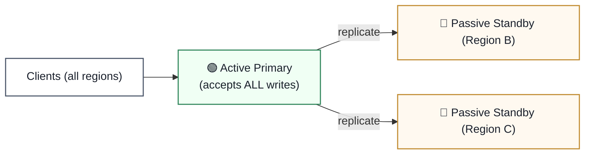
Simple to reason about consistency — there's only ever one place a write can happen. But users far from the active region pay extra latency on every write, and failover to a passive node takes time and coordination.

### Active-Active — Multiple Writers, Conflict Resolution Required

Every region writes locally — low latency everywhere, and no single region is a single point of failure for writes. But now two regions can accept conflicting writes to the same record at nearly the same time, and something has to resolve that conflict.

### The Core Trade-off, Side by Side

| | Active-Passive | Active-Active |
|---|---|---|
| **Write latency for remote users** | High — must reach the one active node | Low — writes happen locally in-region |
| **Conflict handling** | Not needed — only one writer | Required — concurrent writes to the same record must be reconciled |
| **Failover** | Manual/automated promotion needed if the active node fails | No single write bottleneck to fail over |
| **Complexity** | Lower | Higher — needs conflict resolution strategy (last-write-wins, CRDTs, application-level merge) |

### Enterprise Example
**MongoDB's** active-active application architecture pattern is commonly used for globally distributed apps that need low-latency local writes in multiple regions — accepting the added complexity of conflict resolution (often last-write-wins by timestamp, or custom merge logic) in exchange for no single region being a write bottleneck or single point of failure. Traditional relational primary-replica setups (like a standard Postgres deployment) are active-passive by default — exactly one primary accepts writes at any time.

> **Trade-off:** Active-active removes the single-writer bottleneck and gives every region fast local writes, but it fundamentally requires a conflict resolution strategy — because in a distributed system, two regions *can* both accept a write to the same record before either learns about the other's write. Active-passive sidesteps that entire problem by design, at the cost of write latency for anyone far from the single active node.

### 📋 Quick Reference — Database Architectures
| | |
|---|---|
| **One-liner** | Active-passive: one writer, simple consistency. Active-active: multiple writers, needs conflict resolution |
| **Use active-passive when** | Simplicity and strong consistency matter more than global write latency |
| **Use active-active when** | Users are globally distributed and need fast local writes, and you can handle write conflicts |
| **Key idea to remember** | Active-active isn't "better" — it's a deliberate trade of consistency simplicity for write latency, and it only makes sense once you've designed for the conflicts it introduces |

### 🎯 Most Asked Interview Questions — Database Architectures

**Q1: What's the fundamental difference between active-passive and active-active replication?**
*A: In active-passive, exactly one node accepts writes at any time, and the others are read-only standbys kept in sync — simple to reason about because there's never a question of which write "wins." In active-active, multiple nodes — often in different regions — accept writes simultaneously, which gives every region fast local writes but means two nodes can genuinely both accept conflicting writes to the same record before they've synced with each other.*

**Q2: Why would a globally distributed application choose active-active despite the added complexity?**
*A: Because in active-passive, every write from a user far from the single active region pays a real latency cost crossing that distance, which is a poor experience for a truly global user base. Active-active lets each region accept writes locally, so users get low write latency everywhere — the trade is accepting that conflict resolution logic is now a required part of the system, not optional.*

**Q3: How do systems typically resolve write conflicts in an active-active setup?**
*A: A common simple approach is last-write-wins based on timestamp, though that can silently lose one of the conflicting writes, which isn't safe for every kind of data. More sophisticated systems use CRDTs (conflict-free replicated data types) that are mathematically designed to merge concurrent updates without loss, or push conflict resolution to the application layer where business logic can decide — like merging two concurrent shopping cart updates instead of picking just one.*

**Q4: Is active-passive replication the same thing as having read replicas?**
*A: They're closely related — a standard primary with read replicas is a form of active-passive architecture, since the replicas are passive with respect to writes even though they actively serve reads. The "active-passive" framing specifically emphasizes the write path — only the primary is "active" for writes — while "read replicas" emphasizes what they're used for on the read side. Same underlying architecture, different angle of description.*

**Q5: How does failover work differently between active-passive and active-active?**
*A: In active-passive, if the active node fails, a passive standby has to be promoted to become the new active node — this takes some time and coordination, and there's a window where writes may be unavailable or need to be queued. In active-active, since multiple nodes already accept writes independently, losing one region doesn't create a write bottleneck the same way — traffic can shift to the remaining active regions without needing a promotion step, which is a big part of active-active's resilience appeal.*

---

## Quick-Reference Interview Cheat Sheet

| Topic | One-line Definition | Primary Mechanisms |
|---|---|---|
| **ACID Transactions** | All-or-nothing operations with strong reliability guarantees | Atomicity, Consistency, Isolation, Durability |
| **SQL vs NoSQL** | Structured/relational vs. flexible/horizontally-scalable | Schema, joins, consistency model |
| **Database Indexes** | Structures that avoid full table scans | B-trees, composite indexes, query planners |
| **Database Sharding** | Splitting rows across servers by a shard key | Hash-based, range-based, consistent hashing |
| **Data Replication** | Synchronized copies for read scaling and availability | Synchronous vs. asynchronous, replication lag |
| **Database Scaling** | The full ordered toolkit for growth | Indexing → caching → replicas → sharding |
| **Database Types** | Matching storage model to workload | Relational, key-value, document, wide-column, graph |
| **Bloom Filters** | Space-efficient probabilistic membership checks | Bit array + k hash functions, no false negatives |
| **Database Architectures** | How replicas handle writes | Active-passive (one writer) vs. active-active (conflict resolution) |

### Common Interview Follow-Up Questions
- "How does sharding relate to consistent hashing?" → consistent hashing is the placement strategy that minimizes data movement when shards are added/removed — see the System Design Pillars doc for the ring mechanics
- "Would you use a Bloom filter instead of an index?" → no, they solve different problems — a Bloom filter is a cheap pre-check that sits *in front of* an index or disk lookup, not a replacement for one
- "Does sharding conflict with ACID transactions?" → yes, in the sense that cross-shard transactions lose the simplicity of a single-server ACID guarantee — this is exactly why patterns like Saga and two-phase commit exist
- "How do database types relate to SQL vs NoSQL?" → SQL vs NoSQL is really shorthand for "relational vs. everything else" — the Database Types section is the more precise breakdown of what "everything else" actually contains
