# Caching Fundamentals
### Interview-ready reference guide

---


## Why Caching Matters

Every system eventually hits the same wall: the database is slow, the network is slow, and doing the same expensive work over and over is wasteful. Caching is the single highest-leverage technique in system design — it's the reason Twitter can serve your timeline in milliseconds instead of re-querying millions of tweets, the reason Amazon product pages load instantly during Prime Day, and the reason Google can answer the same search query for the billionth time without touching its index servers.

At its core, caching trades **space for time** — you spend memory to save compute and I/O. The topics below build on each other: what caching is, how you keep it correctly populated, how you evict when it's full, how you scale it across machines, and how you push it all the way to the edge of the network via a CDN.

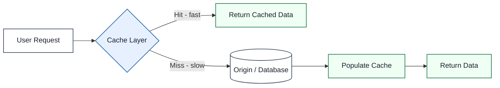

---

## 1. Caching 101 (What Is Caching)

### Definition
A cache is a small, fast storage layer that holds a copy of frequently accessed data, sitting between a client and a slower, more expensive source of truth (a database, an API, disk) — so repeated requests are served from fast memory instead of redoing expensive work.

### Real-World Analogy
Think of a barista who keeps a batch of pre-brewed coffee on the counter instead of grinding fresh beans for every single customer. Most people want a regular black coffee — pre-brewing it means 95% of orders are instant. Only unusual orders (a custom half-caf oat-milk cortado) require going back to "make it from scratch."

### Diagram — Cache Hit vs Cache Miss

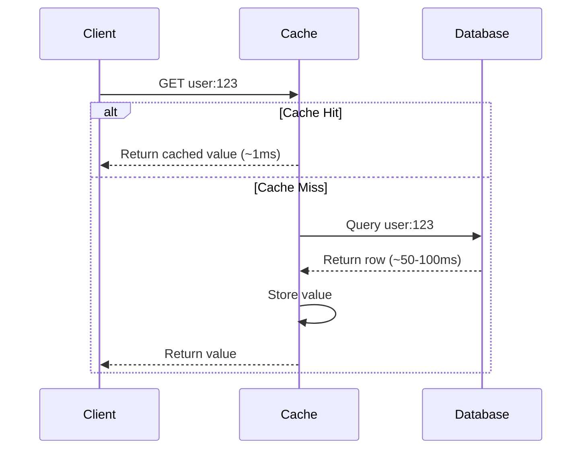

### Diagram — Multi-Layer Caching in a Real Request Path

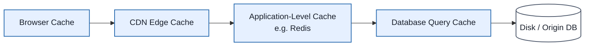

### Key Metrics

| Metric | What It Measures | Why It Matters |
|---|---|---|
| **Hit Ratio** | % of requests served from cache | Higher = more effective cache; <80% often means poor key design or too-small cache |
| **Cache Latency** | Time to read/write cache entry | Should be sub-millisecond (in-memory) vs tens of ms (DB) |
| **Eviction Rate** | How often entries are kicked out before expiry | High eviction rate = cache too small for working set |
| **Miss Latency (Penalty)** | Cost of going to origin on a miss | Determines worst-case tail latency |

### Enterprise Example
**Twitter/X** caches user timelines in Redis rather than recomputing "which tweets should this user see" from scratch on every page load — timeline assembly is expensive (fan-out across follows), so precomputed/cached timelines are what make scrolling feel instant even under massive read load.

> **Trade-off:** Caching buys speed at the cost of **staleness** — the cached value can lag behind the true source of truth for some window of time. Every caching strategy is really a different answer to "how much staleness can we tolerate, and how do we bound it?"

### 📋 Info Card
- **One-liner:** A fast memory layer that avoids repeating expensive work.
- **Use when:** Data is read far more often than it's written, and slight staleness is tolerable.
- **Watch out for:** Low hit ratios (bad key design), and caches that mask an underlying scaling problem instead of fixing it.
- **Key idea to remember:** Caching trades space for time, and correctness for speed — you're always choosing a staleness budget.

### 🎯 Most Asked Interview Questions

**Q1: When would you NOT use a cache?**
*A: If the data changes on almost every read (e.g. a live stock ticker mid-trade) or if strict read-your-writes consistency is required (e.g. a bank balance right after a transfer), a cache adds complexity without much payoff and introduces a staleness risk I don't want to own. I'd only introduce caching once I've measured that a specific read path is both hot and mostly-stable.*

**Q2: How do you decide what's worth caching?**
*A: I look at the read/write ratio and the cost of a cache miss. Expensive-to-compute, rarely-changing, frequently-read data — like a user profile or a product catalog page — is the sweet spot. I'd instrument actual query patterns first rather than guessing; caching the wrong things just adds invalidation complexity for no latency win.*

**Q3: What's a "cold cache" problem and how do you handle it?**
*A: Right after a deploy or a cache flush, every request is a miss, and the origin gets hit with full production load simultaneously — this is the "thundering herd." I'd either pre-warm the cache before cutover, or add jitter and request coalescing so concurrent misses for the same key collapse into a single origin fetch instead of hundreds.*

**Q4: How do you measure whether your caching strategy is working?**
*A: Hit ratio is the headline number, but I also track p99 latency before and after, and origin QPS — a cache that has a great hit ratio but the origin is still getting hammered on the miss path tells me the miss penalty itself needs work, maybe via read replicas or request coalescing.*

**Q5: What's the risk of over-caching?**
*A: Stale data being served longer than acceptable, and a false sense of scalability — the origin's true capacity is masked until a cache flush or outage exposes it all at once. I always make sure the origin can survive a reasonable fraction of direct traffic, not just cached traffic.*

---

## 2. Caching Strategies

### Definition
A caching strategy defines exactly **when** data gets written into the cache and **how** the cache stays synchronized with the source of truth — the choice determines your consistency, latency, and failure-mode trade-offs.

### Real-World Analogy
Think of a restaurant kitchen. **Cache-aside** is a cook who only preps a dish after the first order comes in, then keeps extras ready for the next one. **Write-through** is a kitchen that preps and logs every dish into inventory the moment it's made, even before anyone orders it again. **Write-behind** is a kitchen that serves the dish immediately and does the inventory paperwork later, in a batch, after service.

### Diagram — Cache-Aside (Lazy Loading)

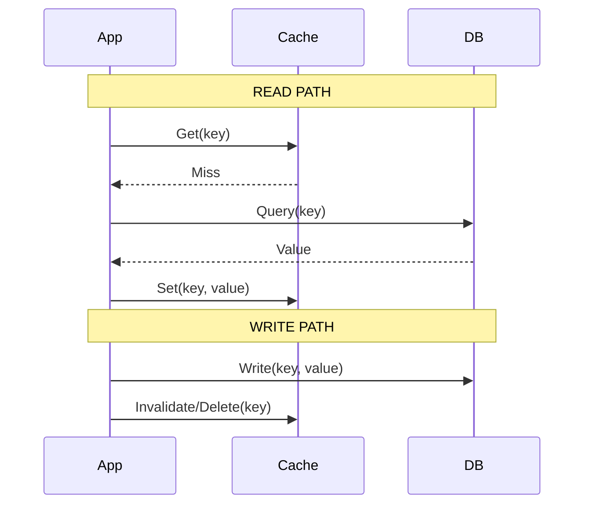

### Diagram — Read-Through

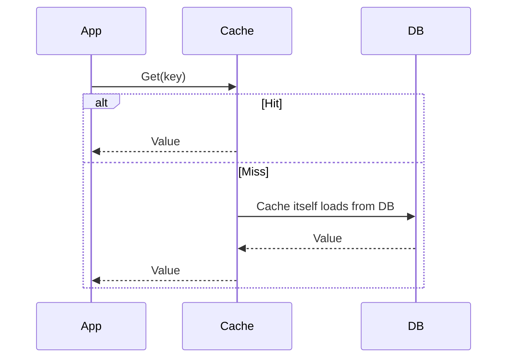

### Diagram — Write-Through / Write-Around / Write-Behind

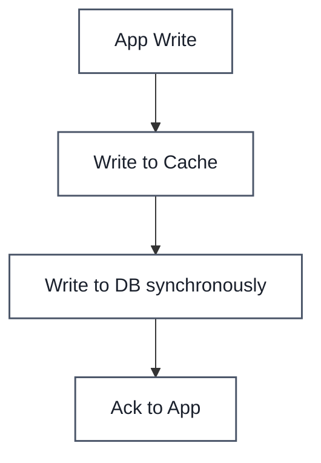

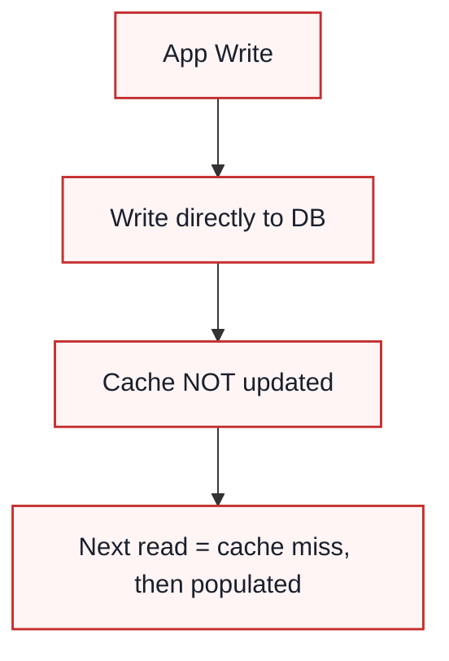

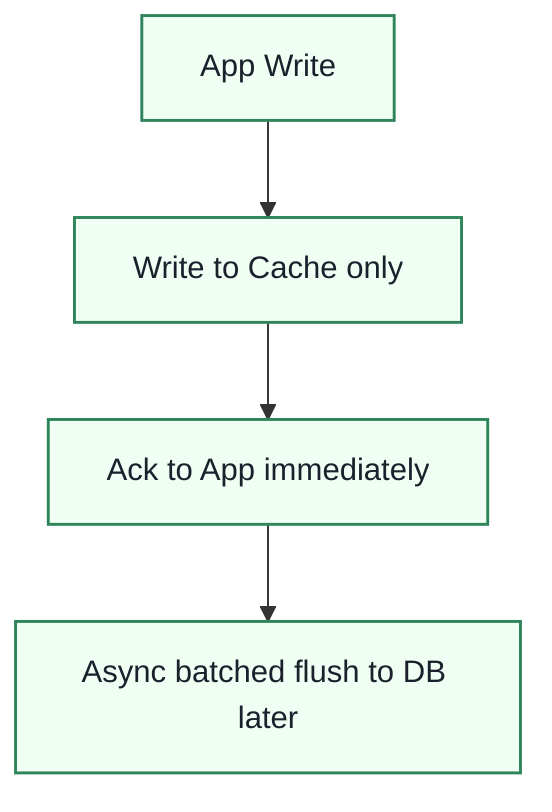

### Comparison Table

| Strategy | Read Path | Write Path | Consistency | Best For | Main Risk |
|---|---|---|---|---|---|
| **Cache-Aside** | App checks cache, then DB on miss | App writes DB, then invalidates cache | Eventually consistent | General-purpose, most common pattern | Race condition between DB write and cache invalidation |
| **Read-Through** | Cache itself loads from DB on miss | Usually paired with write-through | Eventually consistent | Simplifies app code (cache library owns loading) | Cache becomes a hard dependency |
| **Write-Through** | Standard cache read | Every write goes to cache AND DB synchronously | Strong (cache always fresh) | Data that must never be stale after write | Higher write latency (two writes per request) |
| **Write-Around** | Standard cache read (miss on new writes) | Write goes straight to DB, cache untouched | Cache lags until next read | Write-heavy, rarely-re-read data (logs) | First read after write is always a miss |
| **Write-Behind (Write-Back)** | Standard cache read | Write to cache, async flush to DB | Weak — risk of data loss | Very write-heavy workloads needing low write latency | Data loss if cache crashes before flush |

### Enterprise Example
**Facebook's Memcached** deployment (one of the largest cache-aside deployments in the world) uses cache-aside at massive scale — application servers look up Memcached first and fall back to MySQL on a miss, repopulating the cache, which is what lets Facebook serve billions of reads/sec without every request touching the database tier. Contrast this with **financial trading systems**, which often use write-through caching for account balances, because a stale balance is unacceptable even for a few hundred milliseconds.

> **Trade-off:** Write-through gives you freshness at the cost of write latency; write-behind gives you write speed at the risk of data loss; cache-aside is the flexible middle ground but pushes cache-consistency logic onto the application.

### 📋 Info Card
- **One-liner:** The strategy decides when the cache is populated and how in-sync it stays with the DB.
- **Use when:** Cache-aside for general reads; write-through for correctness-critical data; write-behind for extreme write throughput.
- **Watch out for:** The cache-aside race condition — a stale read can be cached if a write happens between your DB read and cache set.
- **Key idea to remember:** Every strategy is a different trade between write latency, read freshness, and durability risk.

### 🎯 Most Asked Interview Questions

**Q1: Walk me through the classic cache-aside race condition and how you'd fix it.**
*A: Thread A reads a miss, queries the DB, and before it writes back to cache, Thread B updates the DB and invalidates the cache — then Thread A's stale read gets written into cache after the invalidation, leaving it permanently stale until TTL expiry. I'd mitigate this with a short TTL as a safety net, or a versioned/compare-and-set write to the cache so a stale write can't clobber a newer invalidation.*

**Q2: Why would you choose write-around over write-through?**
*A: If the data being written is unlikely to be read again soon — audit logs, one-time events — write-through wastes cache space and adds latency to every write for data that'll never be read from cache anyway. Write-around keeps the cache reserved for actually-hot data.*

**Q3: What's the real risk with write-behind caching?**
*A: If the cache node crashes before the async flush to the database happens, that write is gone — you've told the client the write succeeded, but it never reached durable storage. I'd only use write-behind where some data loss is acceptable, or pair it with a durable write-ahead log the cache flushes from.*

**Q4: How do you keep read-through and cache-aside consistent when the underlying DB is updated by another service?**
*A: Neither pattern alone handles out-of-band DB writes — I'd add a TTL as a bound on staleness, or better, have the writing service publish an invalidation event (via a message queue) that all caching layers subscribe to, so cache invalidation isn't solely the reader's responsibility.*

**Q5: If you had to pick one default strategy for a typical CRUD web app, which would it be and why?**
*A: Cache-aside — it's the most operationally simple, doesn't add latency to the write path, and degrades gracefully: if the cache is down entirely, the app still works, just slower, because reads fall straight through to the DB. Write-through and write-behind both make the cache a harder dependency.*

---

## 3. Cache Eviction Policies

### Definition
An eviction policy decides which entries to remove when the cache is full and a new entry needs space — the goal is to keep the entries most likely to be reused and evict the ones least likely to be needed again.

### Real-World Analogy
Think of a small kitchen fridge. **LRU** throws out whatever hasn't been touched in the longest time. **LFU** throws out whatever gets eaten least often, regardless of when. **FIFO** throws out whatever went in first, no matter how popular it turned out to be — like clearing out the oldest leftovers first even if they're everyone's favorite.

### Diagram — LRU Walkthrough (Capacity = 3)

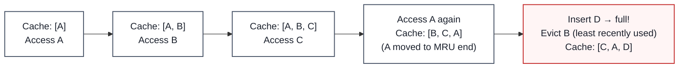

### Diagram — LFU Walkthrough

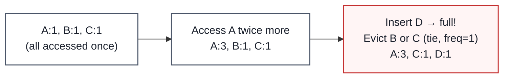

### Diagram — TTL-Based Expiry

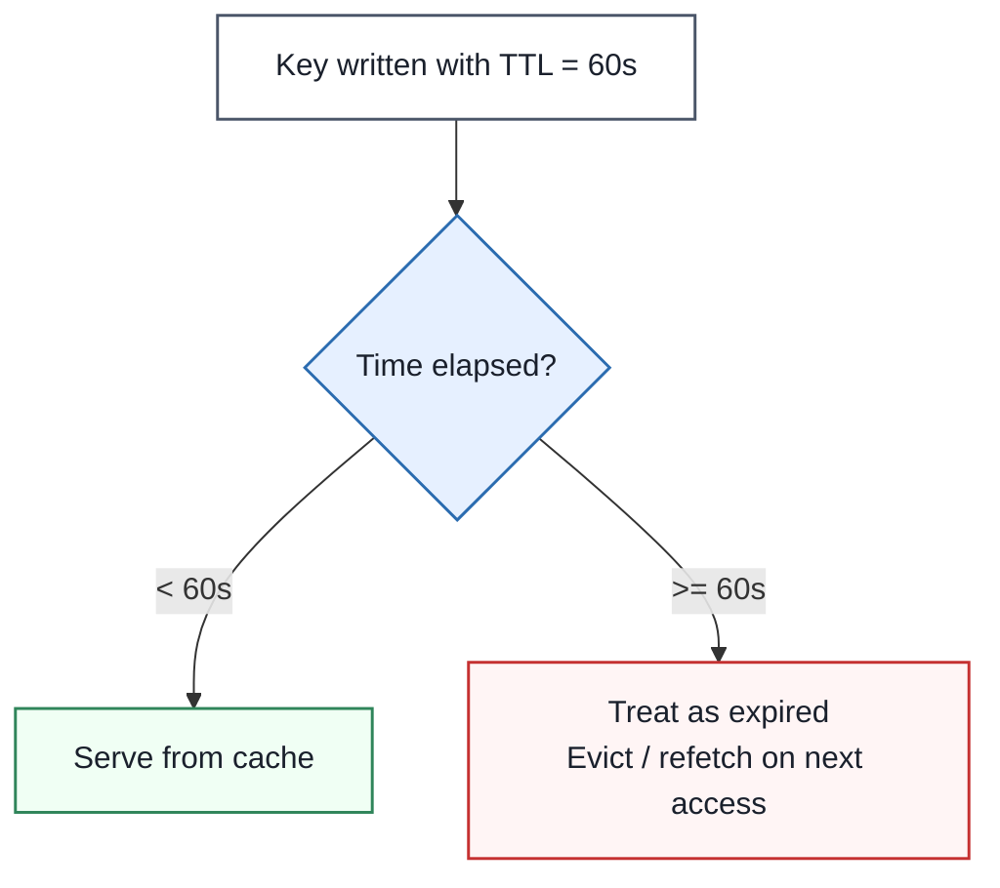

### Comparison Table

| Policy | Evicts | Best Fit | Main Weakness |
|---|---|---|---|
| **LRU** (Least Recently Used) | Item not accessed for the longest time | General-purpose, temporal locality workloads | A single scan/burst can evict genuinely hot items |
| **LFU** (Least Frequently Used) | Item accessed the fewest times | Workloads with stable long-term popularity | Slow to adapt — old popular items can "outstay" relevance |
| **FIFO** | Oldest inserted item, regardless of use | Simple queues, streaming buffers | Ignores usage entirely — can evict hot items |
| **Random Replacement (RR)** | A randomly chosen item | Extremely simple/cheap implementations | No intelligence — unpredictable performance |
| **MRU** (Most Recently Used) | The item just accessed | Rare — cyclic scan patterns where recent items won't be reused soon | Counter-intuitive; wrong choice for most workloads |
| **TTL** (Time To Live) | Item older than a fixed expiry window | Data with a natural "freshness window" (auth tokens, quotes) | Doesn't consider popularity — can evict hot AND cold items alike |
| **Two-Tiered (e.g. LRU + LFU segments)** | Combines recency and frequency signals | High-scale production caches (Redis' approximated LFU, CDN tiers) | More complex to implement and tune |

### Enterprise Example
**Redis** supports multiple configurable eviction policies (`allkeys-lru`, `volatile-lru`, `allkeys-lfu`, `volatile-ttl`, etc.), letting engineers pick the policy per use case rather than being locked into one — most production Redis deployments default to `allkeys-lru` because it's a strong general-purpose choice. **CDNs** (covered below) rely heavily on TTL-based expiry combined with LRU at the edge to decide what stays cached closest to users.

> **Trade-off:** Precise policies like LFU give better hit ratios but cost more memory/CPU to track access frequency; simple policies like FIFO or Random are cheap but can evict hot data — the right choice depends on whether you can afford the bookkeeping.

### 📋 Info Card
- **One-liner:** Eviction policy decides who gets kicked out of a full cache.
- **Use when:** LRU as a solid default; LFU when popularity is stable over time; TTL whenever data has a natural expiry.
- **Watch out for:** LRU's vulnerability to cache pollution from a single large scan (e.g. a batch job reading everything once).
- **Key idea to remember:** No eviction policy is free — they all trade memory/CPU overhead for a better prediction of future access.

### 🎯 Most Asked Interview Questions

**Q1: Why might LRU perform badly for a specific workload?**
*A: LRU assumes recent access predicts future access, which breaks down for scan-heavy workloads — a batch job that reads a million records once can evict your entire working set of genuinely hot data. I've seen this called "cache pollution," and the fix is usually a scan-resistant variant like LRU-K or segmenting the cache so scans can't evict the hot segment.*

**Q2: How does Redis approximate LFU without huge overhead?**
*A: True LFU needs an exact access counter per key, which is expensive at scale, so Redis uses a probabilistic counter with logarithmic growth and periodic decay — it's approximate, but close enough to get LFU's benefits without the bookkeeping cost of tracking every access precisely.*

**Q3: When would you choose TTL-based expiry over LRU/LFU?**
*A: When the data has a natural point where it becomes wrong, not just less popular — a session token, a stock quote, a weather forecast. TTL guarantees a staleness bound regardless of popularity, which LRU/LFU can't promise since a popular-but-stale item might never get evicted.*

**Q4: What's cache pollution and how do you defend against it?**
*A: It's when a burst of one-time-use keys floods the cache and evicts your actual hot working set — think a crawler or batch export. I'd defend with a separate small cache or bypass for bulk/scan operations, or a scan-resistant eviction algorithm like LRU-K that requires multiple accesses before an item is treated as 'hot.'*

**Q5: How do you choose cache size relative to eviction policy?**
*A: I'd look at the working set size — how much distinct hot data is actually accessed repeatedly — and size the cache to comfortably hold it with headroom, then let the eviction policy handle the long tail. Undersizing the cache makes any eviction policy look bad because you're constantly evicting things you'll need again soon.*

---

## 4. Distributed Caching

### Definition
Distributed caching spreads cached data across multiple cache nodes (instead of one machine) so the cache itself can scale horizontally in capacity and throughput, using a partitioning scheme to decide which node owns which key.

### Real-World Analogy
Think of a large food court with many separate stalls, each responsible for a specific range of menu items, instead of one giant single counter trying to serve everyone. If one stall's line gets too long (a "hot" item), the whole food court doesn't grind to a halt — but if everyone suddenly wants the same one dish from the same one stall, that stall alone gets overwhelmed.

### Diagram — Why One Cache Server Isn't Enough

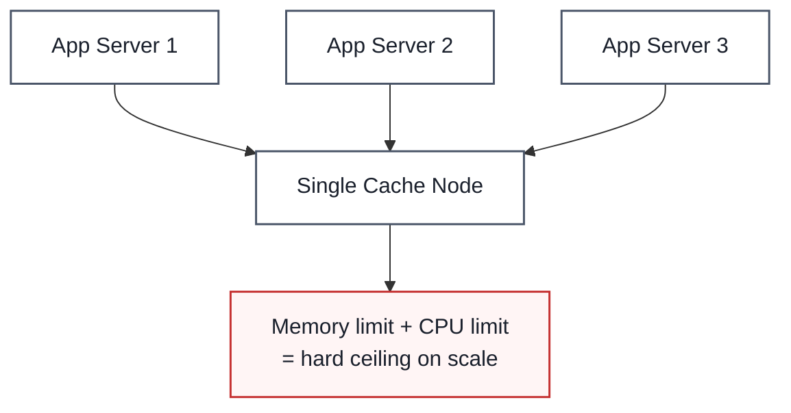

### Diagram — Consistent Hashing Routes Keys to Nodes

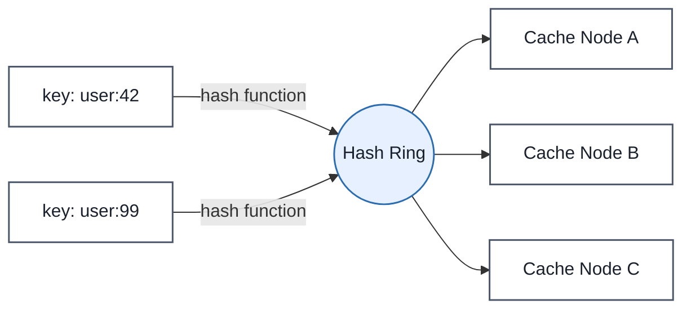
*(See the Pillars doc's [Consistent Hashing section](#) for the full ring/virtual-node mechanics — distributed caching is one of the primary real-world use cases for consistent hashing.)*

### Diagram — The Hot Key Problem

```mermaid
graph TD
    HK[Celebrity's viral post: key = "post:999"] --> N[Single Node B owns this key]
    N --> OVERLOAD[Node B gets 100x traffic<br/>while A and C sit idle]

    classDef box fill:#ffffff,stroke:#4a5568,stroke-width:1.5px,color:#1a202c
    classDef warn fill:#fff5f5,stroke:#c53030,stroke-width:1.5px,color:#1a202c

    class HK,N box
    class OVERLOAD warn
```

### Components of a Distributed Cache

| Component | Role |
|---|---|
| **Cache Nodes** | Individual machines holding a shard/partition of the total cached data |
| **Client-Side Routing / Proxy** | Determines which node owns a given key (consistent hashing is the standard approach) |
| **Replication** | Copies of hot partitions across multiple nodes to avoid hot-key bottlenecks and survive node failure |

### Enterprise Example
**Memcached** popularized client-side consistent hashing (the "Ketama" algorithm) for distributing keys across a cache cluster without a central coordinator. **Redis Cluster** takes a related but distinct approach — it partitions the keyspace into 16,384 fixed "hash slots" distributed across nodes, giving predictable, evenly-distributed sharding without needing full consistent hashing.

> **Trade-off:** Distributing the cache buys you horizontal scale and resilience to a single node's failure, but introduces network hops for every cache access and the hot-key problem — a single very popular key can still overwhelm the one node that owns it, no matter how many nodes you add.

### 📋 Info Card
- **One-liner:** Spreads cache load across many nodes instead of one, using consistent hashing to route keys.
- **Use when:** Cache working set or request throughput outgrows a single machine.
- **Watch out for:** The hot-key problem — sharding by key doesn't help if one key gets disproportionate traffic.
- **Key idea to remember:** Distributed caching solves capacity/throughput scaling, but hot keys need a separate fix (replication or local caching of that one key).

### 🎯 Most Asked Interview Questions

**Q1: How would you solve the hot-key problem in a distributed cache?**
*A: Since sharding alone can't fix a single overloaded key, I'd replicate that specific hot key across multiple nodes and have clients randomly pick a replica to read from, spreading the load. A cheaper first line of defense is a small local in-process cache on each app server for the handful of keys known to be extremely hot, so most hits never leave the app server at all.*

**Q2: Why use consistent hashing instead of simple modulo (key % N) for routing to cache nodes?**
*A: With modulo hashing, adding or removing a single node changes almost every key's target node, causing a massive wave of cache misses. Consistent hashing only remaps the keys that were owned by the node that joined or left — roughly 1/N of keys move instead of nearly all of them.*

**Q3: What happens to a distributed cache when a node fails?**
*A: Without replication, every key that node owned becomes an instant miss, and the origin database takes a spike of traffic for exactly that partition. I'd mitigate this with replica nodes for each partition and a reasonable request timeout with fallback so the app degrades gracefully instead of hanging.*

**Q4: Redis Cluster's fixed hash slots vs. Memcached's consistent hashing — what's the practical difference?**
*A: Redis Cluster's 16,384 fixed slots make rebalancing explicit and centrally coordinated — an operator moves slot ranges between nodes — which is more predictable but less automatic. Memcached's Ketama consistent hashing rebalances automatically and needs no central coordinator, but gives you less control over exactly how keys are distributed.*

**Q5: How do you handle cache warm-up when adding a new node to a distributed cache?**
*A: Right after a new node joins, it owns a slice of the keyspace but starts completely empty, so every request for its keys is a guaranteed miss until it's warmed. I'd either pre-populate it from a snapshot/replica before routing traffic to it, or accept a temporary miss-rate bump and let it warm naturally, depending on how much load the origin can absorb.*

---

## 5. Content Delivery Network (CDN)

### Definition
A CDN is a globally distributed network of proxy servers ("edge" or "Points of Presence" — PoPs) that cache and serve content from a location physically close to the end user, minimizing the network distance (and therefore latency) between the user and the data.

### Real-World Analogy
Instead of every customer worldwide ordering a book from one central warehouse in Ohio, a CDN is like having small regional warehouses stocked with the most popular books in every country — most customers get their order from a nearby warehouse, and only a rare or exotic order needs to go all the way back to Ohio.

### Diagram — The Distance-Latency Problem

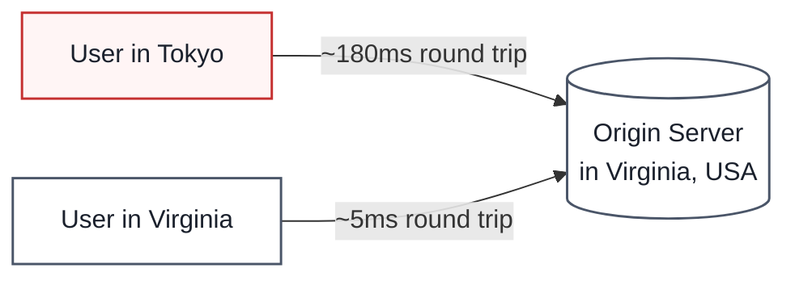

### Diagram — Pull CDN Flow (Cache Miss → Cache Hit)

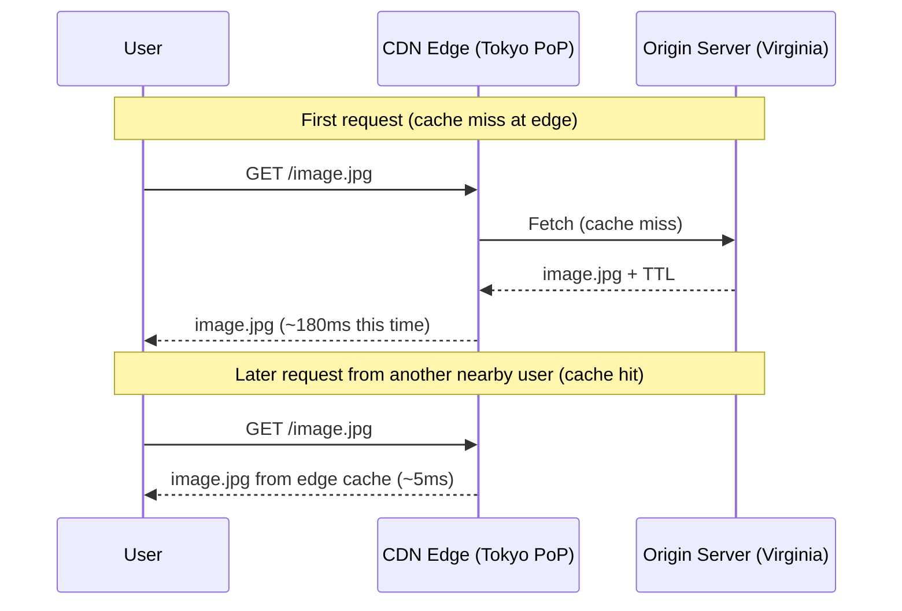

### Diagram — Push vs. Pull CDN

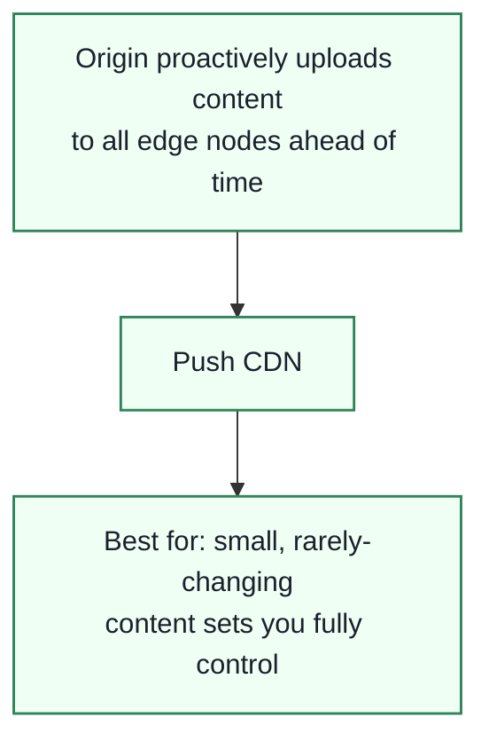

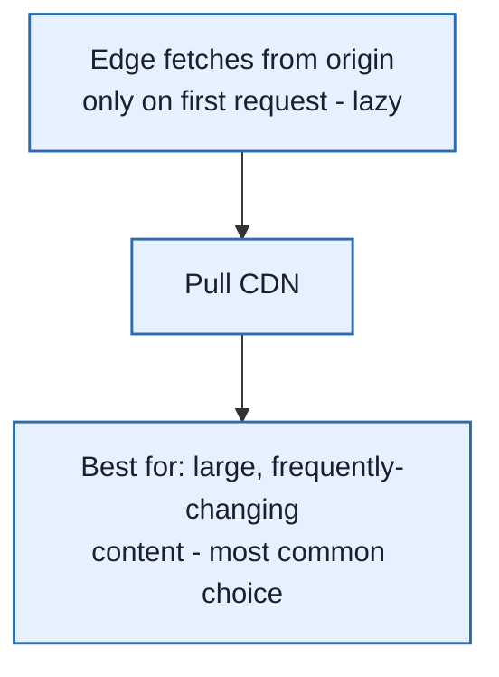

### Comparison Table

| Aspect | Push CDN | Pull CDN |
|---|---|---|
| **Who initiates the copy** | Origin uploads content to edges ahead of time | Edge fetches from origin lazily, on first request |
| **Best for** | Small, stable content sets (e.g. a software installer) | Large, dynamic content sets (most websites, video) |
| **First-request latency** | Fast — already at the edge | Slow — cache miss triggers origin fetch |
| **Storage cost** | Higher — content duplicated everywhere upfront | Lower — only cached where/when actually requested |
| **Staleness control** | Origin controls exactly when edges update | Governed by TTL expiry |

### What CDNs Typically Cache
Static assets — images, videos, CSS/JS bundles, downloadable files — are the classic CDN use case. Modern CDNs also increasingly cache **dynamic content** at the edge (personalized API responses with short TTLs) and even run **edge compute** (Cloudflare Workers, Lambda@Edge) to execute logic close to the user.

### Enterprise Example
**Netflix Open Connect** is Netflix's own purpose-built CDN — they place dedicated caching appliances directly inside ISP networks worldwide, so the majority of Netflix's streaming traffic never has to leave a user's own ISP, which is what makes 4K streaming to hundreds of millions of users feasible. **Cloudflare** and **Akamai** are third-party CDNs used by a huge share of the web — Akamai alone has historically served a significant percentage (commonly cited around 15-30%) of all global web traffic through its edge network.

> **Trade-off:** CDNs dramatically cut latency and offload origin traffic, but introduce their own staleness window (governed by TTL and cache-invalidation/purge mechanisms) — pushing a content update globally isn't instant, and purging a CDN cache at scale is itself an engineering problem.

### 📋 Info Card
- **One-liner:** Caches content at edge locations physically close to users to minimize network latency.
- **Use when:** Serving static assets or media globally, or offloading read-heavy traffic from an origin.
- **Watch out for:** Cache invalidation/purge delay across thousands of edge nodes when content changes.
- **Key idea to remember:** A CDN is distributed caching applied at internet scale — the "nodes" are edge PoPs, and the "hot key problem" becomes "which region is this content popular in."

### 🎯 Most Asked Interview Questions

**Q1: How do you handle cache invalidation across a CDN when content changes?**
*A: Most CDNs offer an explicit purge/invalidation API to force-expire specific URLs across all edge nodes, but it's not instant and can take seconds to propagate globally. For content I know will change, I'd version the URL itself (e.g. a content hash in the filename) so the "old" cached version simply becomes unreferenced rather than needing an active purge.*

**Q2: When would you choose a push CDN over a pull CDN?**
*A: Push makes sense when I have a small, well-defined set of files that change together and I want them guaranteed to be at every edge before traffic starts — like a game client update. For a typical website with a huge and constantly-changing set of assets, pull is far more practical since I don't have to manage pushing everything everywhere manually.*

**Q3: How does a CDN decide which edge location serves a given user?**
*A: Typically via DNS-based routing (the CDN's DNS returns an IP for the geographically or network-nearest PoP) or anycast routing, where the same IP address is announced from multiple locations and standard internet routing sends the user to the closest one. Either way, the goal is minimizing round-trip network distance.*

**Q4: Why does Netflix run its own CDN (Open Connect) instead of just using a third-party one?**
*A: At Netflix's traffic volume, the economics and control of owning the edge infrastructure — placing appliances directly inside ISPs — outweigh the cost of building it themselves, and it lets them precisely control caching behavior for video-specific workloads. Most companies don't have that traffic volume, so a third-party CDN like Cloudflare or Akamai is the pragmatic choice.*

**Q5: What's the interaction between CDN caching and dynamic, personalized content?**
*A: Purely dynamic per-user content historically bypassed the CDN entirely and went straight to origin, but modern CDNs support short-TTL caching or edge compute for semi-personalized content — like caching a page structure at the edge while injecting user-specific data client-side. I'd only push personalized content to CDN caching if the personalization can be cleanly separated from the cacheable bulk of the response.*

---

## Bringing It All Together — A Viral Traffic Scenario

Imagine a product page suddenly goes viral after a celebrity mentions it:

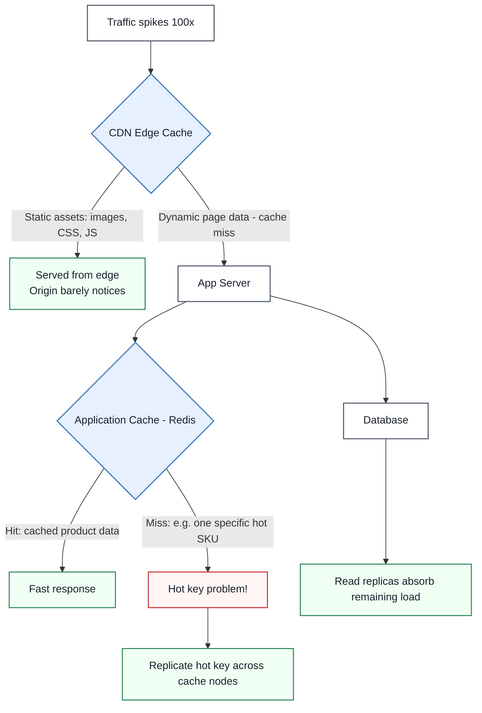

Each layer catches a different failure mode: the CDN absorbs the static-asset flood so it never reaches the origin, the application cache absorbs repeated reads of the same product data, and — when even that isn't enough because everyone wants the *same* item — hot-key replication and read replicas share the remaining load. This is exactly why real systems layer multiple caching techniques rather than relying on just one.

---

## Quick-Reference Cheat Sheet

| Concept | One-Line Definition | Primary Techniques |
|---|---|---|
| **Caching 101** | Storing frequently-used data in fast storage to avoid repeating expensive work | Hit ratio monitoring, multi-layer caching |
| **Caching Strategies** | When/how the cache is populated relative to the source of truth | Cache-aside, read-through, write-through, write-around, write-behind |
| **Eviction Policies** | Deciding what to remove when the cache is full | LRU, LFU, FIFO, TTL, Two-Tiered |
| **Distributed Caching** | Scaling the cache itself across multiple nodes | Consistent hashing, replication, hot-key mitigation |
| **CDN** | Caching content at the network edge, close to users | Push vs. pull, TTL expiry, anycast/DNS routing |

### Common Interview Follow-Up Questions

**Q: What's the difference between a cache and a database?**
*A: A database is the durable source of truth; a cache is a disposable, faster copy of a subset of that data. If a cache is lost entirely, the system should still function correctly (just slower) by falling back to the database — that's the core design invariant.*

**Q: How does distributed caching relate to consistent hashing?**
*A: Consistent hashing is the standard mechanism for deciding which cache node owns which key in a distributed cache — see the [Consistent Hashing section](#) of the Pillars doc for the full ring and virtual-node mechanics; it's the same technique, just applied specifically to cache-node routing.*

**Q: What's the single most common caching mistake you see in interviews?**
*A: Candidates reach for a cache before establishing the read/write ratio and consistency requirements — caching is not a free win, and I always want to hear someone articulate what staleness they're willing to accept before proposing where to put a cache.*

**Q: How do caching and CAP theorem relate?**
*A: A cache is inherently an AP-leaning component — it deliberately serves a possibly-stale copy of data to stay fast and available rather than always going to the strongly-consistent source of truth. Understanding that trade-off is exactly why every caching strategy above is fundamentally about managing staleness.*

**Q: If a system doesn't have a cache today, what's your process for introducing one?**
*A: I'd profile actual read/write patterns and latency first, identify the specific hot, read-heavy, slow-changing data paths, start with the simplest strategy (cache-aside) on just that path, and measure hit ratio and origin load before and after — caching should be added surgically based on data, not applied broadly as a default.*
