# Asynchronous Communication
### Interview-ready reference guide

---


## Why Asynchronous Communication Matters

Synchronous request/response works fine until one service's slowness becomes every caller's slowness. Asynchronous communication breaks that coupling: a producer hands off work (or announces a fact) and moves on, trusting the messaging layer to deliver it. This is the backbone of almost every large-scale system — Uber uses Kafka to move trip and location events between hundreds of services, LinkedIn built Kafka specifically to decouple its activity-stream pipeline, and Netflix uses event streams to keep dozens of microservices in sync without a single point of failure taking down the whole platform.

The three patterns in this doc solve different problems: **Pub/Sub** broadcasts a fact to many independent listeners, **Message Queues** distribute units of work across a pool of workers, and **Change Data Capture (CDC)** turns database writes themselves into a stream of events other systems can react to.

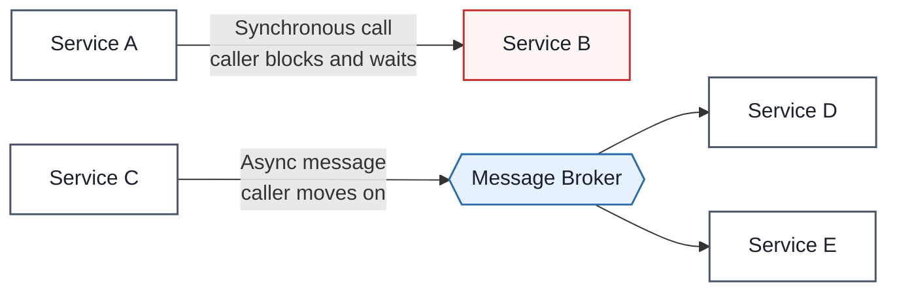

---

## 1. Pub/Sub (Publish-Subscribe)

### Definition
Pub/Sub is a messaging pattern where a **publisher** sends events to a **topic** without knowing who's listening, and any number of independent **subscribers** each receive their own copy of every event.

### Real-World Analogy
Think of a YouTube channel. The creator (publisher) uploads a video to their channel (topic) without knowing or caring who's subscribed. Every subscriber gets notified independently — one watches immediately, another watches next week, another never watches at all — and none of that affects the creator or the other subscribers.

### Diagram — Fan-Out to Independent Subscribers

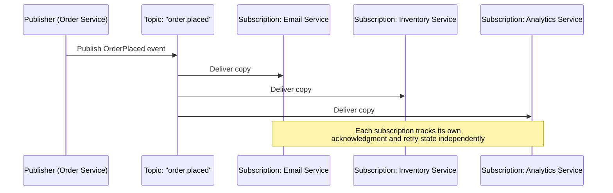

### Diagram — Push vs. Pull Delivery

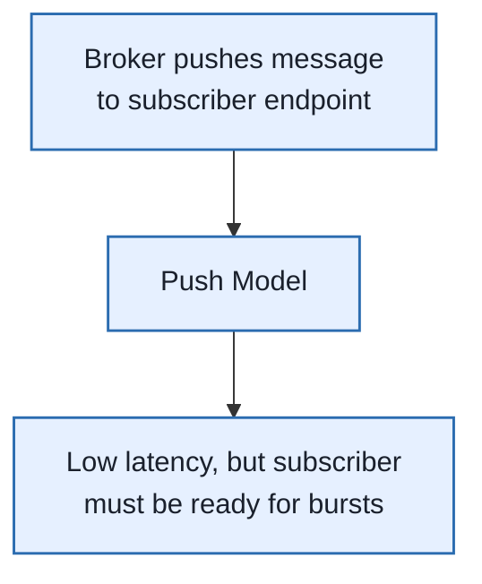

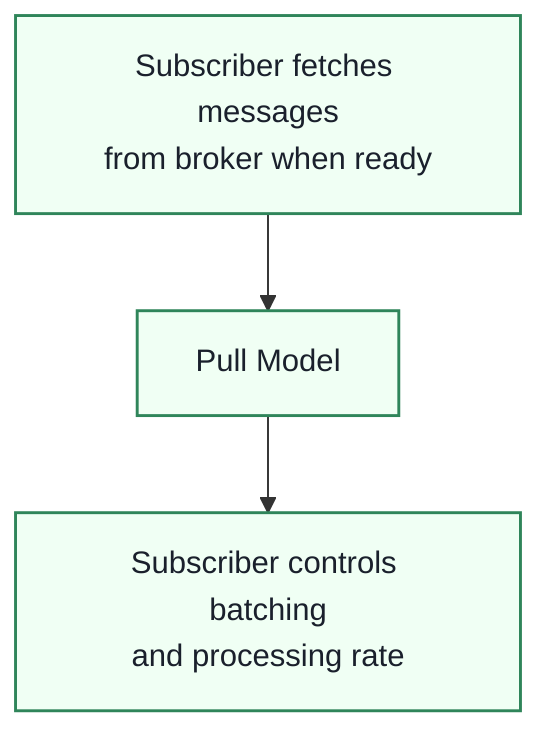

### Diagram — Fan-Out-to-Queues Pattern (SNS → SQS)

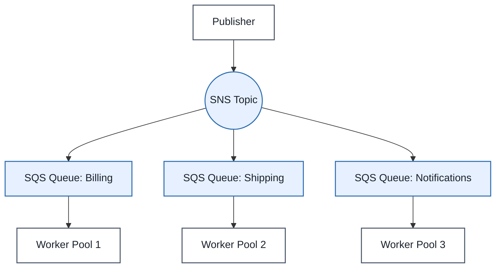

### Pub/Sub vs. Message Queue (Quick Distinction)

| Aspect | Pub/Sub | Message Queue |
|---|---|---|
| **Recipients** | Every interested subscription gets a copy | One worker from a pool gets each message |
| **Purpose** | Fan-out — "this happened, react if you care" | Distribute work — "someone do this task" |
| **Coupling** | Publisher doesn't know subscriber count | Producer often expects the task to get done once |

### Enterprise Example
**Amazon SNS** is a managed Pub/Sub service used extensively across AWS-based architectures for fan-out — a single event (e.g. "order placed") published once to SNS can simultaneously trigger an SQS queue for billing, a Lambda function for fraud checks, and an email notification, all independently. **Apache Kafka**, originally built at **LinkedIn**, underlies this same pattern at massive scale — LinkedIn uses it to move activity-stream and operational data between hundreds of internal services with durable, replayable logs.

> **Trade-off:** Pub/Sub decouples publishers from subscriber count and identity, but that same decoupling means the publisher has no guarantee any given subscriber actually processed the event — you're trading control for scalability, and you now own monitoring subscription lag and designing idempotent consumers.

### 📋 Info Card
- **One-liner:** Broadcasts an event to every independent subscriber, not just one worker.
- **Use when:** Multiple services need to react to the same event, and the publisher shouldn't need to know who's listening.
- **Watch out for:** Delivery is typically at-least-once — subscribers will see duplicates and must be idempotent.
- **Key idea to remember:** Pub/Sub answers "this happened"; a queue answers "someone do this."

### 🎯 Most Asked Interview Questions

**Q1: How would you handle a subscriber that's consistently falling behind?**
*A: I'd monitor subscription lag as a first-class metric — most managed Pub/Sub systems expose it directly — and alert before the backlog grows unbounded. If it's a capacity problem I'd scale out consumers within that subscription; if it's a poison message repeatedly failing, I'd route it to a dead-letter queue after a bounded number of retries so it stops blocking the rest of the stream.*

**Q2: Why is at-least-once delivery the norm, and how do you deal with duplicate messages?**
*A: Guaranteeing exactly-once delivery across a network requires either extremely expensive coordination or accepting at-least-once and making consumers idempotent — most systems choose the latter because it's far cheaper and simpler to reason about. I'd include a unique eventId with every message and have consumers check-and-record that ID before processing, so a duplicate delivery becomes a no-op.*

**Q3: How do you evolve an event schema without breaking existing subscribers?**
*A: I treat events as a stable contract — I only add new fields, never remove or repurpose existing ones, and I include a version field so consumers can branch on it if needed. Breaking changes go out as a new event type or topic version rather than mutating the old one in place, so subscribers that haven't upgraded keep working.*

**Q4: When would you NOT use Pub/Sub?**
*A: If the caller needs an immediate synchronous response, Pub/Sub is the wrong tool entirely — it's fire-and-forget by design. I'd also avoid it for a single handler with no fan-out need, where a plain queue is simpler and gives clearer work-distribution semantics, and for workflows needing strict sequential ordering across the whole stream rather than just within a partition.*

**Q5: How do you guarantee ordering in a Pub/Sub system?**
*A: Most Pub/Sub systems only guarantee ordering within a partition or a message key, not globally — Kafka is the classic example, where ordering holds per-partition. If strict ordering matters for a given entity, like all events for one order ID, I'd key messages by that ID so they always land on the same partition and are processed in sequence.*

**Q6: What's the risk of using Pub/Sub for extremely low-latency, high-reliability financial transactions?**
*A: The main risks are delivery lag and at-least-once duplication — neither is acceptable if you need a guaranteed, once-only, immediate state change like debiting an account. For that I'd favor a synchronous call with a durable local transaction, or if async, pair it with a strict idempotency key and reconciliation job rather than relying on the messaging layer alone for correctness.*

---

## 2. Message Queues

### Definition
A message queue decouples producers from consumers by buffering units of work — a producer drops a message onto the queue and moves on, and one consumer from a pool of workers picks it up, processes it, and acknowledges completion.

### Real-World Analogy
Think of a deli counter's ticket system. Customers (producers) take a numbered ticket and walk away instead of waiting at the counter. Any available deli worker (consumer) calls the next number and handles that one order. If a worker steps away mid-order without completing it, that ticket goes back into rotation for another worker to pick up — the customer never has to know or care which worker handled it.

### Diagram — Message Lifecycle

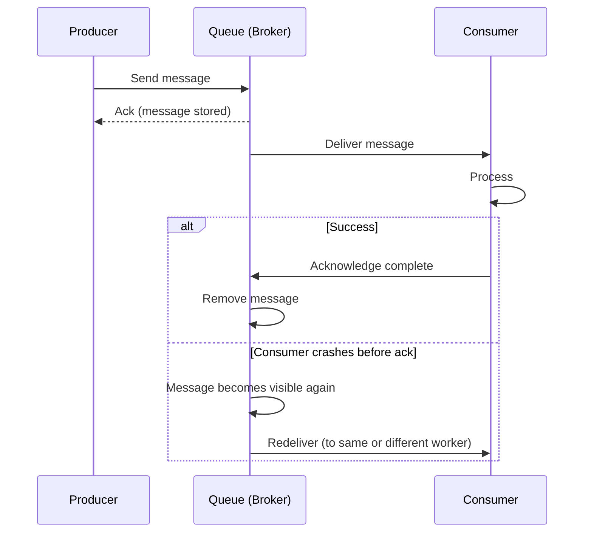

### Diagram — Work Queue Pattern (Load Distributed Across Workers)

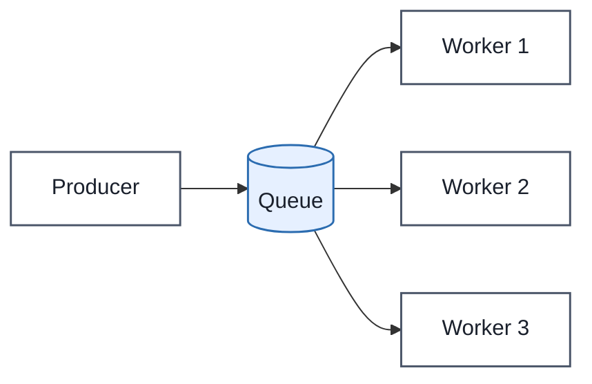

### Diagram — Retry Exhaustion → Dead Letter Queue

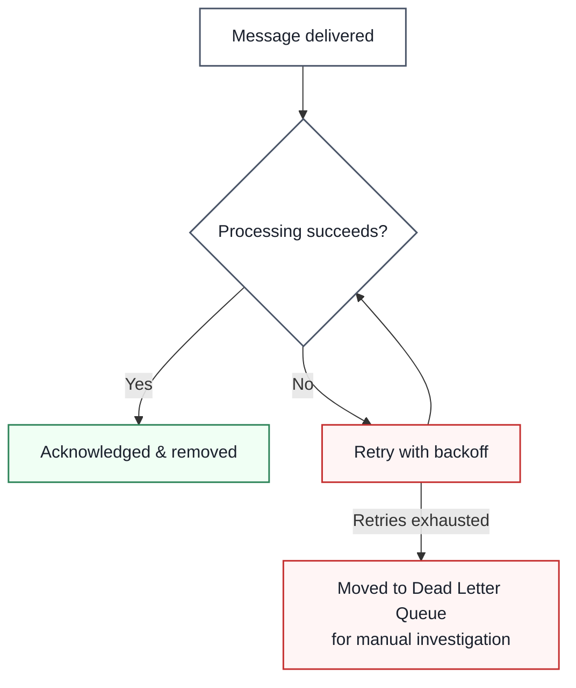

### Comparison Table — Popular Message Queue Systems

| System | Strength | Typical Use Case |
|---|---|---|
| **RabbitMQ** | Flexible routing (exchanges, bindings) | Traditional task/work queues |
| **Amazon SQS** | Fully managed, simple, near-infinite scale | Decoupling microservices on AWS |
| **Apache Kafka** | Durable partitioned log, replay, high throughput | Event streaming at very large scale |
| **Redis Streams** | Lightweight, low operational overhead | When Redis is already in the stack |
| **Google Cloud Pub/Sub** | Managed multi-subscriber distribution | Fan-out across GCP services |

### Enterprise Example
**Amazon SQS** is used throughout Amazon's own retail platform to decouple order processing from downstream steps like payment, fraud checks, and fulfillment — if the fulfillment system is temporarily overloaded, orders queue up safely instead of failing outright. **Uber** relies heavily on Kafka-based queues and streams to move ride, location, and pricing events between its hundreds of backend services without those services calling each other directly and cascading failures during traffic spikes.

> **Trade-off:** Queues absorb traffic spikes and let producers and consumers scale independently, but they add operational surface area — you now have to monitor queue depth, message age, and retry storms, and a silently growing backlog is a production incident waiting to be noticed.

### 📋 Info Card
- **One-liner:** Buffers units of work so producers and consumers can scale and fail independently.
- **Use when:** Background processing, traffic smoothing, or any workflow where the caller doesn't need an immediate synchronous result.
- **Watch out for:** Retry amplification — aggressive retries against an already-failing downstream service can make an outage worse.
- **Key idea to remember:** A queue distributes each message to exactly one worker; that's the core difference from Pub/Sub's fan-out.

### 🎯 Most Asked Interview Questions

**Q1: How do you design a consumer to be safely retried?**
*A: The core requirement is idempotency — processing the same message twice should produce the same end state as processing it once. I'd usually do this with an idempotency key stored alongside the side effect, so a duplicate delivery can check "have I already done this?" before acting, rather than trusting the queue to deliver exactly once.*

**Q2: What's a dead letter queue and when does a message end up there?**
*A: It's a separate queue that catches messages which have failed processing repeatedly and exhausted their retry budget, so they stop blocking or endlessly retrying against the main queue. I'd always pair a DLQ with alerting, since a DLQ that nobody's watching just becomes a black hole where failed orders or payments silently pile up.*

**Q3: How do you prevent a retry storm from making an outage worse?**
*A: Exponential backoff with jitter is the standard fix — instead of every failed message retrying immediately and in lockstep, retries spread out over time and don't all hammer the struggling downstream service simultaneously. I'd also cap the maximum retry count so a truly broken message routes to a DLQ instead of retrying forever.*

**Q4: How do you monitor whether a queue-based system is healthy?**
*A: The key signals are queue depth, oldest message age, and consumer processing rate — a growing queue depth combined with rising message age tells me consumers can't keep up, whether from a traffic spike or a slow downstream dependency. I'd alert on message age crossing a threshold rather than raw queue depth alone, since depth can be normal for a bursty but healthy system.*

**Q5: SQS vs. Kafka — how would you choose?**
*A: If I need a simple, fully-managed work queue with minimal operational overhead, SQS is the pragmatic choice. If I need replayable event history, very high throughput, or multiple independent consumer groups reading the same stream at different speeds, Kafka's log-based model fits better — the trade-off is Kafka requires more operational expertise to run well.*

**Q6: How would you handle ordering requirements in a queue-based system?**
*A: Standard queues typically don't guarantee strict ordering once you have multiple consumers, since messages can be picked up and processed at different speeds. If ordering matters for a specific entity, I'd use a FIFO queue or partition/group messages by that entity's ID so all its messages are always handled by the same consumer in sequence.*

---

## 3. Change Data Capture (CDC)

### Definition
Change Data Capture detects committed changes in a database (inserts, updates, deletes) as they happen and propagates them to downstream systems in near real-time, instead of relying on periodic batch scans.

### Real-World Analogy
Think of a bank's real-time transaction feed versus a monthly paper statement. A monthly statement (batch polling) only tells you what happened, summarized, after the fact — you might miss that money was deposited and then withdrawn the same day. A real-time transaction alert (CDC) tells you about every single change the instant it's committed, in order, without you having to keep re-checking your balance.

### Diagram — Log-Based CDC Flow

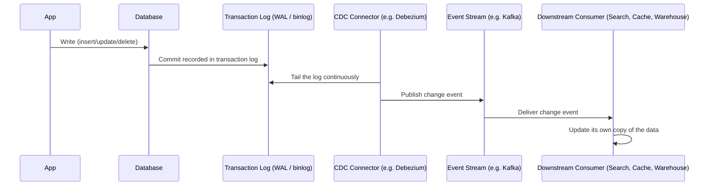

### Diagram — Three CDC Approaches Compared

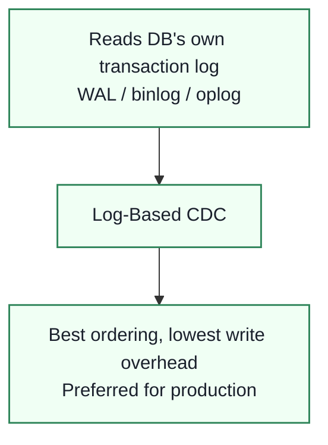

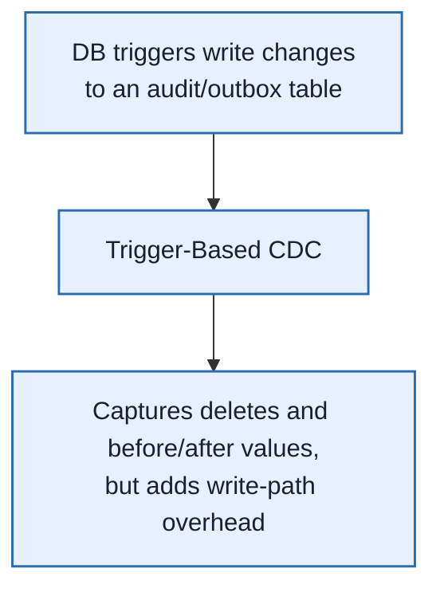

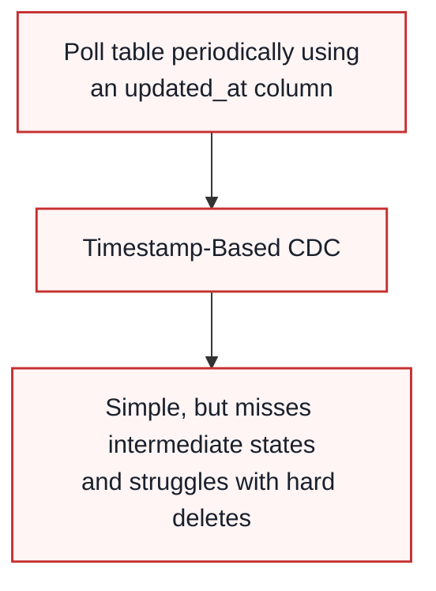

### Comparison Table

| Approach | Ordering Quality | Write Overhead | Captures Deletes? | Best For |
|---|---|---|---|---|
| **Log-Based** | Excellent (matches commit order) | Minimal — reads existing log | Yes | High-volume production systems |
| **Trigger-Based** | Good | Higher — every write also fires a trigger | Yes | When log access isn't available |
| **Timestamp-Based** | Poor — can miss intermediate states | None (polling-based) | No — hard deletes leave no trace | Simple, low-stakes sync jobs |

### Enterprise Example
**Debezium**, an open-source log-based CDC platform, is widely used to stream changes from databases like MySQL and PostgreSQL into Kafka — companies like **Shopify** and **Airbnb** have publicly discussed using Debezium-style CDC pipelines to keep search indexes, caches, and analytics systems synchronized with their primary transactional databases without hammering those databases with polling queries.

> **Trade-off:** CDC gives you near-real-time synchronization without touching application code, but it couples downstream consumers to your database's internal change format, and initial full-table snapshots for large tables can be expensive to produce and stream.

### 📋 Info Card
- **One-liner:** Streams database changes as events instead of polling for what changed.
- **Use when:** Keeping a search index, cache, or downstream service's read model in sync with a source-of-truth database.
- **Watch out for:** Growing CDC lag, and log retention windows limiting how far back you can recover after an outage.
- **Key idea to remember:** Log-based CDC is the production-grade default — trigger-based and timestamp-based are fallbacks when log access isn't available.

### 🎯 Most Asked Interview Questions

**Q1: Why is log-based CDC generally preferred over trigger-based or timestamp-based approaches?**
*A: The transaction log is something the database already maintains for its own durability and replication needs, so tailing it adds essentially zero overhead to the write path and preserves exact commit ordering. Triggers add overhead to every write, and timestamp polling can miss multiple updates that happen between poll intervals or entirely miss hard deletes.*

**Q2: How would you use CDC to keep a search index like Elasticsearch in sync with a primary database?**
*A: I'd set up a log-based CDC connector — Debezium is the standard choice — to stream every insert/update/delete from the source database into a Kafka topic, then have a consumer apply those changes to Elasticsearch. This avoids nightly batch reindexing and keeps search results close to real-time without adding read or write load directly on the primary database.*

**Q3: What happens to CDC consumers during a large initial table snapshot?**
*A: The connector typically has to read and stream the entire existing table as a starting snapshot before it can start tailing live changes, which can be slow and resource-intensive for very large tables. I'd usually schedule that snapshot during low-traffic windows and make sure downstream consumers can distinguish snapshot events from live change events if that matters for their logic.*

**Q4: How do you handle schema changes in a CDC pipeline without breaking downstream consumers?**
*A: I'd pair CDC with a schema registry so every change event's structure is versioned and validated before it's published, and I'd favor additive schema changes over renaming or removing columns whenever possible. For genuinely breaking changes, I'd version the topic or event type so old consumers keep working against the old shape until they're migrated.*

**Q5: What's the "outbox pattern" and how does it relate to CDC?**
*A: Instead of trying to infer business-meaningful events from raw row changes, a service writes an explicit "event" row into an outbox table as part of the same transaction as its actual data change — then CDC tails that outbox table specifically, turning it into a clean, intentional event stream rather than exposing raw internal table structure to every consumer.*

**Q6: How would you monitor CDC pipeline health in production?**
*A: The key metric is CDC lag — the delay between a change being committed in the source database and it appearing downstream — which I'd track continuously and alert on. I'd also monitor the connector's own health and the source database's log retention window, since if the connector falls too far behind and the log rotates past what it hasn't read yet, you can lose changes entirely and need a fresh snapshot.*

---

## Bringing It All Together — An Order Placement Scenario

Imagine an e-commerce checkout flow that needs to update inventory, notify the customer, sync a search index, and feed analytics — all without the customer waiting on any of it:

```mermaid
graph TD
    U[Customer clicks "Place Order"] --> API[Order Service]
    API --> DB[(Orders Database)]
    API --> Topic((Pub/Sub Topic:<br/>order.placed))

    Topic --> Q1[Queue: Email Worker]
    Topic --> Q2[Queue: Inventory Worker]
    Topic --> Q3[Analytics Consumer]

    DB --> Log[Transaction Log]
    Log --> CDC[CDC Connector]
    CDC --> Search[Search Index Sync]
    CDC --> Cache[Cache Invalidation]

    classDef box fill:#ffffff,stroke:#4a5568,stroke-width:1.5px,color:#1a202c
    classDef lb fill:#e6f0ff,stroke:#2b6cb0,stroke-width:1.5px,color:#1a202c
    classDef region fill:#f0fff4,stroke:#2f855a,stroke-width:1.5px,color:#1a202c

    class U,API box
    class Topic,CDC lb
    class DB,Log,Q1,Q2,Q3,Search,Cache region
```

The customer gets an instant "order confirmed" response — the API only had to write to the database and publish one event. Pub/Sub fans that event out to email, inventory, and analytics independently; queues make sure each of those tasks completes reliably even if a worker crashes mid-processing; and CDC, running off the database's own transaction log, keeps the search index and cache in sync without the order service needing to know either of them exist.

---

## Quick-Reference Cheat Sheet

| Concept | One-Line Definition | Primary Mechanisms |
|---|---|---|
| **Pub/Sub** | Broadcasts an event to every independent subscriber | Topics, subscriptions, fan-out, push/pull delivery |
| **Message Queues** | Distributes units of work across a pool of consumers | Producer/consumer, ack/retry, dead letter queues |
| **Change Data Capture** | Streams database changes as events instead of polling | Log-based tailing (WAL/binlog), connectors, outbox pattern |

### Common Interview Follow-Up Questions

**Q: Is Kafka a message queue or Pub/Sub system?**
*A: Both, really — Kafka's durable partitioned log supports classic work-queue-style consumption (one consumer group processes each message once) and Pub/Sub-style fan-out (multiple independent consumer groups can each read the entire stream at their own pace). That flexibility is a big part of why it's become the default choice for large-scale event-driven systems.*

**Q: What's the single biggest correctness risk across all three patterns?**
*A: Assuming exactly-once delivery when the underlying system only guarantees at-least-once — nearly every real messaging system can redeliver a message, so consumers that aren't idempotent will eventually double-process something, whether that's charging a customer twice or double-incrementing an inventory count.*

**Q: How does CDC relate to Pub/Sub and queues?**
*A: CDC is really a source of events — it generates a stream of change events off the database, which then typically flows into the same Pub/Sub or queue infrastructure used for any other event. You'd rarely compare "CDC vs. Pub/Sub" as competing choices; CDC usually feeds into Pub/Sub/Kafka as its transport layer.*

**Q: When would a system need all three patterns together?**
*A: Any sufficiently large event-driven system tends to need all three — Pub/Sub for fan-out notifications, queues for reliable background task processing, and CDC to keep derived views (search, cache, warehouse) in sync with the source of truth — because each solves a distinct problem that the others don't.*

---

## How to Answer This in a Live Interview

Async communication questions usually show up as **"How would you decouple these two services?"** or **"How would you make sure this system doesn't fall over under a traffic spike?"** — open-ended prompts where you're expected to pick the right pattern and defend it.

### Step 1 — Clarify Before You Answer

Never propose a messaging pattern before you know:
1. **Does the caller need an immediate response**, or is fire-and-forget acceptable?
2. **How many downstream consumers need to react** to the same event — one worker, or many independent services?
3. **What ordering guarantees are required** — global, per-entity, or none?
4. **Can consumers tolerate duplicate delivery?** (Almost always yes if designed for it — but confirm.)
5. **Is this about distributing work, broadcasting a fact, or syncing a database's state elsewhere?**
6. **What's the acceptable lag** between an event happening and consumers seeing it?

### Step 2 — Map Constraints to Concepts

| If the interviewer says... | ...it points you toward |
|---|---|
| "Multiple services need to react to the same event" | Pub/Sub |
| "We just need to distribute background jobs across workers" | Message Queue |
| "One service's database changes need to reach other systems" | Change Data Capture |
| "We need replay and very high throughput" | Kafka (works for both Pub/Sub and queue semantics) |
| "Strict ordering per customer/order matters" | Partition/key by that entity's ID |
| "Consumers keep failing on the same message" | Dead letter queue + alerting |

### Step 3 — Structure Your Spoken Answer

1. **State the coupling problem** — "Service A is currently blocked waiting on Service B, and that's making A's availability dependent on B's."
2. **Propose the pattern** — Pub/Sub, queue, or CDC, and say which one and why in one sentence.
3. **Name the delivery guarantee** you're assuming (almost always at-least-once) and how consumers stay correct under it (idempotency).
4. **Call out ordering scope** — global, per-partition, or none — before the interviewer has to ask.
5. **Mention failure handling** — retries, backoff, dead letter queue.
6. **Mention how you'd monitor it** — queue depth/message age for queues, subscription lag for Pub/Sub, CDC lag for change streams.

### Step 4 — Worked Example Answer

**Prompt: "Our checkout service currently calls the inventory, email, and analytics services directly and synchronously — checkout gets slow whenever any of them is slow. How would you fix this?"**

*"The core problem is that checkout's availability is currently bounded by the slowest of three unrelated services, so I'd decouple them with Pub/Sub — checkout publishes a single 'order placed' event and returns immediately, without needing to know which services care about it. Inventory, email, and analytics each get their own independent subscription, so a slow or failing email service can't block or slow down checkout at all. I'd assume at-least-once delivery and make sure each subscriber is idempotent using the order ID, since duplicate delivery is normal for this pattern. For ordering, I don't think global ordering matters here — each order's events just need to be consistent relative to that order, so keying by order ID within a partition is enough. I'd monitor subscription lag per consumer so if, say, the inventory service starts falling behind, that shows up before it becomes a customer-facing problem, and I'd route consistently-failing messages to a dead letter queue after a few retries rather than let them retry forever."*

### Step 5 — Follow-Up Traps to Expect

- **"What if two of these events for the same order arrive out of order?"** → Emphasize event versioning/timestamps and designing consumers to handle out-of-order arrival, not just duplicates.
- **"How would you keep a search index in sync with this same database?"** → This is the interviewer checking if you reach for CDC instead of trying to bolt search-sync logic onto every write path manually.
- **"What happens if the message broker itself goes down?"** → Talk about producer-side buffering/retry and the broker's own durability guarantees — don't let this expose that you think the broker is infallible.
- **"How does this change if we need exactly-once processing for billing?"** → Acknowledge that true exactly-once is very hard and expensive; the practical answer is at-least-once delivery plus a strong idempotency key, not chasing exactly-once at the transport layer.

> **Golden rule:** Don't reach for "we'll just use Kafka" as a reflexive answer. Name the actual coupling problem first — fan-out, work distribution, or state synchronization — because that's what decides whether you want Pub/Sub semantics, queue semantics, or CDC, even if Kafka ends up being the transport underneath all three.
