# Distributed Systems and Microservices
### Interview-ready reference guide

---

## Why This Matters

Once a system spans more than one machine, almost every assumption from single-process programming breaks: messages can be delayed, nodes can crash mid-operation, and clocks drift. Everything in this doc is a tool for coping with that reality. Kubernetes uses heartbeats to decide which pods are alive, Netflix pioneered the circuit breaker pattern (Hystrix) to stop cascading failures across hundreds of microservices, Cassandra uses gossip to let thousands of nodes stay aware of each other without a central coordinator, and Google's SRE practice treats disaster recovery and distributed tracing as first-class operational disciplines, not afterthoughts.

These eight topics cluster into three jobs a distributed system has to do: **know who's alive and where things are** (heartbeats, service discovery, gossip), **agree and coordinate safely** (consensus, distributed locking), and **survive and explain failure** (circuit breakers, disaster recovery, distributed tracing).

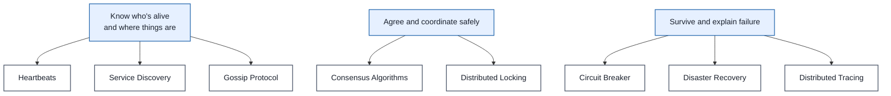

---

## 1. Heartbeats

### Definition
A heartbeat is a small, periodic signal sent between nodes so that each side can tell the other is still alive — when a heartbeat is missed for longer than a configured timeout, the receiving side declares the sender unavailable and can trigger failover.

### Real-World Analogy
Think of a hiking buddy system where you check in with base camp every 30 minutes by radio. If base camp doesn't hear from you after 45 minutes (a timeout past the expected interval), they assume something's wrong and send a search party — even though you might just be in a radio dead zone, not actually in trouble.

### Diagram — Basic Heartbeat / Timeout Flow

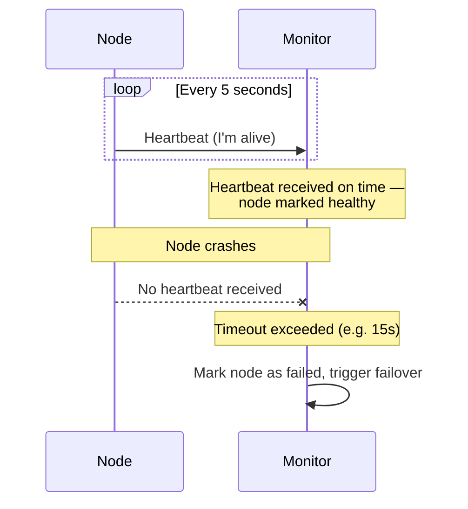

### Diagram — Push vs. Pull Heartbeats

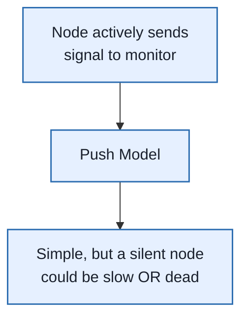

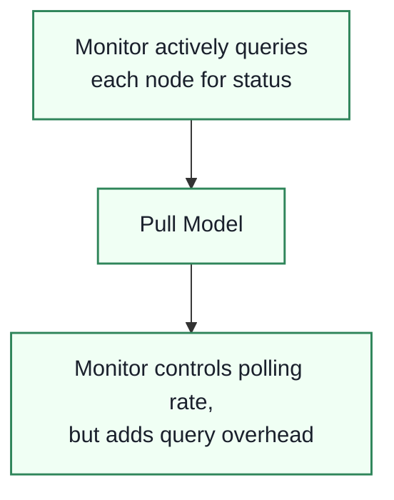

### Tuning Trade-off Table

| Setting | Too Aggressive | Too Lenient |
|---|---|---|
| **Heartbeat interval** | Wastes bandwidth/CPU at scale | Delays failure detection |
| **Timeout threshold** | False positives — a slow-but-alive node gets killed | Real failures take longer to notice and recover from |

### Enterprise Example
**Kubernetes** uses heartbeat-like signals (kubelet node status updates, liveness/readiness probes) so the control plane knows which nodes and pods are healthy enough to receive traffic — a node that stops heartbeating gets marked `NotReady` and its pods are rescheduled elsewhere. **Elasticsearch** nodes use heartbeats within a gossip-style network for peer discovery and cluster state sharing.

> **Trade-off:** Heartbeats are the cheapest, simplest failure-detection mechanism available, but they can't distinguish "the node is dead" from "the node (or the network path to it) is just slow" — that ambiguity is exactly what causes split-brain scenarios during network partitions.

### 🎯 Most Asked Interview Questions

**Q1: How do you pick a heartbeat interval and timeout?**
*A: I'd start from how fast the system actually needs to detect failure — a database failover might need sub-second detection while a batch worker pool can tolerate tens of seconds — and set the timeout to a multiple of the interval, typically 3x, so a couple of missed heartbeats due to transient network jitter doesn't trigger a false failover. I'd also account for realistic network latency in that environment rather than assuming an idealized local network.*

**Q2: What's a false positive in heartbeat-based failure detection, and why is it dangerous?**
*A: It's declaring a node dead when it's actually just slow — overloaded with a long GC pause, say — and that's dangerous because triggering failover on a node that's actually still processing can cause split-brain, where two nodes both think they're the active one. I'd rather tolerate a slightly longer detection window than risk false positives for anything stateful.*

**Q3: How does a heartbeat-based system avoid split-brain during a network partition?**
*A: Heartbeats alone can't solve this — both sides of a partition can simultaneously conclude the other side is dead. I'd pair heartbeat-based failure detection with a consensus mechanism or quorum requirement, so a node only takes over as leader if it can confirm it has majority agreement, not just the absence of a heartbeat from the old leader.*

**Q4: Push vs. pull heartbeats — when would you choose each?**
*A: Push is simpler and lower-latency for detecting failure since the node itself signals health, but it means every node needs outbound connectivity to the monitor. Pull gives the monitor more control over polling rate and works well when you already have a central coordinator querying nodes for other reasons, like Kubernetes' kubelet probes.*

**Q5: How do heartbeats interact with autoscaling or load balancer health checks?**
*A: A load balancer's health check is essentially a heartbeat mechanism — if an instance stops responding to health checks within the configured threshold, it's pulled out of rotation. I'd make sure the health check reflects actual application readiness, not just whether the process is running, so a node that's up but can't reach its database still gets marked unhealthy.*

---

## 2. Service Discovery

### Definition
Service discovery lets services in a distributed system find and communicate with each other dynamically — through a service registry — rather than relying on hardcoded IP addresses that break the moment instances scale up, scale down, or get rescheduled.

### Real-World Analogy
Think of a company directory app instead of memorizing everyone's desk phone extension. When someone changes teams or moves desks, you look them up fresh instead of dialing a number you memorized — the directory (registry) stays current even as people move around.

### Diagram — Client-Side Discovery

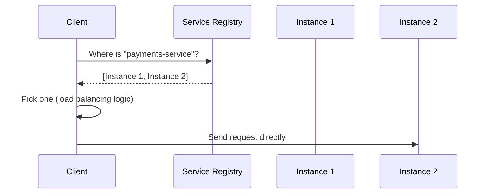

### Diagram — Server-Side Discovery

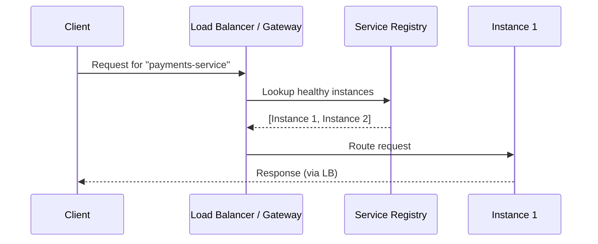

### Comparison Table

| Model | Who Decides Routing | Real-World Tool | Trade-off |
|---|---|---|---|
| **Client-Side Discovery** | The calling client | Netflix Eureka | No extra network hop, but discovery logic lives in every client |
| **Server-Side Discovery** | A load balancer / gateway | AWS Elastic Load Balancer | Simpler clients, but adds a hop and a potential single point of failure |

### Registration Approaches

| Approach | How It Works |
|---|---|
| **Self-Registration** | Service registers itself and sends its own heartbeats |
| **Third-Party / Sidecar** | A separate agent registers the service on its behalf |
| **Automatic (Orchestrator-Managed)** | Kubernetes or similar handles registration transparently |
| **Manual** | An operator registers it by hand — least scalable, rarely used in production |

### Enterprise Example
**Netflix's Eureka** is a widely cited client-side discovery implementation built to handle Netflix's scale of constantly-changing microservice instances across AWS. **Kubernetes** takes a different, mostly server-side approach — it exposes services via internal DNS names backed by its own built-in registry, so pods never need to know each other's actual IP addresses.

> **Trade-off:** Service discovery removes hardcoded addresses and lets the system scale elastically, but the registry itself becomes critical infrastructure — if it's down or inconsistent, services can't find each other even if every instance is individually healthy.

### 🎯 Most Asked Interview Questions

**Q1: Client-side vs. server-side discovery — how would you choose?**
*A: If I want to avoid an extra network hop and I'm fine distributing load-balancing logic into every client — which works well inside a single company's polyglot services using a shared client library — I'd go client-side like Eureka. If I'd rather keep clients simple and centralize routing logic, especially for external-facing traffic, server-side via a load balancer or API gateway is cleaner, accepting the extra hop as the cost.*

**Q2: What happens if the service registry itself goes down?**
*A: Existing connections between services that already resolved addresses keep working, but new lookups fail, and nothing can discover newly started instances. I'd always run the registry as a replicated, highly-available cluster — never a single node — and have clients cache the last known-good instance list so a brief registry outage doesn't immediately take down the whole system.*

**Q3: How does service discovery handle an instance that's technically running but unhealthy?**
*A: Pure "is it registered" isn't enough — I'd pair discovery with active health checks, so an instance that's up but failing to connect to its database gets marked unhealthy and removed from the routable set even though its process never actually crashed.*

**Q4: How would you design service discovery for a multi-region deployment?**
*A: I'd keep a registry per region so local lookups stay fast and don't cross a WAN link for every request, with some mechanism — often each region's control plane syncing metadata — to let callers fail over to another region's instances if the local region's services are entirely down.*

**Q5: What's the risk of self-registration vs. orchestrator-managed registration?**
*A: Self-registration means the service itself is responsible for registering and heartbeating — if that logic has a bug, the service could be running but silently absent from the registry. Orchestrator-managed registration, like Kubernetes', is more reliable because the platform itself verifies the pod is running rather than trusting the application to report honestly on itself.*

---

## 3. Gossip Protocol

### Definition
The gossip (epidemic) protocol is a decentralized way for nodes to spread state across a cluster — each node periodically exchanges information with a few random peers, and through repeated rounds, information eventually reaches every node with high probability, without any central coordinator.

### Real-World Analogy
Think of how a rumor spreads at a large party. You don't announce it to everyone at once — you tell a couple of people nearby, they each tell a couple more, and within a surprisingly small number of rounds, almost the whole party has heard it, even though no single person broadcast it to everyone directly.

### Diagram — Gossip Propagation Rounds

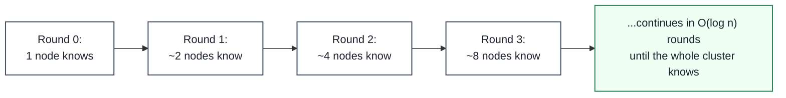

### Diagram — Each Gossip Round

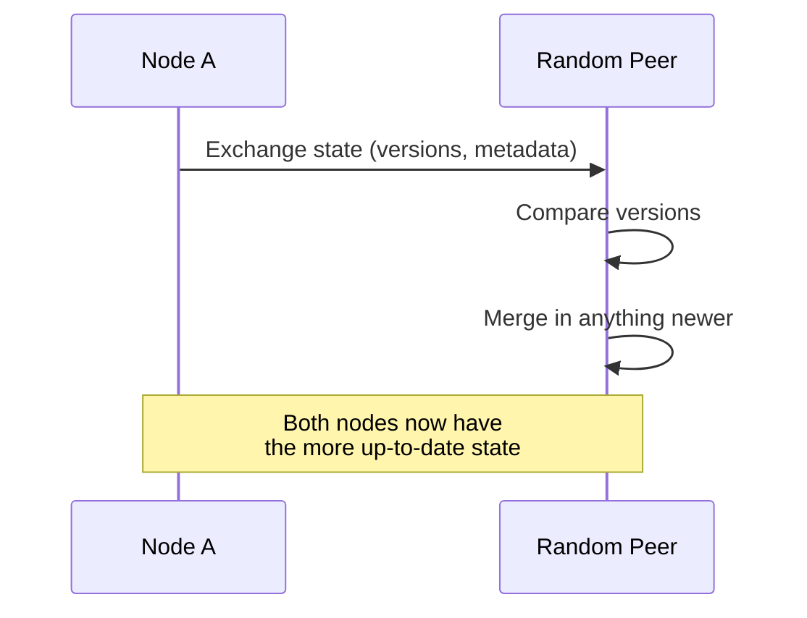

### Three Gossip Styles

| Style | What It Does | Best For |
|---|---|---|
| **Anti-Entropy** | Compares and patches differences between full replicas (often via Merkle trees) | Reconciling long-term drift between nodes |
| **Rumor-Mongering** | Spreads only recent updates | Low-overhead propagation of fresh changes |
| **Aggregation** | Computes cluster-wide values by sampling and combining | Cluster size estimates, average load, etc. |

### Enterprise Example
**Apache Cassandra** uses gossip for cluster membership, node metadata exchange, and failure detection across potentially thousands of nodes — no single node needs a complete picture at once; the cluster-wide view emerges from repeated pairwise exchanges. **Amazon's Dynamo** paper, which influenced Cassandra and DynamoDB, also uses gossip for the same purpose: decentralized membership and failure detection without a single point of failure.

> **Trade-off:** Gossip scales beautifully — the message load per node stays roughly constant regardless of cluster size — but it only gives you eventual consistency; a piece of information takes O(log n) rounds to fully propagate, so there's always a window where different nodes disagree about the current state.

### 🎯 Most Asked Interview Questions

**Q1: Why does gossip scale so well compared to a centralized membership service?**
*A: Because each node only ever talks to a small, fixed number of random peers per round rather than everyone, or rather than all talking to one central coordinator — so the per-node message load stays roughly constant as the cluster grows, and propagation still completes in O(log n) rounds thanks to the exponential spread. A centralized approach would make that one coordinator a bottleneck and single point of failure at scale.*

**Q2: What's the practical cost of gossip's eventual consistency?**
*A: There's a real window — proportional to log(cluster size) gossip rounds — where different nodes can have different views of cluster state, like which nodes are currently alive. For Cassandra this means a client could briefly route a request based on stale membership info, which is why gossip-based systems are generally paired with retry logic and don't rely on gossip state alone for strict correctness decisions.*

**Q3: How does gossip handle a network partition?**
*A: Gossip protocols are generally "partition-blind" — nodes on each side of a partition keep gossiping normally within their own side, each believing the other side is just unreachable or dead, rather than detecting the partition as a distinct event. That's actually a reasonable default for availability-focused systems, but it means gossip alone can't tell you whether a node is truly dead or just on the other side of a split.*

**Q4: Push, pull, or push-pull gossip — when would each make sense?**
*A: Push is efficient when updates are rare — a node proactively tells peers about the one thing that changed. Pull works better when there are many updates accumulating, since a node polling peers can catch up on everything at once. Push-pull hybrids are generally preferred in production because they converge fastest and are more robust to any single exchange being lost.*

**Q5: How would you debug an issue in a gossip-based cluster where nodes disagree about membership?**
*A: Since gossip is inherently non-deterministic and asynchronous, I'd start by checking whether the disagreement is just normal convergence lag — compare timestamps/version numbers on the conflicting state — versus a genuine bug, like a node stuck not participating in gossip rounds at all. Cassandra and similar systems expose gossip state inspection tools specifically because "it'll just converge eventually" isn't good enough when debugging a live incident.*

---

## 4. Consensus Algorithms

### Definition
Consensus algorithms let a group of distributed nodes agree on a single value or decision — even if some nodes crash or messages are delayed — satisfying three properties: **agreement** (all correct nodes decide the same value), **validity** (the decided value actually came from a proposer), and **termination** (every correct node eventually decides).

### Real-World Analogy
Think of a jury that must reach a unanimous verdict even though jurors can't always hear each other perfectly and one juror might fall asleep. The process (deliberation, re-votes, a majority threshold) is designed so that as long as enough jurors are still participating and paying attention, the group reaches one agreed verdict — not several different verdicts held by different jurors.

### Diagram — Leader Election via Consensus (Simplified Raft-style)

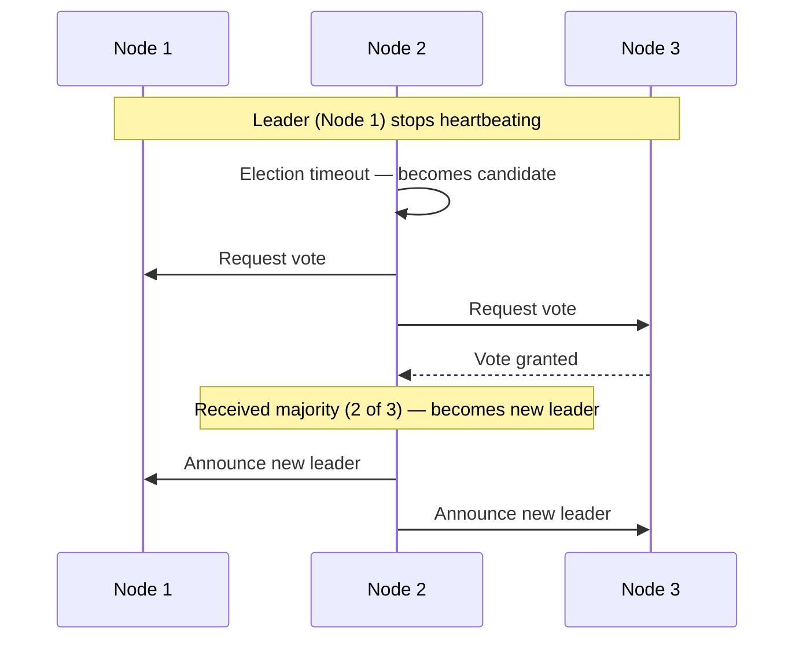

### Diagram — Why Majority Quorum Matters

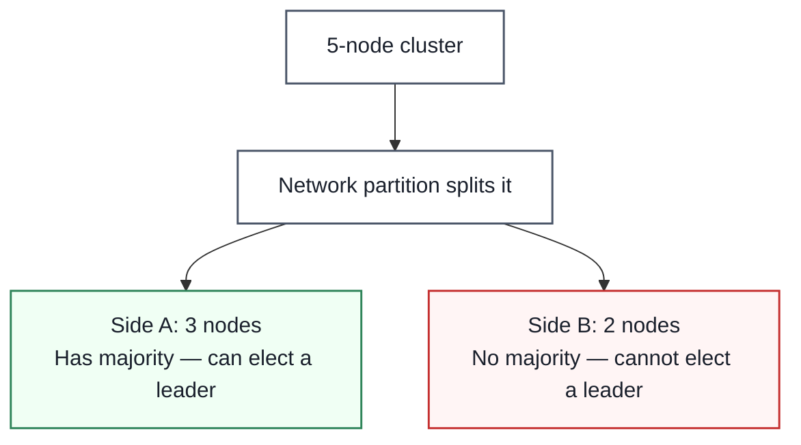

### Comparison Table

| Algorithm | Approach | Known For |
|---|---|---|
| **Paxos** | Voting-based, proven correct | Theoretically foundational, notoriously hard to implement correctly |
| **Raft** | Voting-based, designed for understandability | Leader election + log replication, widely used in practice |
| **pBFT** | Byzantine fault tolerant, 3-phase (pre-prepare/prepare/commit) | Tolerates nodes that lie or behave maliciously, not just crash |
| **Proof of Work / Stake** | Proof-based | Blockchain consensus among untrusted, open participants |

### Enterprise Example
**etcd** (Kubernetes' backing store) and **HashiCorp Consul** both use the **Raft** consensus algorithm to keep their distributed key-value state consistent across replicas, which is exactly what lets Kubernetes trust that its cluster state is accurate even if individual control-plane nodes fail. **Apache ZooKeeper** uses its own Paxos-derived protocol (ZAB) for the same purpose — coordinating leader election and configuration across distributed systems like Kafka's older controller architecture.

> **Trade-off:** Consensus gives you strong correctness guarantees even under node failures, but it's fundamentally expensive — every decision requires a majority of nodes to communicate and agree, which adds latency and means the system can't make progress at all if it loses quorum (majority availability).

### 🎯 Most Asked Interview Questions

**Q1: Why do consensus algorithms require a majority (quorum) rather than just any two nodes agreeing?**
*A: Requiring a strict majority guarantees that any two quorums must overlap by at least one node, which is what prevents a network partition from allowing two different sides to both make conflicting decisions simultaneously — only one side can ever have a majority at a time. Without that overlap guarantee, you could get split-brain, where both halves of a partition believe they're authoritative.*

**Q2: What's the practical difference between Paxos and Raft?**
*A: They solve the same problem and offer equivalent guarantees, but Raft was explicitly designed to be easier to understand and implement correctly — it separates leader election, log replication, and safety into distinct, more approachable sub-protocols. That's a big part of why Raft, not classic Paxos, became the default choice for newer systems like etcd and Consul.*

**Q3: What happens to a Raft-based cluster if it loses quorum?**
*A: The cluster can't elect a new leader or commit new writes until quorum is restored, so it effectively becomes read-only or fully unavailable for writes rather than risking an inconsistent decision. That's a deliberate trade-off — consensus-based systems favor consistency and correctness over availability during a partition, which is the CP side of CAP.*

**Q4: When would you need Byzantine fault tolerance instead of simple crash-fault-tolerant consensus like Raft?**
*A: Crash-fault-tolerant algorithms assume a failed node just stops responding — it never lies. Byzantine fault tolerance is needed when nodes might behave maliciously or send conflicting information to different peers, which is the normal assumption in open, trustless environments like public blockchains, but overkill for a company's own internal cluster where nodes are assumed honest, just occasionally crashed.*

**Q5: How does consensus relate to the CAP theorem?**
*A: Consensus-based systems are inherently CP — they explicitly sacrifice availability during a partition to guarantee that every committed decision is consistent across the cluster, refusing to make progress rather than risk two conflicting answers. That's precisely why you'd reach for consensus for things like leader election or distributed locks, where correctness matters more than always being available.*

---

## 5. Distributed Locking

### Definition
Distributed locking ensures that out of multiple nodes that might attempt the same operation, only one actually executes it at a time — coordinating mutual exclusion across machines rather than within a single process.

### Real-World Analogy
Think of a single bathroom key at a small coffee shop, shared by both the customer bathroom and a street-facing door. Only one person can hold the key at a time, and the whole system depends on everyone reliably returning it — if someone walks off with it and loses track of time, everyone else is stuck waiting, or worse, someone picks the lock and now two people are "in" at once.

### Diagram — The Core Risk: Lock Expiry vs. Paused Process

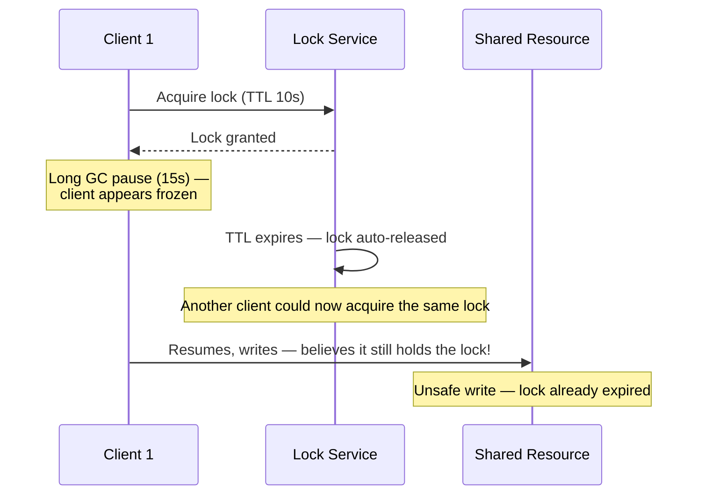

### Diagram — Fencing Tokens Fix This

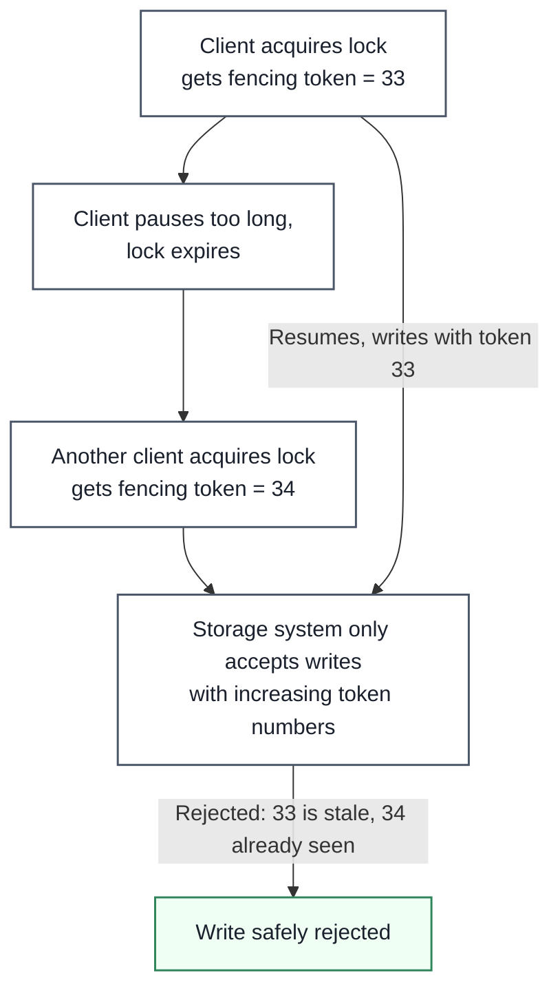

### Comparison Table — Two Very Different Use Cases

| Use Case | What a Failure Costs | Recommended Approach |
|---|---|---|
| **Efficiency lock** (avoid duplicate work) | Minor — redundant work gets done twice | Simple single-node Redis lock is fine |
| **Correctness lock** (prevent data corruption) | Serious — data loss, corruption, inconsistency | Use a proper consensus system (e.g. ZooKeeper) with fencing tokens enforced at the storage layer |

### Enterprise Example
Martin Kleppmann's widely-cited critique of **Redlock** (Redis's own proposed distributed-locking algorithm) argues it's unsafe for correctness-critical use because it relies on synchronous system assumptions — bounded network delay, bounded process pauses, accurate clocks — that don't hold in real systems; **GitHub** has publicly documented incidents involving packet delays of up to 90 seconds, far beyond what Redlock's timing assumptions can tolerate. **ZooKeeper**, by contrast, is commonly used for correctness-critical distributed locks specifically because it's built on real consensus (ZAB) rather than timing assumptions.

> **Trade-off:** A fast, simple lock (like single-node Redis) is cheap and good enough when the worst case is wasted work, but using that same simple lock for correctness-critical coordination risks silent data corruption — the fix (consensus-based locking with fencing tokens) is significantly more expensive and complex to operate.

### 🎯 Most Asked Interview Questions

**Q1: Why is Redlock controversial for correctness-critical locking?**
*A: Redlock assumes bounded network delays, bounded process pauses, and reasonably synchronized clocks, but none of those are guaranteed in real distributed systems — a client can pause for a GC cycle well past its lock's TTL and then resume believing it still holds the lock, performing an unsafe write. The deeper issue Kleppmann raised is that Redlock has no fencing-token mechanism to protect against exactly that scenario.*

**Q2: What's a fencing token and how does it make locking safe?**
*A: It's a strictly increasing number issued every time a lock is granted, which the client must include with every write to the protected resource — the storage system itself then rejects any write carrying an older token than one it's already seen. This moves the actual safety guarantee from "trust the client still holds the lock" to "let the storage system enforce ordering," which is what makes it robust even if a client pauses unexpectedly.*

**Q3: When is a simple single-node lock (without fencing tokens) actually fine to use?**
*A: When the cost of the lock occasionally failing is just wasted work, not corrupted data — like deduplicating a scheduled job so it doesn't run twice. For that efficiency use case, the complexity of consensus-based locking with fencing tokens isn't worth it; a simple Redis `SET NX` with a TTL is a reasonable, pragmatic choice.*

**Q4: How would you implement a correctness-critical distributed lock in production?**
*A: I'd use a system built on actual consensus, like ZooKeeper, rather than a timing-based approach — ZooKeeper naturally provides monotonically increasing sequence numbers through its znode model, which work well as fencing tokens. Critically, I'd also make sure the resource being protected enforces those tokens itself, since the lock service alone can't guarantee safety if the downstream write path doesn't check them.*

**Q5: What's the difference between an efficiency lock and a correctness lock, and why does that distinction matter?**
*A: An efficiency lock just avoids redundant work — if it occasionally fails, you've wasted some compute, nothing more. A correctness lock protects against two processes corrupting shared state simultaneously, where a failure means real data loss or inconsistency. I'd never reach for a heavyweight consensus-based lock for the former, and I'd never settle for a lightweight timing-based lock for the latter — matching the lock's rigor to what's actually at stake is the core judgment call here.*

---

## 6. Circuit Breaker

### Definition
The circuit breaker pattern stops a service from repeatedly calling a downstream dependency that's already failing — it "trips" after enough failures, short-circuiting further calls with an immediate error instead of letting them pile up and wait on a dependency that won't respond anyway.

### Real-World Analogy
It's named directly after an electrical circuit breaker in your house: if a circuit draws too much current (a fault), the breaker trips and cuts power immediately, protecting the rest of the house from damage, rather than letting the overload keep flowing until something burns.

### Diagram — The Three States

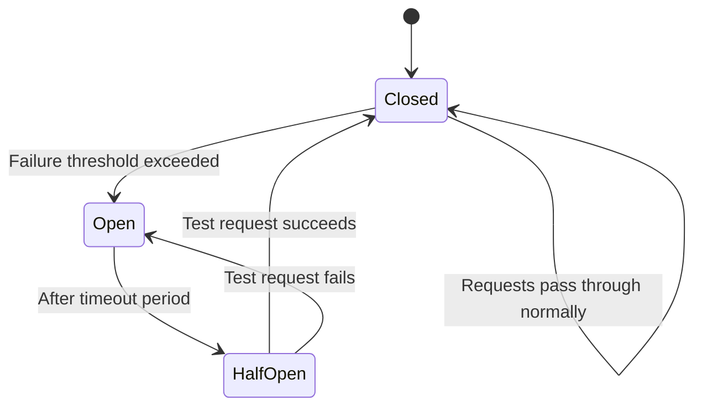

### Diagram — What It Prevents: Cascading Failure

*Without a circuit breaker, D's slowness propagates backward — C waits on D, B waits on C, A waits on B, and threads pile up at every layer until the whole chain is exhausted.*

### Comparison Table — With vs. Without a Circuit Breaker

| Aspect | Without Circuit Breaker | With Circuit Breaker |
|---|---|---|
| **Failing dependency** | Every caller waits for a full timeout | Open state returns an immediate error — no wait |
| **Thread/connection pool** | Can be exhausted by piled-up waiting requests | Protected — failing calls short-circuit instantly |
| **Recovery detection** | Requires manual intervention or blind retries | Half-Open state automatically tests for recovery |
| **Blast radius** | Failure cascades upstream through the whole call chain | Contained at the first circuit breaker layer |

### Enterprise Example
**Netflix** popularized this pattern at scale with **Hystrix**, built specifically to stop one failing microservice from cascading failures across Netflix's hundreds of interdependent services — Hystrix has since been succeeded by **Resilience4j** as the more actively maintained library in the Java ecosystem, but the pattern itself remains foundational to microservice resilience engineering industry-wide.

> **Trade-off:** A circuit breaker protects the caller and the rest of the system from a cascading failure, but while it's open, it sacrifices correctness/completeness for that one dependency entirely — callers get fast, predictable errors instead of a slow success, so the calling code needs a sensible fallback (cached data, a default value, a graceful degradation) rather than just surfacing the error raw.*

### 🎯 Most Asked Interview Questions

**Q1: Walk me through what happens when a circuit breaker trips.**
*A: Once failures cross a configured threshold — say, 50% error rate over the last N requests — the breaker moves from Closed to Open, and every subsequent call fails immediately without even attempting to reach the downstream service. After a cooldown period it moves to Half-Open and lets a small number of test requests through; if those succeed, it closes again, and if they fail, it reopens and waits another cooldown cycle.*

**Q2: Why is a circuit breaker better than just setting a shorter timeout?**
*A: A timeout still means every single request pays that latency cost while the dependency is down, and under high request volume that can still exhaust your thread or connection pool even if each individual wait is short. A circuit breaker avoids that entirely once it's open — it fails fast with effectively zero latency, which is a fundamentally different risk profile than "wait a shorter but still nonzero amount of time, every time."*

**Q3: What should a caller do when a circuit breaker is open?**
*A: It needs a deliberate fallback rather than just propagating the error — serving stale cached data, a sensible default value, or a degraded experience, depending on what the dependency actually provides. Designing that fallback is often the harder engineering problem than the circuit breaker mechanism itself, since it requires deciding in advance what "good enough without this dependency" looks like.*

**Q4: How do you tune the failure threshold and cooldown period?**
*A: I'd base the threshold on normal baseline error rates for that dependency plus some margin, so transient blips don't trip the breaker unnecessarily, and I'd base the cooldown on how long that dependency realistically takes to recover from a typical failure. Too sensitive a threshold causes the breaker to flap open and closed constantly; too lenient and it stops protecting you at all.*

**Q5: How does the circuit breaker pattern relate to retries, and can they work together badly?**
*A: They absolutely can — if every failed call is both retried several times AND those retries happen before the breaker's failure threshold registers them, you can actually amplify load on an already-struggling dependency. I'd design retries to be aware of the circuit breaker's state, so once it's open, retries stop entirely rather than continuing to hammer a dependency the breaker has already identified as down.*

---

## 7. Disaster Recovery

### Definition
Disaster recovery (DR) is an organization's planned ability to restore IT systems and data after a major disruptive event — a natural disaster, a large-scale outage, a ransomware attack — measured primarily by how much downtime (RTO) and data loss (RPO) the business can tolerate.

### Real-World Analogy
Think of a fire escape plan for a building. You don't wait until there's an actual fire to figure out where the exits are, how long evacuation takes, and what the fallback meeting point is — the plan, the drills, and the clearly marked exits are all prepared in advance so that when disaster actually strikes, the response is fast and rehearsed rather than improvised under panic.

### Diagram — RTO and RPO on a Timeline

### Diagram — The 5 Steps of a DR Plan

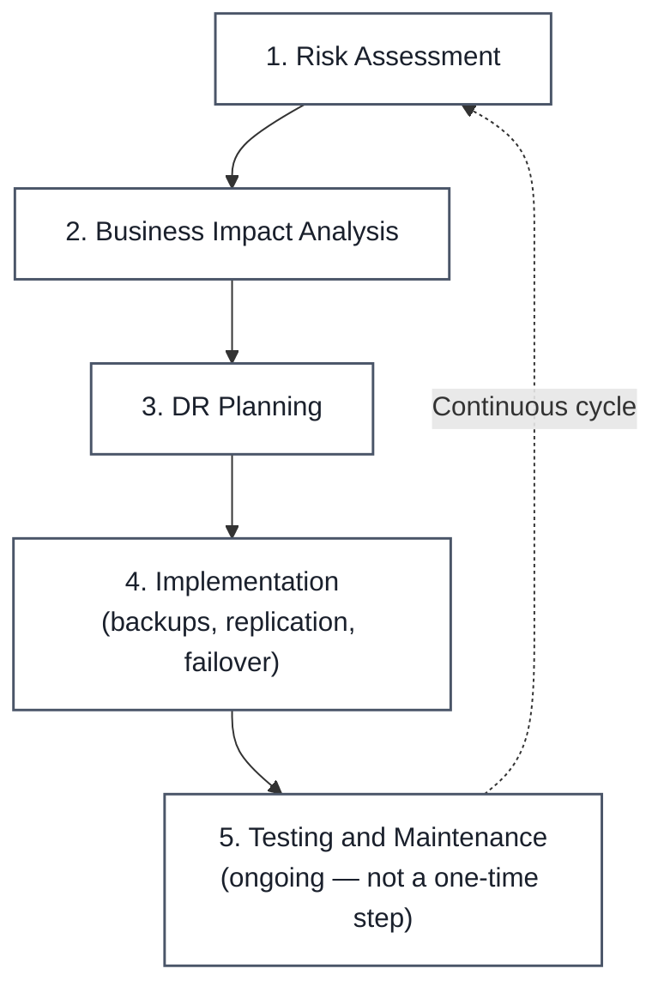

### DR Strategy Comparison Table

| Strategy | Description | Best Fit |
|---|---|---|
| **Backups** | Data copied to a secondary offsite location, no standby infrastructure | Long-term archival, compliance retention |
| **Backup as a Service (BaaS)** | Third-party manages regular backups | Small/medium businesses without in-house DR resources |
| **DR as a Service (DRaaS)** | Third-party backs up data AND orchestrates the full DR plan/failover | Organizations wanting to outsource the entire DR process |
| **Point-in-Time Snapshots** | Full data/database snapshot at a specific moment | Fast recovery from corruption or accidental deletion |
| **Virtual DR** | A full replica of infrastructure runs on offsite VMs, ready to fail over | Fast resumption of operations without owning physical DR hardware |
| **Disaster Recovery Sites** | A physical secondary location with its own infrastructure | Strict compliance or regulatory requirements for physical control |

### The 3-2-1 Backup Rule
**3** copies of your data, on **2** different storage media, with **1** copy stored offsite — a simple, durable baseline that protects against hardware failure, software corruption, and site-wide disasters simultaneously.

### Enterprise Example
**Google Cloud** documents disaster recovery as a core discipline for any production system, emphasizing that RTO and RPO should be explicitly defined per application rather than assumed — a payments system might need an RTO of minutes, while an internal reporting dashboard might tolerate hours. Cloud providers' **multi-region** offerings exist largely to support DR strategies like virtual DR and DRaaS without organizations needing to own a second physical data center.

> **Trade-off:** Lower RTO and RPO targets are always achievable technically, but they cost more — a hot standby replica ready to take over in seconds is far more expensive to run continuously than a nightly backup that might take hours to restore. The real DR design decision is matching cost to what the business actually needs, not minimizing downtime unconditionally.

### 🎯 Most Asked Interview Questions

**Q1: What's the difference between RTO and RPO, and why do both matter?**
*A: RTO is how long you can be down — it drives how fast your recovery mechanism needs to be. RPO is how much data you can afford to lose — it drives how frequently you need to back up or replicate. A system can have a strict RTO but a loose RPO, like an e-commerce catalog that needs to come back online in minutes but can tolerate losing the last hour of non-critical browsing analytics.*

**Q2: How would you design a DR strategy for a payments system versus an internal analytics dashboard?**
*A: For payments, I'd want a near-zero RPO and a very short RTO — synchronous or near-synchronous replication to a standby region, with automated failover, because data loss or extended downtime there is a direct business and compliance risk. For an internal dashboard, nightly backups and a multi-hour RTO are probably fine, since the cost of a hot standby wouldn't be justified by the actual business impact of it being briefly unavailable.*

**Q3: Why is testing part of a DR plan, not just having backups?**
*A: A backup you've never tested restoring is really just a hope, not a guarantee — I've seen cases where backups were silently corrupted or incomplete for months before anyone needed them. Regular DR drills — actually failing over to the secondary site or restoring from backup — are what convert "we have a DR plan" into "we know our DR plan works."*

**Q4: What's the trade-off between DR cost and recovery speed?**
*A: It's roughly a spectrum — cold backups are cheap but slow to restore, warm standby is more expensive but recovers faster, and hot active-active replication is the most expensive but gives near-zero RTO/RPO. I'd map each system's actual business-impact tolerance to a point on that spectrum rather than defaulting every system to the most expensive option "just in case."*

**Q5: How does the 3-2-1 backup rule protect against different failure modes?**
*A: The 2 different storage media protects against a failure mode specific to one medium — like a bad firmware bug affecting one disk type. The 1 offsite copy protects against a site-wide event — fire, flood, a regional outage — that would take out all your on-site copies simultaneously regardless of how many you have. Each part of the rule is defending against a distinct, independent risk.*

---

## 8. Distributed Tracing

### Definition
Distributed tracing follows a single request as it travels across multiple services, assigning it a unique trace ID that's propagated through every hop — letting engineers reconstruct the full path, timing, and failure point of that request across a microservices architecture.

### Real-World Analogy
Think of a tracking number for a package shipped through multiple carriers — a regional pickup truck, a long-haul flight, a local delivery van. Each leg of the journey gets logged under the same tracking number, so you (or support staff) can see exactly where the package is, how long each leg took, and precisely which leg it got stuck on if it's delayed — rather than just knowing "it hasn't arrived yet."

### Diagram — A Trace Made of Spans

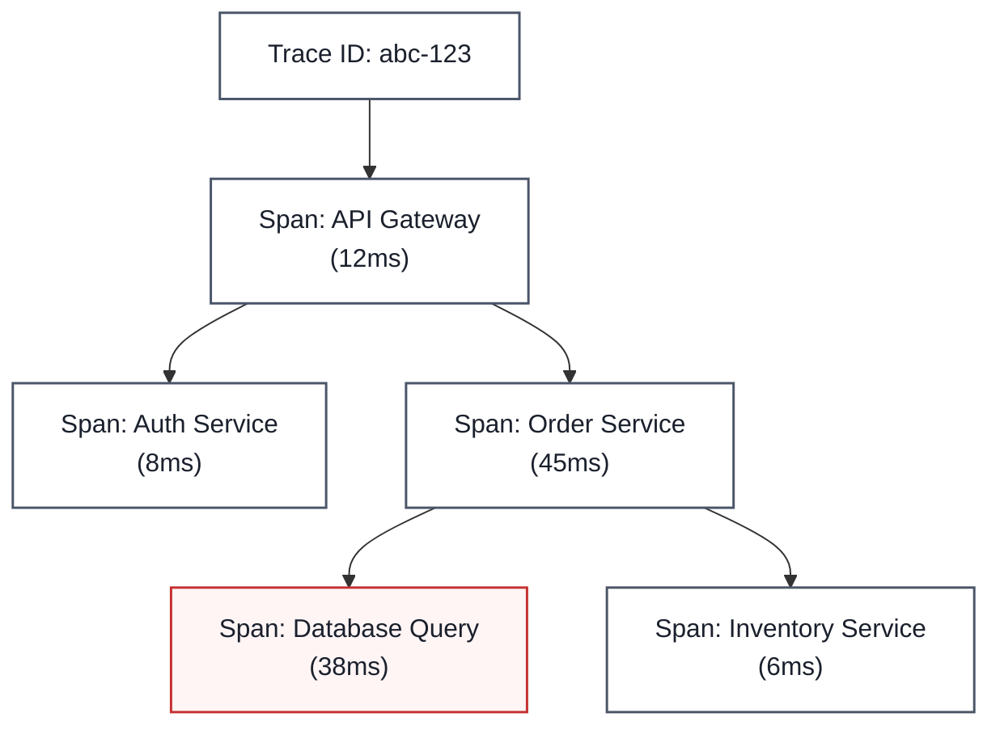
*The database query span (38ms out of the order service's 45ms) is clearly the bottleneck here — distributed tracing makes that immediately visible instead of requiring correlation across separate service logs.*

### Diagram — Trace Context Propagation Across Services

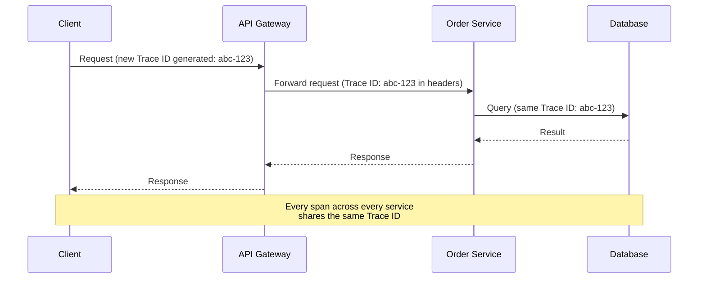

### Benefits vs. Challenges

| Benefits | Challenges |
|---|---|
| Faster root-cause analysis for latency/errors | Requires instrumentation across every service |
| Pinpoints exact bottleneck span, not just "it's slow somewhere" | Some tools cover backend only, missing frontend/client spans |
| Shorter mean time to detect (MTTD) and repair (MTTR) | Head-based sampling can miss rare but critical traces |
| Clarifies real service dependencies in a microservices architecture | High trace volume at scale can be expensive to store and query |

### Enterprise Example
**OpenTelemetry** has become the industry-standard open specification for generating and propagating trace context, with **Jaeger** and **Zipkin** as widely used open-source backends for collecting and visualizing those traces — most major observability vendors (Datadog, Dynatrace, New Relic) now support ingesting OpenTelemetry-formatted traces directly rather than requiring proprietary instrumentation.

> **Trade-off:** Distributed tracing gives you precise, request-level visibility that logs and metrics alone can't provide, but full instrumentation has real engineering cost, and capturing every single trace at high traffic volumes is expensive — most production systems use sampling (keeping only a percentage of traces), which trades completeness for cost and can occasionally miss the exact rare trace you needed.

### 🎯 Most Asked Interview Questions

**Q1: How is distributed tracing different from just aggregating logs from each service?**
*A: Logs from each service are inherently disconnected — correlating them for one specific request means manually matching timestamps and request details across systems, which doesn't scale and is error-prone. Tracing solves this structurally by propagating one shared trace ID through every hop, so every span is already linked together and the full request path can be reconstructed with a single query.*

**Q2: What's span sampling, and what's the risk of using it?**
*A: Since capturing 100% of traces at high request volume is expensive to store and query, most systems sample — keeping only a percentage of traces, often decided at the very start of the request (head-based sampling). The risk is that a rare but important trace, like one specific failing edge case, might simply not get sampled, so some systems use tail-based sampling instead, which decides what to keep after seeing how the request actually behaved, including whether it errored.*

**Q3: How would you use distributed tracing to find a performance regression after a deploy?**
*A: I'd compare the span-level breakdown of the same endpoint's traces before and after the deploy — if one specific span's duration jumped while the others stayed flat, that pinpoints exactly which service or downstream call the regression is in, rather than just knowing overall latency went up. That's a much faster diagnosis path than bisecting commits or guessing from aggregate metrics alone.*

**Q4: What's required to actually get trace context propagated correctly across services?**
*A: Every service in the call path needs to both read the incoming trace context (usually from HTTP headers, per the W3C Trace Context standard) and forward it on any outbound calls it makes — if even one service in the middle drops or fails to propagate that context, the trace breaks into disconnected fragments. This is why adopting a standard like OpenTelemetry across all services matters more than picking any one tracing tool.*

**Q5: How does distributed tracing complement, rather than replace, metrics and logs?**
*A: Metrics tell you something's wrong in aggregate — error rate or latency went up — logs give you detailed context about one specific event, and tracing connects those events across services for one specific request. I'd use metrics to detect that a problem exists, then use tracing to narrow down which service and span is responsible, and logs to get the detailed error message or stack trace once I know exactly where to look.*

---

## Bringing It All Together — A Production Incident Scenario

Imagine a checkout service starts timing out intermittently during a traffic spike:

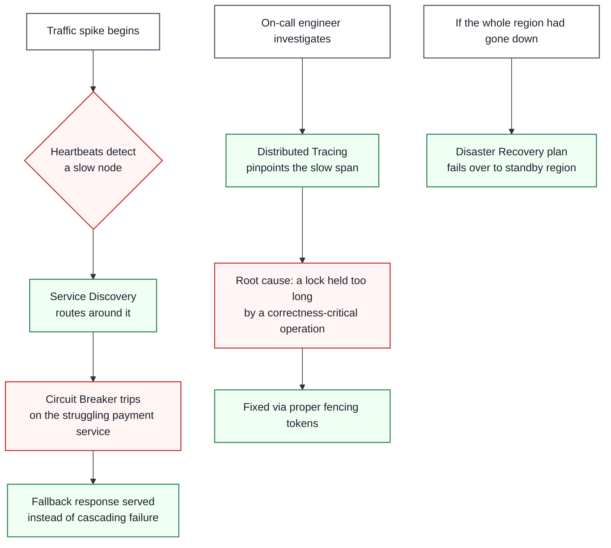

Each mechanism in this doc catches a different stage of the incident: heartbeats and service discovery detect and route around a failing node automatically; the circuit breaker contains the blast radius instead of letting it cascade; distributed tracing gives the on-call engineer a precise root cause instead of a guessing game; and if things had gone further — a full region outage — the disaster recovery plan is what stands between "brief degraded service" and "extended business-impacting outage."

---

## Quick-Reference Cheat Sheet

| Concept | One-Line Definition | Primary Mechanisms |
|---|---|---|
| **Heartbeats** | Periodic liveness signals between nodes | Push/pull, interval + timeout tuning |
| **Service Discovery** | Dynamically finding where services live | Registry, client-side vs. server-side |
| **Gossip Protocol** | Decentralized, epidemic-style state propagation | Anti-entropy, rumor-mongering, O(log n) rounds |
| **Consensus Algorithms** | Agreeing on one value despite failures | Paxos, Raft, pBFT, majority quorum |
| **Distributed Locking** | Mutual exclusion across machines | Fencing tokens, consensus-backed locks |
| **Circuit Breaker** | Stops cascading failure from a bad dependency | Closed / Open / Half-Open states |
| **Disaster Recovery** | Planned recovery from major outages | RTO/RPO, 3-2-1 backup rule, DR strategies |
| **Distributed Tracing** | Follows one request across every service | Trace ID, spans, context propagation |

### Common Interview Follow-Up Questions

**Q: How do heartbeats, gossip, and consensus relate to each other?**
*A: They sit on a spectrum of coordination strength — heartbeats are the simplest (binary alive/dead signal between two parties), gossip spreads that kind of state across a whole cluster without central coordination, and consensus is the strongest guarantee, used when the cluster needs to agree on one authoritative decision, not just converge on shared awareness.*

**Q: Which of these topics are about detecting failure, and which are about surviving it?**
*A: Heartbeats, service discovery, and gossip are primarily about detecting and routing around failure as it happens. Circuit breakers, disaster recovery, and distributed locking (via fencing tokens) are about containing the damage once failure is detected — and distributed tracing sits apart as the tool for understanding failure after the fact.*

**Q: Why do so many of these mechanisms trade availability for consistency, or vice versa?**
*A: Because the CAP theorem's trade-off is unavoidable the moment you have more than one node — gossip and circuit breakers lean toward availability (keep serving, even with stale or degraded data), while consensus and fencing-token-based locking lean toward consistency (refuse to proceed rather than risk corruption). Recognizing which side a given mechanism leans toward is often the key to using it correctly.*

**Q: What's the single most common mistake engineers make with these patterns?**
*A: Using a mechanism designed for availability (like a simple heartbeat or a basic Redis lock) in a place that actually needs strong consistency guarantees — the classic example is using Redlock for a correctness-critical lock instead of a consensus-backed one. Matching the mechanism's actual guarantee to what the use case needs is the recurring theme across all eight of these topics.*

---

## How to Answer This in a Live Interview

Distributed systems questions tend to show up as **"How would you detect and handle a failing service?"** or **"Walk me through how you'd make this system resilient to node failures."** — broad reliability prompts where you're expected to reach for the right combination of these tools.

### Step 1 — Clarify Before You Answer

Never propose a mechanism before you know:
1. **What kind of failure are we protecting against** — a single node crashing, a whole region going down, or a slow-but-alive dependency?
2. **Does this need strong consistency, or is eventual consistency acceptable?** (This single answer steers you toward consensus/locking vs. gossip/heartbeats.)
3. **What's the acceptable downtime and data loss** if the worst happens? (RTO/RPO — this matters even outside a formal DR conversation.)
4. **Is the coordination problem about detecting failure, agreeing on a decision, or containing blast radius?**
5. **How many nodes/services are involved**, and is the topology centralized or fully decentralized?

### Step 2 — Map Constraints to Concepts

| If the interviewer says... | ...it points you toward |
|---|---|
| "We need to know quickly if a node is down" | Heartbeats |
| "Services keep changing IPs as we scale" | Service Discovery |
| "We have thousands of nodes and no central coordinator" | Gossip Protocol |
| "Multiple nodes might try to become leader" | Consensus Algorithms (Raft/Paxos) |
| "Two processes could corrupt shared data if they run at the same time" | Distributed Locking (with fencing tokens) |
| "One failing dependency keeps taking down everything upstream" | Circuit Breaker |
| "What if we lose an entire data center or region?" | Disaster Recovery |
| "We can't tell which service is causing the slowdown" | Distributed Tracing |

### Step 3 — Structure Your Spoken Answer

1. **Name the actual failure mode** you're defending against — be specific, not just "resilience."
2. **Propose the mechanism(s)** — often more than one of these work together, as in the scenario above.
3. **State which side of the CAP trade-off** this leans toward, and say so explicitly.
4. **Call out the operational cost** — what does this mechanism cost in latency, complexity, or infrastructure?
5. **Mention how you'd detect it's working** — what metric or signal tells you the mechanism is actually catching failures.
6. **Mention a known failure mode of the mechanism itself** — e.g. false positives from heartbeats, or gossip's eventual-consistency window.

### Step 4 — Worked Example Answer

**Prompt: "Our order service calls a third-party payment provider, and when that provider is slow, our whole checkout flow backs up. How would you fix this?"**

*"The failure mode here is a slow-but-alive dependency cascading backward through our call chain, so the first thing I'd add is a circuit breaker around the payment provider call — once its error or timeout rate crosses a threshold, we trip to Open and fail fast instead of letting requests pile up and exhaust our thread pool. While it's open, I'd serve a sensible fallback — maybe queue the order for payment retry rather than blocking the customer entirely — since just surfacing a raw error isn't good enough for checkout. I'd pair that with distributed tracing so when this happens, we can immediately see it's specifically the payment provider span that's slow, not guess across five services. This leans toward availability over strict consistency — we're choosing to let checkout continue in a degraded mode rather than block entirely — which is the right trade-off here since a delayed payment confirmation is recoverable, but a fully blocked storefront isn't. I'd monitor the circuit breaker's open/closed state and the fallback queue depth as the signal that this is actually working as intended.*

### Step 5 — Follow-Up Traps to Expect

- **"What if the circuit breaker itself has a bug and never closes again?"** → Mention the Half-Open state's automatic recovery testing, and monitoring/alerting on a breaker that's been open unusually long.
- **"How would this change if you had thousands of service instances instead of a handful?"** → This is the interviewer checking whether you'd reach for gossip-based coordination instead of a centralized heartbeat monitor at that scale.
- **"What if two instances both think they're responsible for retrying the same failed payment?"** → Bring up distributed locking with fencing tokens, not just "we'd add a lock."
- **"How do you know your disaster recovery plan actually works?"** → Emphasize regular DR drills/testing, not just having backups configured.

> **Golden rule:** Don't name-drop these patterns as a checklist ("I'd add a circuit breaker and some tracing"). Tie each one explicitly to the specific failure mode it addresses — interviewers are testing whether you understand *why* a mechanism fits, not whether you've memorized the vocabulary.
