# Architectural Patterns
### Interview-ready reference guide

---

## Why Architectural Patterns Matter

An architectural pattern is the answer to "how do we divide this system into parts, and how do those parts talk?" — the decision that's hardest to reverse later. Amazon famously broke its monolith into services in the early 2000s, Netflix moved from a datacenter monolith to hundreds of cloud microservices, Uber and LinkedIn run on event streams through Kafka, and BitTorrent shows what happens when you remove the central server entirely. Each pattern below optimizes a different thing: **Client-Server** optimizes for control, **Microservices** for independent team velocity, **Serverless** for operational simplicity and pay-per-use, **Event-Driven** for decoupling and reactivity, and **Peer-to-Peer** for resilience and capacity that grows with its users.

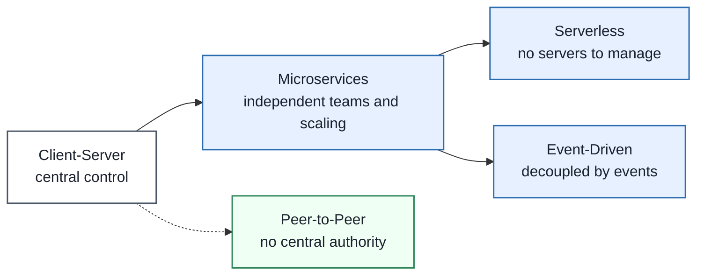

---

## 1. Client-Server Architecture

### Definition
Client-server architecture splits a system into **clients** that request work and **servers** that process those requests and own the shared resources (data, business rules) — the foundation almost every web, mobile, and API system is built on.

### Real-World Analogy
A restaurant: the customer (client) places an order, the kitchen (server) prepares it using ingredients and recipes the customer never sees, and a waiter (the network) carries requests and responses back and forth. Customers can't wander into the kitchen and change the recipe.

### Diagram — Request/Response Lifecycle

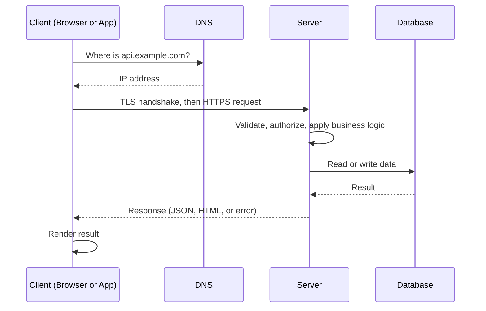

### Diagram — Tiers: 1-Tier to 3-Tier

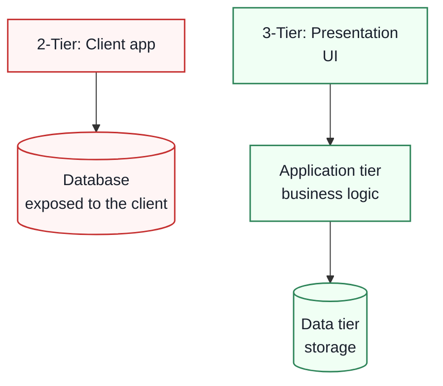

### Diagram — Why Stateless Servers Scale

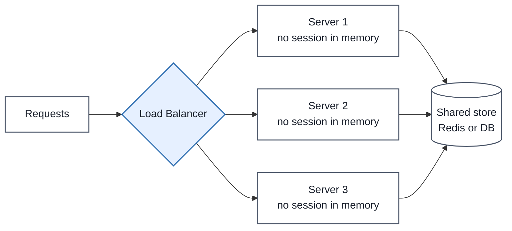

### Tier Comparison

| Tier | Layout | Used For | Limitation |
|---|---|---|---|
| **1-Tier** | Everything in one program | Local and offline tools | No sharing or central control |
| **2-Tier** | Client talks directly to DB | Small, trusted internal tools | Credentials and logic exposed to clients, hard to scale |
| **3-Tier** | UI, application logic, data store separated | Standard for web and mobile | More hops and moving parts |
| **N-Tier** | Adds gateway, auth, queues, caches | Large systems, multiple teams, compliance | Operational complexity |

### Enterprise Example
Online banking is the textbook case: the mobile app (client) never touches the ledger database; every balance check and transfer goes through server-side authentication, validation, and fraud rules, so a modified or malicious client cannot bypass them. Most large web companies (Amazon, Airbnb, Stripe) run N-tier variants of this with gateways, caches, and queues between the tiers.

> **Trade-off:** Centralizing logic and data on the server gives you control, security, and easy updates (no client redeploy), but the server becomes the scaling bottleneck and a failure point — every client depends on it, so you need load balancing, replication, and careful API versioning for clients you cannot force to upgrade.

### 🎯 Most Asked Interview Questions

**Q1: Why do we put business logic on the server instead of the client?**
*A: Because anything on the client can be inspected and modified, so validation, authorization, and pricing rules must be enforced server-side where the user can't tamper with them. The client may duplicate checks for UX, but the server is the only authority I'd trust for correctness.*

**Q2: What makes a server stateless, and why does it matter for scaling?**
*A: A stateless server keeps no user-specific data in its own memory between requests — session state lives in a shared store like Redis or in a signed token. That lets a load balancer send any request to any instance, so I can add or remove servers freely and failover is trivial. The cost is an extra lookup to the shared store per request.*

**Q3: When is a 2-tier architecture acceptable?**
*A: Only in controlled environments such as an internal tool on a trusted network, since the client holds database access directly. For anything internet-facing I'd use 3-tier so credentials and business rules stay behind an application server.*

**Q4: How do you scale a client-server system when the server becomes the bottleneck?**
*A: I'd go roughly in order of cost: add a cache and CDN to cut repeated work, scale application servers horizontally behind a load balancer, optimize the database with indexes and read replicas, and push slow work to background queues. I'd add rate limiting and graceful degradation to protect the server under spikes.*

**Q5: How do you handle API versioning when you can't force clients to update?**
*A: Mobile apps in particular linger on old versions for months, so I'd version the API explicitly, keep changes additive where possible, and support the previous version for a defined deprecation window. Breaking changes ship under a new version rather than mutating the old contract.*

---

## 2. Microservices Architecture

### Definition
Microservices structure an application as a set of small, loosely coupled services — each owning one business capability and its own data, deployable and scalable independently, communicating over well-defined APIs or messages.

### Real-World Analogy
A shopping mall versus a department store. In the department store (monolith) one company runs everything under one roof and one policy change affects every floor. In the mall (microservices), each shop runs, staffs, and renovates itself independently; one shop closing doesn't close the mall — but now you need shared infrastructure like a directory, security, and delivery docks.

### Diagram — Monolith vs. Microservices

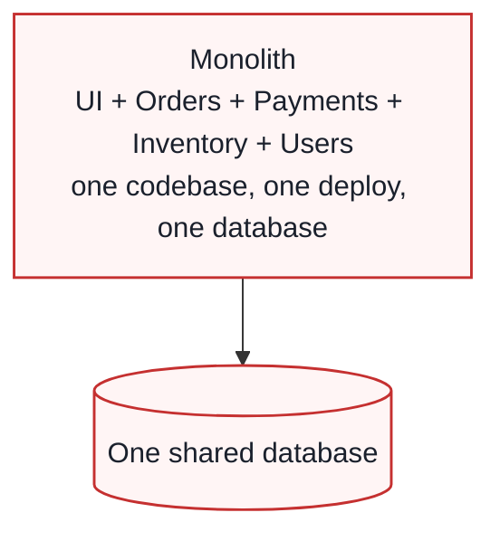

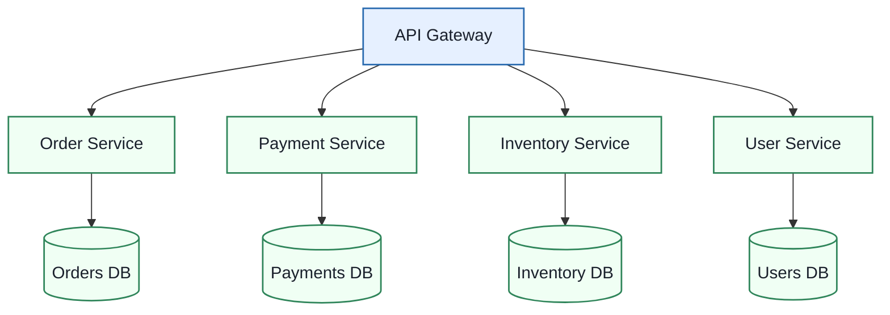

### Diagram — Database per Service (Never Reach Into Another Service DB)

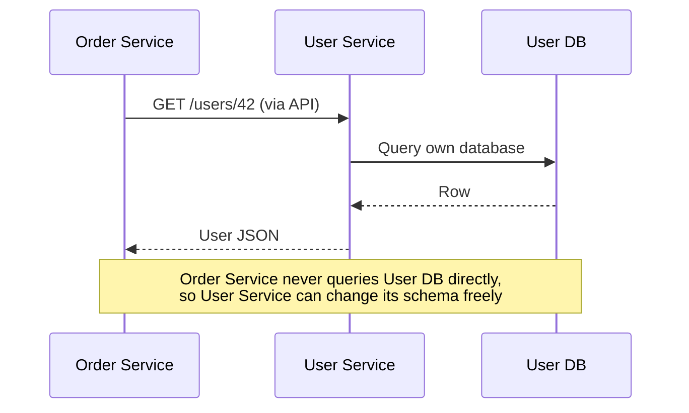

### Diagram — Distributed Transaction via Saga

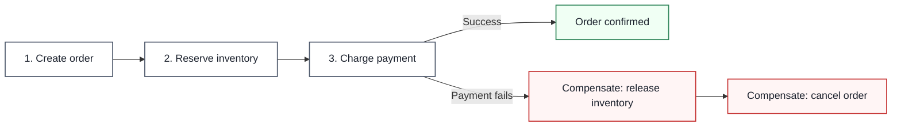

### Monolith vs. Microservices

| Aspect | Monolith | Microservices |
|---|---|---|
| **Deployment** | One unit, all or nothing | Each service independently |
| **Scaling** | Scale the whole app | Scale only the hot service |
| **Fault isolation** | One bug can take everything down | Failures contained (with circuit breakers, bulkheads) |
| **Team autonomy** | Shared codebase, coordination heavy | Small teams own services end to end |
| **Tech stack** | One for all | Best tool per service |
| **Data consistency** | Easy ACID transactions | Eventual consistency, sagas |
| **Operational cost** | Low | High: discovery, tracing, gateways, CI/CD per service |
| **Best for** | Small team, early product | Large org, clear domain boundaries |

### Supporting Patterns You Need Around Microservices

| Concern | Pattern |
|---|---|
| Single entry point, auth, rate limiting | API Gateway |
| Finding service instances | Service Discovery (Consul, etcd, Kubernetes DNS) |
| Cascading failures | Circuit Breaker, Bulkhead |
| Cross-service transactions | Saga |
| Tracing and debugging | Distributed tracing, centralized logging |
| Migrating off a monolith | Strangler Fig (route features to new services gradually) |

### Enterprise Example
**Amazon** moved from a monolithic retail application to service-oriented teams in the early 2000s, with the well-known "two-pizza team" ownership model — each team owns a service and its operations. **Netflix** migrated from a datacenter monolith to hundreds of AWS microservices after a 2008 database corruption outage, and built resilience tooling (Hystrix, Chaos Monkey) specifically because that many services makes partial failure the normal state.

> **Trade-off:** Microservices buy independent deployment, scaling, and team ownership, but you pay with distributed-systems complexity: network latency between calls, eventual consistency instead of ACID transactions, and heavy operational tooling. A small team adopting microservices too early often gets all the cost and none of the benefit — start with a well-structured monolith and split along real boundaries.

### 🎯 Most Asked Interview Questions

**Q1: When would you NOT choose microservices?**
*A: For a small team or an early product where domain boundaries are still unclear. The operational overhead — service discovery, tracing, per-service pipelines, distributed data — outweighs the benefits, and wrong service boundaries are expensive to fix. I'd start with a modular monolith and extract services when a specific part needs independent scaling or ownership.*

**Q2: How do you handle a transaction that spans multiple services?**
*A: I avoid distributed two-phase commit and use the saga pattern: each service performs its local transaction and publishes an event or reply, and if a later step fails, earlier steps run compensating actions like releasing inventory or refunding a payment. The trade-off is eventual consistency and having to design compensations carefully.*

**Q3: Why should each microservice own its database?**
*A: Shared databases create hidden coupling — a schema change by one team can break others and you can't deploy independently. With a database per service, other services go through the owning service's API, which lets each team evolve its schema and choose the right storage engine. The cost is that cross-service joins become API calls or replicated read models.*

**Q4: Synchronous REST calls or asynchronous messaging between services?**
*A: Synchronous calls are simple and fine when the caller needs an immediate answer, but chained sync calls multiply latency and couple availability — if one service is down, callers fail. I'd use async messaging for anything that doesn't need an immediate response, and wrap sync calls in timeouts, retries with backoff, and circuit breakers.*

**Q5: How would you migrate a monolith to microservices safely?**
*A: With the strangler fig approach: put a gateway in front, pick one well-bounded capability, build it as a new service, route that traffic to it, and retire the old code path. I'd repeat incrementally rather than rewrite everything, so the system stays shippable and each step is reversible.*

**Q6: What are the biggest operational requirements once you adopt microservices?**
*A: Centralized logging, metrics, and distributed tracing so you can follow one request across services, health checks and automated deployment per service, service discovery, and resilience patterns such as circuit breakers and bulkheads. Without that observability you can't debug production.*

---

## 3. Serverless Architecture

### Definition
Serverless lets you build and run applications on infrastructure fully managed by a cloud provider: you deploy functions or services, the provider provisions and scales capacity automatically (down to zero), and you pay only for actual execution time and resources used.

### Real-World Analogy
Taking a taxi instead of owning a car. You don't maintain, park, or insure anything, and you pay only for the rides you take. If nobody needs a ride, you pay nothing — but at 3am you may wait a bit for a cab to show up (cold start), and you can't customize the vehicle.

### Diagram — How a Function Runs

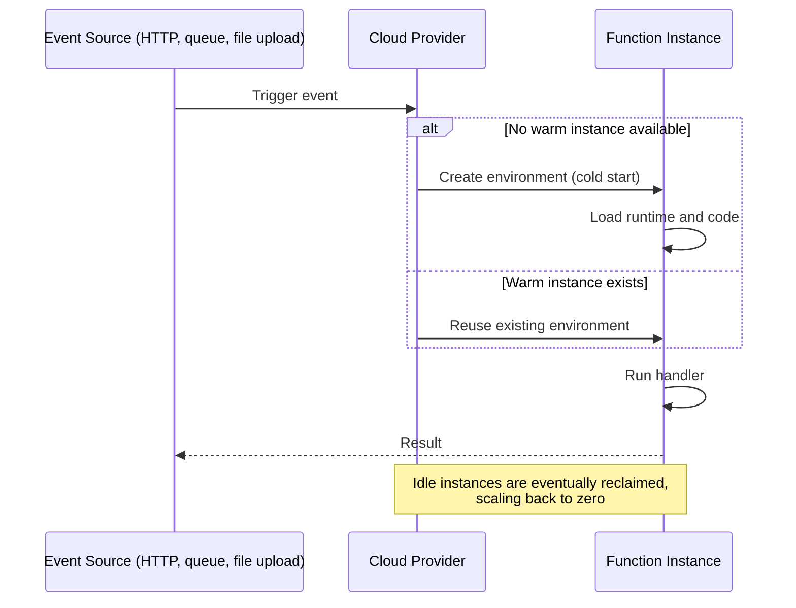

### Diagram — Typical Serverless Backend

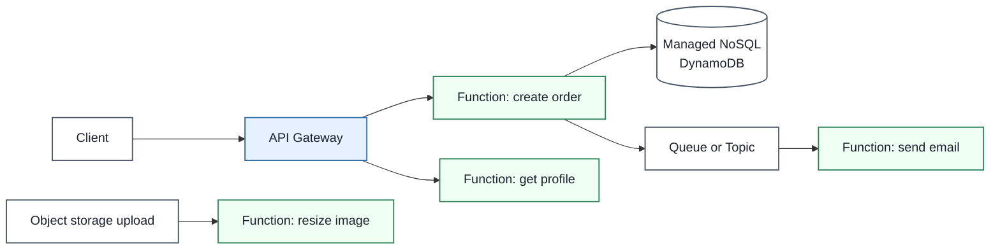

### Diagram — Cost Model: Serverless vs. Always-On Server

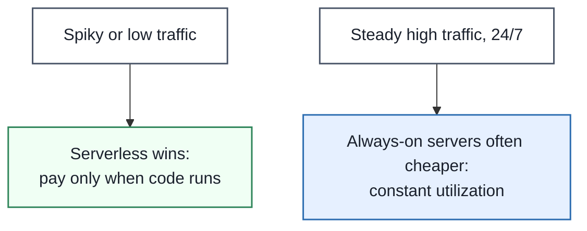

### Pros and Cons

| Pros | Cons |
|---|---|
| No server provisioning or patching | Cold start latency after scaling to zero |
| Automatic scale from zero to peak | Execution time and memory limits per invocation |
| Pay only for actual execution | Vendor lock-in to provider triggers and services |
| Teams focus on code, not infrastructure | Harder debugging and observability across many small functions |
| Natural fit for event-driven workloads | Functions must be stateless; state lives elsewhere |
| | Cost can exceed servers at sustained high load |

### Where It Fits

| Good Fit | Poor Fit |
|---|---|
| Event processing (file uploads, queue messages) | Long-running jobs beyond execution limits |
| Spiky or unpredictable APIs, webhooks | Latency-critical paths where cold starts hurt |
| Scheduled jobs, glue code, IoT and chatbot backends | Steady, heavy, predictable workloads |
| Prototypes and small teams | Workloads needing local state or special hardware |

### Enterprise Example
**AWS Lambda** popularized Function-as-a-Service: companies use it for event-driven pipelines such as resizing images when uploaded to S3, processing queue messages, or serving spiky API traffic behind API Gateway. Provider billing is per request and per unit of execution time, which is why a rarely-used endpoint costs almost nothing but a constantly-busy one can cost more than a fixed fleet of servers.

> **Trade-off:** Serverless removes infrastructure operations and gives elastic, pay-per-use scaling, but you accept cold-start latency, execution limits, harder debugging, and tighter coupling to a vendor's ecosystem. It's strongest for spiky, event-driven work and weakest for steady, latency-critical, or long-running workloads.

### 🎯 Most Asked Interview Questions

**Q1: What is a cold start and how would you mitigate it?**
*A: When a function has scaled to zero or needs a new instance, the provider must create an execution environment and load the runtime and code before running, which adds latency. I'd mitigate it with smaller deployment packages and lighter runtimes, provisioned concurrency to keep instances warm for latency-critical paths, and by keeping user-facing latency-sensitive logic off cold paths. The trade-off is that provisioned warm capacity costs money even when idle.*

**Q2: When is serverless more expensive than servers?**
*A: Pay-per-execution is cheap for spiky or low-volume traffic, but under sustained high utilization you're paying a premium per compute unit compared with reserved or always-on instances. I'd model expected requests, duration, and memory, and compare against a right-sized container or VM fleet before committing.*

**Q3: How do you handle state in a serverless application?**
*A: Functions should be stateless since instances come and go and may run in parallel, so state goes to external services — a managed database, cache, or object store. I'd also make handlers idempotent because event sources typically deliver at-least-once and functions may be retried.*

**Q4: How do you avoid vendor lock-in with serverless?**
*A: Completely avoiding it is unrealistic since triggers and managed services are provider-specific, so I'd keep business logic in portable code separated from thin provider-specific handlers, and use open standards where possible. I'd accept some lock-in consciously where the managed service gives real value.*

**Q5: How do you debug and monitor a system made of many functions?**
*A: I'd rely on structured logging with correlation IDs, distributed tracing across function invocations and downstream services, and metrics on duration, errors, throttles, and cold starts. Without tracing, an event flowing through five functions and a queue is very hard to follow.*

**Q6: Serverless vs. containers on Kubernetes — how do you choose?**
*A: If workloads are event-driven, spiky, and the team wants minimal operations, serverless fits. If I need long-running processes, predictable high load, custom runtimes, or portability, containers give more control at the cost of running the platform. Many systems mix both.*

---

## 4. Event-Driven Architecture (EDA)

### Definition
Event-driven architecture is a design where components communicate by producing and reacting to **events** — records that something happened — usually through a broker, so producers and consumers are decoupled in time, scaling, and knowledge of each other.

### Real-World Analogy
A newsroom wire service. Reporters (producers) file stories to the wire without knowing which newspapers, TV stations, or apps (consumers) will pick them up. New subscribers can join at any time without the reporters changing how they work, and each outlet processes the story at its own pace.

### Diagram — Core Flow

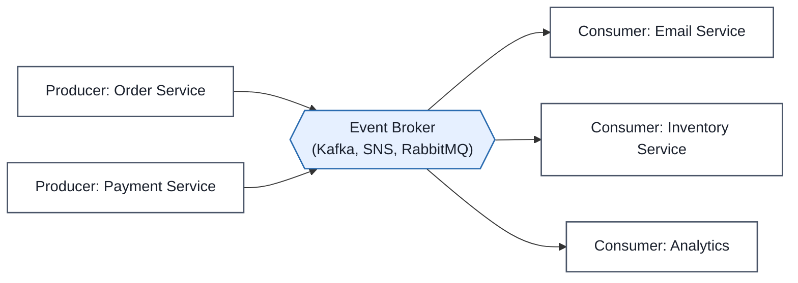

### Diagram — Request-Driven vs. Event-Driven

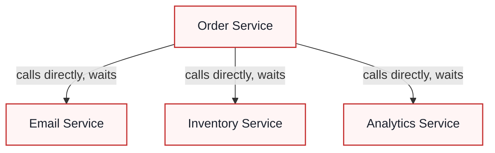

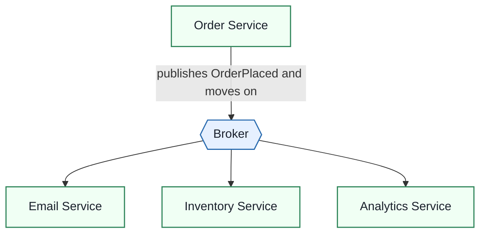

### Diagram — Event Sourcing

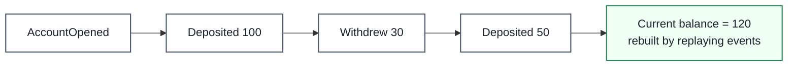

### Diagram — CQRS

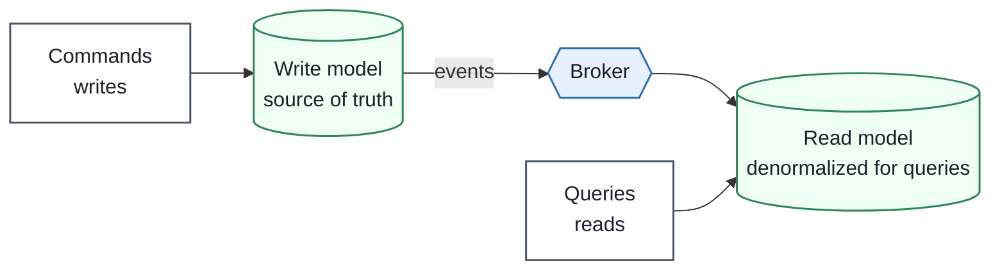

### Event-Driven Patterns

| Pattern | What It Is | Use When |
|---|---|---|
| **Pub/Sub messaging** | Producers publish to topics, subscribers consume independently | Fan-out to many consumers |
| **Event streaming** | Continuous, replayable log of events (Kafka) | Real-time pipelines, analytics |
| **Event notification** | Small event says something happened, consumers fetch details | Loose coupling, minimal payload |
| **Event-carried state transfer** | Event contains the data consumers need | Consumers should not call back |
| **Event sourcing** | State stored as immutable sequence of events | Audit trail, replay, temporal queries |
| **CQRS** | Separate write model and read model | Very different read and write needs |

### Pros and Cons

| Pros | Cons |
|---|---|
| Loose coupling, add consumers without touching producers | Harder to reason about overall flow |
| Independent scaling and failure isolation | Eventual consistency |
| Real-time reactivity, easy integration | Ordering only within partition or key |
| Replay and audit with event logs | Duplicates require idempotent consumers |
| Absorbs traffic spikes via buffering | Debugging across async hops needs tracing |

### Enterprise Example
**LinkedIn** built Apache Kafka to handle its activity streams and operational metrics, and it is now the backbone of event-driven systems at companies such as Uber, Netflix, and many banks. Typical uses include e-commerce order processing, IoT sensor streams, fraud detection on payment events, and keeping search indexes and caches updated as data changes.

> **Trade-off:** EDA gives decoupling, scalability, and replayability, but the system's behavior becomes emergent rather than visible in one call stack. You trade easy debugging and immediate consistency for flexibility, so you must invest in schema management, idempotency, monitoring of consumer lag, and tracing.

### 🎯 Most Asked Interview Questions

**Q1: How is event-driven different from request-driven?**
*A: In request-driven, the caller knows and calls specific services and waits for responses, so it's coupled to their availability. In event-driven, the producer publishes a fact and moves on while any number of consumers react independently. I'd pick events when multiple systems care about the same change and the caller doesn't need an immediate result.*

**Q2: What's the difference between a command, an event, and a message?**
*A: A command asks a specific recipient to do something and can be rejected, like ChargePayment. An event is an immutable fact that already happened, like PaymentCharged, and the publisher doesn't care who listens. Message is the generic transport term for either. Naming them correctly keeps ownership and coupling clear.*

**Q3: How do you handle duplicate or out-of-order events?**
*A: Brokers generally deliver at-least-once and guarantee ordering only per partition or key, so I make consumers idempotent using event IDs, key related events by entity ID so they stay ordered, and include versions or timestamps so stale events can be ignored.*

**Q4: What is event sourcing and what's its cost?**
*A: Instead of storing current state, I store the immutable sequence of events and derive state by replaying them, which gives a full audit trail and the ability to rebuild or time-travel. The cost is complexity: schema evolution of old events, replay time, which I mitigate with snapshots, and a steeper learning curve for the team.*

**Q5: When would you use CQRS?**
*A: When reads and writes have very different shapes or scale — for example a normalized write model for correctness and a denormalized read model for fast queries. It adds eventual consistency between the two, so I'd only use it where that complexity pays off.*

**Q6: How do you monitor and debug an event-driven system?**
*A: I track consumer lag and message age, use dead-letter queues with alerting for poison messages, and propagate a correlation or trace ID through every event so I can reconstruct a flow end to end. Schema registries help prevent breaking changes between teams.*

---

## 5. Peer-to-Peer (P2P) Architecture

### Definition
In a peer-to-peer architecture every participant (peer) acts as both client and server, sharing its own resources — bandwidth, storage, compute — directly with other peers without depending on a central server.

### Real-World Analogy
A neighborhood tool-sharing group versus a hardware store. At the store (client-server), everyone depends on one shop's stock and hours. In the sharing group, everyone lends and borrows from each other; the more neighbors join, the more tools are available, and no single closure shuts it down.

### Diagram — Client-Server vs. P2P

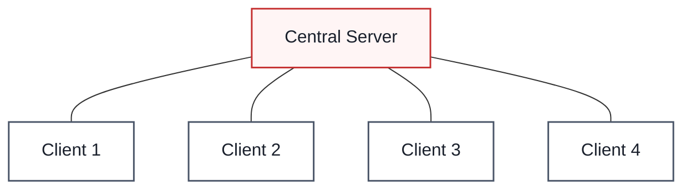

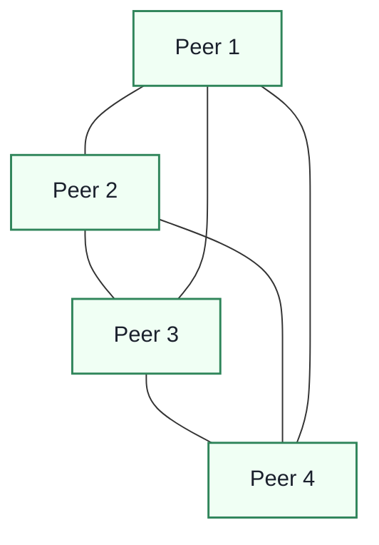

### Diagram — BitTorrent-Style File Download

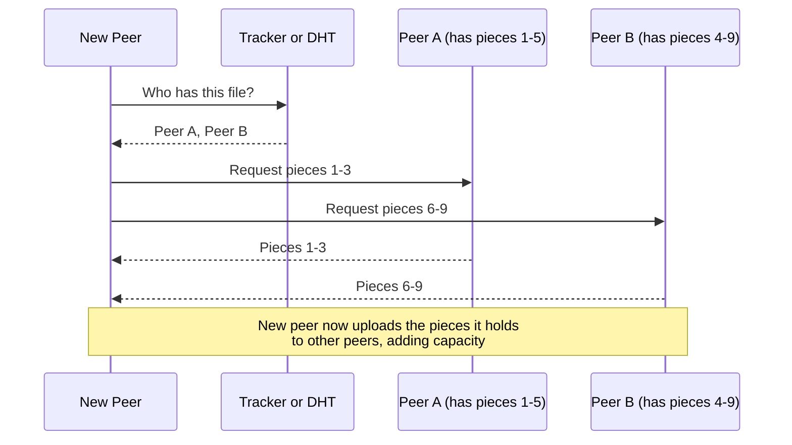

### Three Network Types

| Type | How Peers Find Each Other | Strength | Weakness |
|---|---|---|---|
| **Unstructured** (Gnutella-style) | Random connections, queries flood the network | Simple, tolerates peers joining and leaving | Inefficient search, rare content hard to find |
| **Structured** (DHT-based) | Distributed hash table with consistent hashing maps keys to nodes | Efficient targeted lookup | Sensitive to high churn, nodes maintain neighbor lists |
| **Hybrid** | Central server helps peers discover each other, data flows peer to peer | Easy search plus decentralized transfer | Central component is a dependency |

### P2P vs. Client-Server

| Aspect | P2P | Client-Server |
|---|---|---|
| Resource provision | Distributed across peers | Centralized on servers |
| Scalability | Capacity grows as peers join | Server load grows with clients |
| Single point of failure | None | The server |
| Search and consistency | Harder, variable | Indexed, consistent |
| Security and trust | Hard to verify peers and content | Central authority enforces rules |
| Control and moderation | Low | High |

### Enterprise Example
**BitTorrent** scales distribution by having downloaders upload pieces to each other, so popular files get faster instead of overloading a server; the same idea is used by Windows 10 Delivery Optimization to offload update bandwidth from Microsoft servers. **Blockchain networks** such as Bitcoin and Ethereum are P2P systems where nodes validate and relay transactions without a central operator. **Spotify** historically used a hybrid model — central servers for search and metadata with peer-assisted streaming — until 2014.

> **Trade-off:** P2P gives resilience, censorship resistance, and capacity that scales with the user base at near-zero server cost, but you give up control: search is harder, data consistency is weak, peers can be malicious or freeload, and you can't guarantee availability of rarely shared content.

### 🎯 Most Asked Interview Questions

**Q1: Why does P2P scale better than client-server for file distribution?**
*A: In client-server every new downloader adds load to the origin's bandwidth. In P2P each downloader also becomes an uploader, so total capacity grows with demand and popular content gets faster. The origin only has to seed the initial pieces.*

**Q2: How does a structured P2P network find data without flooding?**
*A: It uses a distributed hash table: keys and node IDs share one hash space via consistent hashing, so any node can route a lookup toward the node responsible for a key in O(log n) hops. That's far more efficient than flooding but needs nodes to maintain routing tables, which churn can disrupt.*

**Q3: What are the main security risks in P2P networks?**
*A: Malicious peers can serve corrupted or malware-laden content, poison routing, or run sybil attacks by creating many fake identities. I'd mitigate with content hashing so pieces are verified against known hashes, reputation or incentive mechanisms such as tit-for-tat, and cryptographic identity.*

**Q4: What's the free-rider problem and how do protocols address it?**
*A: Peers who download without contributing weaken the network. BitTorrent counters this with tit-for-tat choking — peers preferentially upload to those who upload back — so contributing is the way to get good speeds.*

**Q5: When would you choose P2P over client-server in a real product?**
*A: When distributing large, popular content to many users where server bandwidth cost dominates, or when decentralization and censorship resistance are core requirements, as in blockchain. For anything needing strong consistency, moderation, or access control, I'd stay client-server or use a hybrid.*

---

## Bringing It All Together — Evolving an E-Commerce Platform

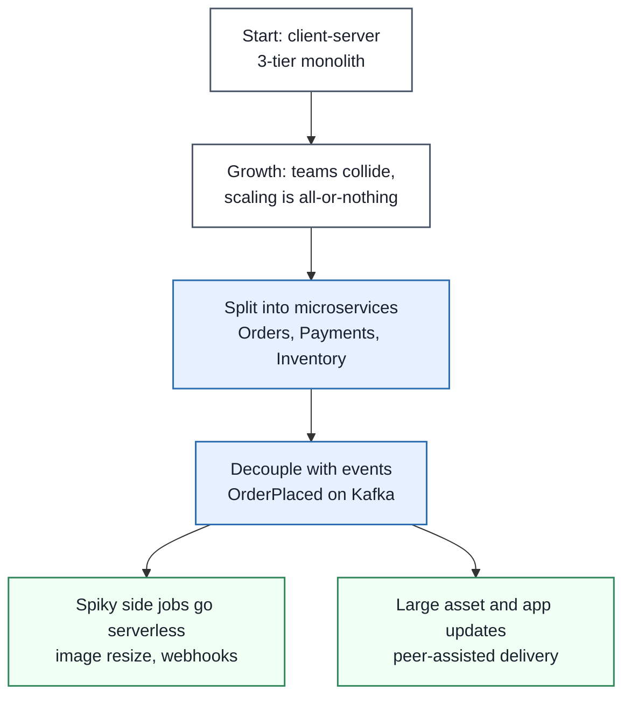

A realistic company rarely picks one pattern. It starts as a client-server monolith, splits into microservices when team and scaling pressure appear, connects those services with events so they don't depend on each other's availability, uses serverless for spiky glue work such as image processing and webhooks, and might use P2P-style distribution where bandwidth cost dominates.

---

## Quick-Reference Cheat Sheet

| Pattern | One-Line Definition | Optimizes For | Main Cost |
|---|---|---|---|
| **Client-Server** | Clients request, servers own logic and data | Control, security, simplicity | Server is bottleneck and failure point |
| **Microservices** | Small independent services, each owning its data | Team autonomy, independent scaling | Distributed complexity, eventual consistency |
| **Serverless** | Provider-managed, auto-scaling, pay per use | Low ops, spiky workloads | Cold starts, limits, lock-in |
| **Event-Driven** | Components react to published events via a broker | Decoupling, real-time reactivity | Harder debugging, eventual consistency |
| **Peer-to-Peer** | Peers are both clients and servers | Resilience, capacity grows with users | Weak control, security, search |

### Common Interview Follow-Up Questions

**Q: Are microservices and event-driven architecture the same thing?**
*A: No — they're orthogonal. Microservices are about how you split a system into independently deployable services, while event-driven is about how components communicate. Microservices often use events to avoid tight coupling, but you can have microservices that only call each other synchronously, or an event-driven monolith.*

**Q: Can serverless and microservices be combined?**
*A: Yes — each function or small group of functions can implement one service's capability, triggered by HTTP or events. The same concerns apply: data ownership, observability, and idempotency, with the added cold-start and lock-in considerations.*

**Q: Is P2P still relevant outside file sharing?**
*A: Yes — blockchain networks, decentralized messaging, and peer-assisted content and update delivery all use it, and the building blocks (DHTs, gossip, consistent hashing) appear inside mainstream systems like Cassandra and Dynamo-style databases.*

**Q: What's the first pattern you'd start a new product with?**
*A: A well-structured client-server monolith, since it's simplest to build, test, and operate, and I'd add events, services, or serverless only where measured pressure justifies the complexity.*

---

## How to Answer This in a Live Interview

Architecture questions usually arrive as **"How would you structure this system?"** or **"Should we use microservices?"** — you're being judged on matching the pattern to the constraints, not naming the trendiest one.

### Step 1 — Clarify Before You Answer

Never pick a pattern before you know:
1. **Team size and structure** — one team or many that need to ship independently?
2. **Traffic shape** — steady, spiky, or unpredictable? Expected scale now versus in two years?
3. **Consistency needs** — can parts of the system be eventually consistent?
4. **Latency requirements** — are there user-facing paths where cold starts or extra network hops are unacceptable?
5. **Operational maturity** — does the team have CI/CD, monitoring, and on-call capacity for many services?
6. **Domain clarity** — are the business boundaries well understood yet?

### Step 2 — Map Constraints to Concepts

| If the interviewer says... | ...it points you toward |
|---|---|
| "Small team, new product, unclear requirements" | Client-server modular monolith |
| "Many teams, deployments blocking each other" | Microservices |
| "One component needs to scale much more than others" | Microservices (extract that service) |
| "Several systems must react when something happens" | Event-driven (pub/sub) |
| "Spiky, infrequent, or event-triggered workloads" | Serverless |
| "Need audit history or ability to replay state" | Event sourcing |
| "Huge read volume with a very different shape than writes" | CQRS |
| "Distribute big content to millions, bandwidth is the cost" | P2P or peer-assisted delivery |

### Step 3 — Structure Your Spoken Answer

1. **Restate the driving constraint** — team, scale, or consistency — in one sentence.
2. **Propose the simplest pattern that satisfies it** and say why simpler options fall short.
3. **Describe the boundaries** — what the services or components are and how they communicate (sync vs events).
4. **Name the cost you're accepting** — consistency model, operational load, latency.
5. **Explain how you'd handle failure** — retries, circuit breakers, idempotency, dead-letter queues.
6. **Say how it evolves** — what trigger would make you move to the next pattern.

### Step 4 — Worked Example Answer

**Prompt: "We have a Spring Boot monolith for an online store. Deployments are painful and the checkout path needs to scale far more than the rest. What would you do?"**

*"The driving constraints are deployment coupling and uneven scaling, so I wouldn't rewrite everything — I'd use a strangler fig approach. I'd first make sure the monolith has clear module boundaries, then put an API gateway in front and extract checkout, the part that needs independent scaling, as its own service with its own database. Other services such as email, inventory, and analytics shouldn't be called synchronously from checkout, so I'd have checkout publish an OrderPlaced event to Kafka and let those consume it independently; that keeps checkout fast and isolates it from their failures. The cost I'm accepting is eventual consistency and the loss of a single ACID transaction, so for the payment-and-inventory flow I'd use a saga with compensating actions, and make consumers idempotent because delivery is at-least-once. I'd add distributed tracing and a circuit breaker around payment calls before going live. I'd leave the rest of the monolith alone until another boundary shows a real scaling or ownership need — splitting everything at once would give us the operational cost of microservices without the benefit."*

### Step 5 — Follow-Up Traps to Expect

- **"Why not just scale the monolith horizontally?"** → Acknowledge it works until team coordination or uneven resource needs dominate; it's often the right first answer.
- **"How do you keep data consistent across services?"** → Saga with compensations, idempotent consumers, outbox pattern; avoid distributed two-phase commit.
- **"Why not make checkout serverless?"** → Cold starts and execution limits on a latency-critical, steady path; serverless is better for spiky side jobs.
- **"What breaks first when you add events everywhere?"** → Observability and debugging — emphasize trace IDs, consumer lag monitoring, and schema management.

> **Golden rule:** Don't pick an architecture because it's fashionable — pick the simplest one that satisfies the stated constraints and say what would make you evolve it. "Microservices" as the opening answer, before asking about team size and scale, is the most common way candidates lose points.
